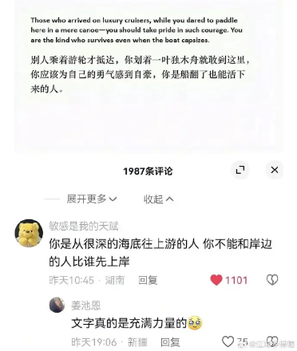
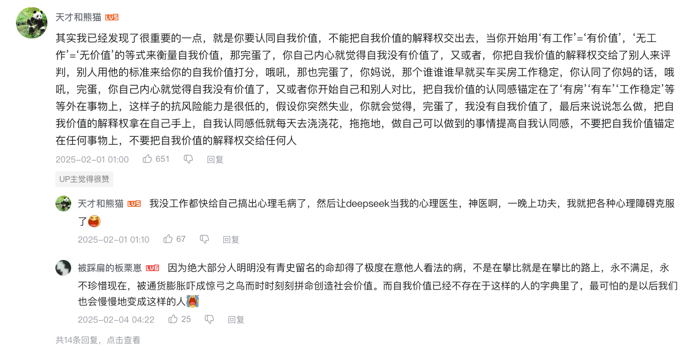
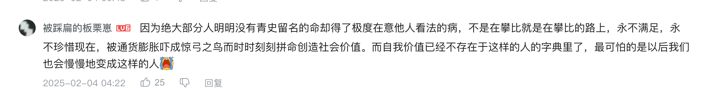

# 人生的意义，本自具足

1. 此心光明，亦复何言 —— 王阳明
1. 有钱难买我乐意
1. 人生本无意义，意义应当由自己赋予
1. 人生总是在无聊和痛苦之间流转，不要去追逐别人的意义，这是没有尽头的
1. TODO
   1. 《有限与无限的游戏》

## 别人乘着游轮才抵达，你划着一叶独木舟就敢到这里

你应该为自己的勇气自豪，你是船翻了也能活下来的人

你是从很深的海底往上游的人，你不能和岸边的人比谁先上岸

- 每个人的海底都是不一样的，困难不是能够比较的，每个人都有自己的课题

## 当你开始用好工作`=`有价值来衡量自己，你就已经完蛋了

## 绝大多数任没有名留青史的命却又得了极度在意他人看法的病

## 参考

1. 【我29岁，名校毕业，失业三年一事无成，能靠做独立游戏活下来吗】 https://www.bilibili.com/video/BV1sTFNeCE4g/?share_source=copy_web&vd_source=5d4accef9045e3ed4e08bbb7a80f3c70
2. 《我可能错了》