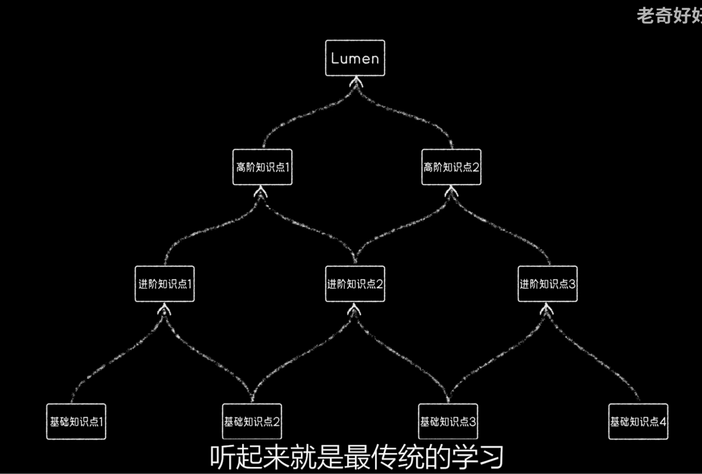

# 学习知识方法论

主要有几点

- 问题导向的学习
- 认知地图
- 元认知

## 问题导向的学习

```
当前状态 => 目标1 => ... => 目标N => 目标任务
```

好处

1. 学习动力更强
2. 自顶向下，只学有用的，不浪费时间打所谓的基础
3. 能带入工程师和科学节家的视角，培养综合能力

## 认知地图

了解自己的状态，绘制到目标的地图



## 元认知


## 参考

1. 