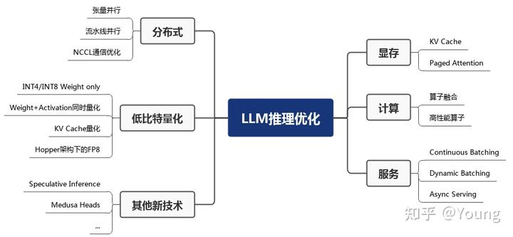
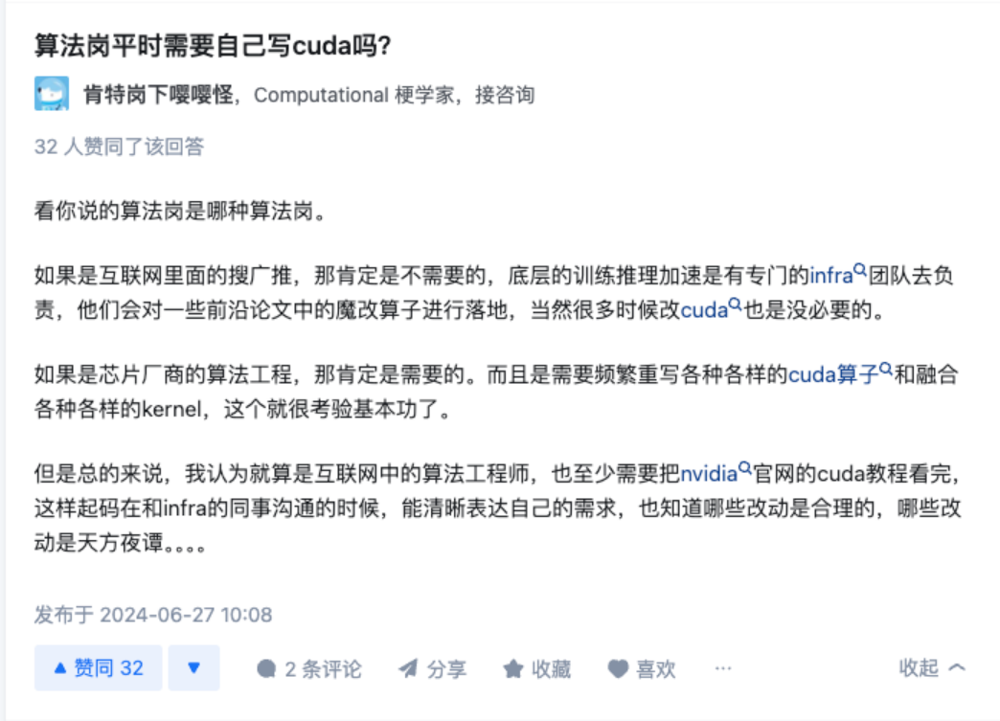

# MLSys Learning PLAN

## MLSys 学习大纲

- 分布式训练
  - 动机、整体集群架构、经典并行训练方法
- 编程模型
- 计算图
- 模型部署
  - 推理优化
  - 模型压缩蒸馏

- 机器学习
  - 机器学习经典模型
  - 深度学习模型的常见应用与原理
  - LLM：NLP、BERT、Transformer

参考

1. [《OPEN MLSYS 机器学习系统：设计和实现》](https://openmlsys.github.io/#)
2. 统计学习方法
3. limu 动手学习深度学习
4. Standford cs231n 
5. 大模型LLM领域，有哪些可以作为学术研究方向？ - zibuyu9的回答 - 知乎
   https://www.zhihu.com/question/595298808/answer/3047369015
6. 大语言模型推理性能优化综述 - Young的文章 - 知乎
   https://zhuanlan.zhihu.com/p/656485997
7. LLM大模型推理部署优化技术综述 - 上天界医神的文章 - 知乎
   https://zhuanlan.zhihu.com/p/655557420

### Week1

大概了解了机器学习系统的一些研究方向，和大模型分布式训练系统

- 主要参考 [《OPEN MLSYS 机器学习系统：设计和实现》](https://openmlsys.github.io/#)
  - 分布式训练
    - 概览
    - 常见分布式并行训练方法
      - DP、MP、HP、PP
    - 分布式训练机器学习集群架构
    - 集合通信 Collective Communication
    - 参数服务器 Parameters Server
  - 分布式训练常见库

- 李沐LLM创业一年文章与上交大演讲。

  - 目前训练 LLM 千卡系统中会常常遇到网络故障、机器故障
  
    - GPU 供电不足导致不稳定；租了千张 H100，一样是各种 bug，GPU 每天都出问题。 
  
      Llama 3 的技术报告说他们改用 H100 后，训练一次模型被打断几百次。
  
    - 网络问题
  
      - 带宽限制
        1. 当前网络带宽是一根光纤承载 400Gigabits，下一代就是 double，变成 800Gigabits。
        2. 一台机器传输到隔壁一米之外的机器所带来的几纳秒延迟就很高了。设计机房会考虑光纤长度，因为一米的差距就会给分布式训练带来一个可见的性能影响。
      - 网络故障：由于光纤的切开角度不对，导致通信不稳定。
      - 网络布局： Nvidia 的推荐网络布局不是最有效的。
  
  - 算力这块，可以用别的芯片做推理；做训练的话目前还是 Nvidia 垄断，也许还要等几年才能够用其他的芯片。

### Week 2 (ongoing)

了解机器学习框架的编程模型、计算图原理。复习机器学习相关知识

- 编程模型
- 计算图
- 机器学习
  - 机器学习经典模型
  - 深度学习模型的常见应用与原理
  - LLM：NLP、BERT、Transformer

### Week 3

## ================

## 机器学习算法

机器学习

- 机器学习算法
  - 概论
    - 有监督学习和无监督学习
    - 模型评估与模型选择
      - 训练测试误差
      - 过拟合与模型选择
      - 正则化与交叉验证
    - 标注问题
    - 泛化能力
  - 分类
  - 聚类
    - K-means
    - Hierarchical Clustering and Transformations
    - Density-Based Clustering
    - Cluster Quality
  - 关联规则 Association Rule
  - 回归
  - 经典模型
    - 线性回归，逻辑回归
    - 感知机
    - KNN
    - 朴素贝叶斯
    - 决策树
    - 支持向量机 SVM
    - 提升方法 AdaBoost 算法
    - 隐马尔可夫模型
- 深度学习
  - 大分类
    - 计算机视觉
      -   人脸识别
      -   体态识别
      -   无人驾驶
      -   图片合成
      -   超分辨率
      -   医学图片
    - 自然语言处理
      -   文本分类
      -   文本合成
      -   文本摘要
      -   实体命名识别
    - 图神经网络
    - 时序数据
    - 强化学习
    - 音频
    - 推荐系统
    - 多模态
    - LLM
      - AIGC
      - 代码生成
  - 特征工程
  - 多层感知机 MLP
  - 卷积神经网络 CNN
  - 现代卷积神经网络 AlexNet GoogleLeNet etc
  - 循环神经网络 RNN 序列模型、语言模型
  - 现代循环神经网络
    - 门控循环单元 GRU
    - 长短期记忆网络 LSTM
    - 深度循环神经网络
    - 双向循环神经网络
    - 编码器与解码器
    - 序列到序列学习
  - 注意力
    - 注意力机制 Attention
    - 使用注意力机制的Seq2Seq
    - 自注意力和位置编码
    - BERT

## Other Links

- [人工智能系统](https://github.com/microsoft/AI-System?tab=readme-ov-file) by 微软
- [CMU DL System](https://dlsyscourse.org/) 陈天奇老师的课。涉及nn库实现、自动微分、GPU加速、模型部署和部分AI编译内容。分布式训练涉及的不够，基础的MLsys还是非常全面的。
  - Data Parallel 数据并行
  - Distributed Data Parallel 分布式数据并行
  - Tensor Parallel 张量并行
  - Pipeline Parallel 流水线并行
  - Auto Parallel 自动并行
  - Sequence Parallel 序列并行
  - Asynchronous Distributed Dataflow 异步数据流
  - Distributed Scheduling 分布式调度

- [TinyML 6.5940](https://hanlab.mit.edu/courses/2024-fall-65940) Chapter III: Efficient Training 
- 

- 从啥也不会到DeepSpeed————一篇大模型分布式训练的学习过程总结 - elihe的文章 - 知乎
  https://zhuanlan.zhihu.com/p/688873027
- Colossalai 流水线并行框架开发

  - https://kirigaya.cn/1
- 对这些有基本的了解

  - CUDA 算子
  - PyTorch 原理
  - GPGPU 体系结构
  - 模型压缩、加速
- 基本机器学习要懂，然后去看高性能计算相关的教材，然后学习基本的DP，PP，MP的原理等。
- AGX Orin 嵌入式开发板上部署 Qwen2.0 大模型
- 实际上下面的这些在 OPEN MLSYS 里都有
- 深度学习框架最重要的是什么？自动求导系统，因为目前的损失函数的优化方法全都基于一阶梯度信息进行梯度下降
- 如何实现梯度的计算？计算图，ptorch 的 tensor 和 numpy 最大的区别在于当你使用 tensor 进行加减乘除运算时，torch 后台会自动帮你构建出计算图。

  - 纯Python实现原理级深度学习框架（一）计算图的原理，节点类的实现和计算图的可视化 - 锦恢的文章 - 知乎
    https://zhuanlan.zhihu.com/p/351961835
- 其他的

  - Hugging Face高效训练技术一：单 GPU 高效训练（Gradient Accumulation、Gradient Checkpointing、混合精度训练、优化其选择）https://blog.csdn.net/qq_56591814/article/details/134177555?spm=1001.2014.3001.5502
  - Hugging Face高效训练技术二：大模型分布式训练策略——ZeRO、FSDP https://blog.csdn.net/qq_56591814/article/details/133189752?spm=1001.2014.3001.5502
  - Hugging Face高效训练技术三：huggingface DeepSpeed文档 https://blog.csdn.net/qq_56591814/article/details/133221357?spm=1001.2014.3001.5502
  - Hugging Face高效训练技术四：多GPU分布式训练（DP、PP、TP 、ZeRO） https://blog.csdn.net/qq_56591814/article/details/134099476
  - Hugging Face高性能技术五：Transformer高效推断（bitsandbytes、FlashAttention、 BetterTransformer） https://blog.csdn.net/qq_56591814/article/details/134237584?spm=1001.2014.3001.5502

## MLsys 的性能优化

### 性能需求

1. 训练时间速度

2. 模型大小

3. 推理效率

### 优化大方向

1. 分布式ML
2. DL 模型压缩、加速
3. DL 框架
4. 用ML优化传统的system问题

### 优化细分

1. GEMM显存相关优化：
   1. CUDA上GEMM优化的资料整理 - Liu六六六的文章 - 知乎
      https://zhuanlan.zhihu.com/p/666664399
2. 计算
   1. 算子融合，算子高性能算子
   2. 模型并行
      1. 常见的并行计算框架，例如MPI/OpenMP/CUDA
   3. 流水线并行
   4. 张量卸载
   5. 优化器卸载
   6. 重计算方法
   7. 混合精度训练
3. 服务相关优化（深度学习框架）
4. 分布式相关优化（分布式机器学习）
5. 低比特量化（加速）
6. 其他新技术（加速）

应用

1. 网络时延，量化
2. 模型剪枝
3. 知识蒸馏
4. 参数量化
5. 模型压缩
6. 神经元稀疏激活现象

## LLM 推理性能优化

大语言模型推理服务性能优化综述 - Young的文章 - 知乎

https://zhuanlan.zhihu.com/p/656485997

LLM 推理服务重点关注两个指标：吞吐量和时延

- 吞吐量：主要从系统的角度来看，即系统在单位时间内能处理的 tokens 数量。

- 时延：主要从用户的视角来看，即用户平均收到每个 token 所需位时间。

### 显存优化

1. KV Cache，空间换时间
   1. 预填充阶段
   2. 解码阶段。每轮推理只需读取 Cache，同时将当前轮计算出的新的 Key、Value 追加写入至 Cache；GEMM 变为 GEMV (GEneral Matrix-Vector multiply) 操作。
2. Paged Attention
   1. FasterTransformer 中，预先为 KV Cache 分配了一个充分长的显存空间，用于存储用户的上下文数据。
   2. Paged Attention 将传统操作系统中对内存管理的思想引入 LLM，实现了一个高效的显存管理器，通过精细化管理显存，实现了在物理非连续的显存空间中以极低的成本存储、读取、新增和删除键值向量。
   3. 具体来讲，Paged Attention 将每个序列的 KV Cache 分成若干块，每个块包含固定数量token 的键和值。
   4. 在实际推理过程中，维护一个逻辑块到物理块的映射表，多个逻辑块可以对应一个物理块，通过引用计数来表示物理块被引用的次数。

### 计算优化

1. 算子融合
   1. 算子融合是深度学习模型推理的一种典型优化技术，旨在通过减少计算过程中的访存次数和 Kernel 启动耗时达到提升模型推理性能的目的，该方法同样适用于 LLM 推理。
   2. 以 DeepSpeed Inference 为例，算子融合主要分为如下四类：
      1. 归一化层和 QKV 横向融合：将三次计算 Query/Key/Value 的操作合并为一个算子，并与前面的归一化算子融合。
      2. 自注意力计算融合：将自注意力计算涉及到的多个算子融合为一个，业界熟知的 FlashAttention 即是一个成熟的自注意力融合方案。
      3. 残差连接、归一化层、全连接层和激活层融合：将 MLP 中第一个全连接层上下相关的算子合并为一个。
      4. 偏置加法和残差连接融合。
   3. 由于算子融合一般需要定制化实现算子 CUDA kernel，因此对 GPU 编程能力要求较高
2. 高性能算子
   1. 针对 LLM 推理运行热点函数编写高性能算子，也可以降低推理时延。
      1. GEMM 操作相关优化：在 LLM 推理的预填充阶段，Self-Attention 和 MLP 层均存在多个 GEMM 操作，耗时占据了推理时延的 80% 以上。GEMM 的 GPU 优化是一个相对古老的问题，在此不详细展开描述算法细节。英伟达就该问题已推出 cuBLAS、CUDA、CUTLASS 等不同层级的优化方案。例如，FasterTransformer 框架中存在大量基于 CUTLASS 编写的 GEMM [内核函数](https://www.zhihu.com/search?q=内核函数&search_source=Entity&hybrid_search_source=Entity&hybrid_search_extra={"sourceType"%3A"article"%2C"sourceId"%3A"656485997"})。另外，Self-Attention 中存在 GEMM+Softmax+GEMM 结构，因此会结合算子融合联合优化。
      2. GEMV 操作相关优化：在 LLM 推理的解码阶段，运行热点函数由 GEMM 变为 GEMV。相比 GEMM，[GEMV](https://www.zhihu.com/search?q=GEMV&search_source=Entity&hybrid_search_source=Entity&hybrid_search_extra={"sourceType"%3A"article"%2C"sourceId"%3A"656485997"}) 的计算强度更低，因此优化点主要围绕降低访存开销开展。
      3. 高性能算子的实现同样对 GPU 编程能力有较高要求，且算法实现中的若干超参数与特定问题规模相关。因此，编译器相关的技术如自动调优也是业界研究的重点。
3. 服务相关优化
   1. 服务相关优化主要包括 Continuous Batching、Dynamic Batching 和 异步 Tokenize / Detokenize。
   2. 如上两个 batching 相关的优化技术可有效提升推理吞吐量，目前已在 HuggingFace Text-Generation-Interface (TGI)、vLLM、OpenPPL-LLM 等多个框架中实现。
4. 分布式相关优化
   1. 由于大语言模型参数量较大，可能无法存放到单一计算设备中，分布式并行可以有效解决该问题。
      1. 模型并行
         1. 模型并行通过将权重参数拆分到多个计算设备中，实现分布式计算。
      2. 流水线并行
   2. 由于每次的通信量很小，实际带宽也远远小于理论带宽。因此模型参数量越大、batchsize 越大，通信效率越高，使用模型并行获得的收益约明显。
5. 低比特量化
   1. LLM 推理具有 Memory-bound 特点，如果降低访存量，将在吞吐量和时延两个性能指标上都有收益。
   2. 其能取得加速的关键在于显存量和访存量的节省以及量化计算的加速远大于反量化带来的额外开销。
6. 其他新技术
   1. 业界在将传统优化技术引入 LLM 推理的同时，同时也在探索从大模型自回归解码特点出发，通过调整推理过程和引入新的模型结构来进一步提升推理性能。
   2. 投机采样（Speculative decoding）针对 LLM 推理串行解码特点，通过引入一个近似模型来执行串行解码
   3. 美杜莎头（Medusa head）则是对投机采样的进一步改进，其摒弃了近似模型，在原始模型结构上新增了若干解码头，每个解码头可并行预测多个后续 tokens，然后使用基于树状注意力机制并行处理，最后使用典型接收方案筛选出合理的后续 tokens。

## LLM 研究方向

大模型LLM领域，有哪些可以作为学术研究方向？ - zibuyu9的回答 - 知乎
https://www.zhihu.com/question/595298808/answer/3047369015

### 效率

高效、高性能计算 （HPC） 

1. 训练 
   1. 需要建设更加高效的分布式训练算法体系，这方面很多高性能计算学者已经做了大量探索，例如，通过模型并行、流水线并行、ZeRO-3 等模型并行策略将大模型参数分散到多张 GPU 中，通过张量卸载、优化器卸载等技术将 GPU 的负担分摊到更廉价的 CPU 和内存上，通过重计算方法降低计算图的显存开销，通过混合精度训练利用 Tensor Core 提速模型训练，基于自动调优算法选择分布式算子策略等 。
   2. 模型并行
   3. 流水线并行
   4. 张量卸载
   5. 优化器卸载
   6. 重计算方法
   7. 混合精度训练
   8. 模型加速领域
      1. 模型加速领域已经建立了很多有影响力的开源工具，国际上比较有名的有微软DeepSpeed、英伟达Megatron-LM，国内比较有名的是OneFlow、ColossalAI等。而在这方面我们OpenBMB社区推出了BMTrain，能够将GPT-3规模大模型训练成本降低90%以上。
   
2. 推理
   1. 推理效率
3. 应用
   1. 模型剪枝
   2. 知识蒸馏
   3. 参数量化
   4. 模型压缩
   5. 神经元稀疏激活现象

### 高效适配

对齐（alignment）

- 提示学习（prompt learning），指令微调（instruction tuning）

- 参数高效微调 **参数高效微调**（Parameter-effcient Tuning 或Delta Tuning）基本思想是保持绝大部分的参数不变，只调整大模型里非常小的一组参数，这能够极大节约大模型适配的存储和计算成本

### 可控生成

ChatGPT在可控生成方面取得了长足进步，现在可控生成有了相对成熟的做法：（1）通过指令微调（Instruction Tuning）[1, 2, 3] 提升大模型意图理解能力，使其可以准确理解人类输入并进行反馈；（2）通过提示工程编写合适的提示来激发模型输出。这种采用纯自然语言控制生成的做法取得了非常好的效果，对于一些复杂任务，我们还可以通过思维链（Chain-of-thought）[4] 等技术来控制模型的生成。

该技术方案的核心目标是让模型建立指令跟随（Instruction following）能力。

最近研究发现，获得这项能力并不需要特别复杂的技术，只要收集足够多样化的指令数据进行微调即可获得不错的模型。

https://github.com/thunlp/UltraChat

### 安全伦理问题

大量实验表明大模型对传统的对抗攻击、OOD样本攻击等展现出不错的鲁棒性[1]，但在实际应用中还是会容易出现大模型被攻击的情况。

而且，随着ChatGPT的广泛应用，人们发现了很多新的攻击方式。例如最近出圈的ChatGPT越狱（jailbreak）[2]（或称为提示注入攻击），利用大模型跟随用户指令的特性，诱导模型给出错误甚至有危险的回复。

例如，有人利用大模型生成假新闻怎么办？如何避免大模型产生偏见和歧视内容？学生用大模型来做作业怎么办？这些都是在现实世界中实际发生的问题，尚无让人满意的解决方案，都是很好的研究课题。

在大模型伦理方面，如何实现大模型与人类价值观的对齐是重要的命题。

此前研究表明模型越大会变得越有偏见[5]，ChatGPT后兴起的RLHF、RLAIF等对齐算法可以很好地缓解这一问题，让大模型更符合人类偏好，生成质量更高。

### 认知学习

“君子性非异也，善假于物也”。

现在大模型虽然在很多方面取得了显著突破，但是生成幻觉问题依然严重，在专业领域任务上面临不可信、不专业的挑战。

因此，大模型需要具备学习使用各种专业工具的能力，这样才能更好地完成各项复杂任务。

工具学习有望解决模型时效性不足的问题，增强专业知识，提高可解释性。而大模型在理解复杂数据和场景方面，已经初步具备类人的推理规划能力，大模型**工具学习（Tool Learning）**[1] 范式应运而生。

已有 WebGPT / WebCPM [2, 3] 等工作成功让大模型学会使用搜索引擎，像人一样网上冲浪，有针对性地获取有用信息进而完成特定任务。

现有大部分努力都集中在单个预训练模型的能力提升上，而在单个大模型已经比较能打的基础上，未来将开启**从单体智能到多体智能的飞跃，实现多模型间的交互、协同或竞争**。

目前，构建多模型交互环境尚无成熟解决方案，为此我们开发了开源框架AgentVerse [6]，支持研究者通过简单的配置文件和几行代码搭建多模型交互环境。

### 创新应用

这方面一个耳熟能详的工作就是AlphaFold，对整个蛋白质结构预测产生了天翻地覆的影响。

如何将领域知识加入AI擅长的大规模数据建模以及大模型生成过程中，这是利用大模型进行创新应用的重要命题。

我们已经在法律智能、生物医学展开了一些探索。例如，早在2021年与幂律智能联合推出了首个中文法律智能预训练模型 [Lawformer](https://link.zhihu.com/?target=https%3A//www.sciencedirect.com/science/article/pii/S2666651021000176)，能够更好地处理法律领域的长篇文书；我们也提出了能够同时建模化学表达式和自然语言的统一预训练模型KV-PLM，在特定生物医学任务上能够超过人类专家，相关成果曾发表在《自然-通讯》（Nature Communications）上并入选编辑推荐专栏（Editor's Highlights）。

### 数据和评估

纵观深度学习和大模型的发展历程，持续验证了**“更多数据带来更多智能”（More Data, More Intelligence）**原则的普适性。

概览近期的前沿动态，一个正在成为主流的技术路线是以语言大模型为基底，融入其他模态信号，从而将语言大模型中的知识和能力吸纳到多模态计算中。

我们近期实验表明，基于刚开源的百亿中英双语基础模型[CPM-Bee](https://link.zhihu.com/?target=https%3A//github.com/OpenBMB/CPM-Bee)，能够支持很快训练得到多模态大模型，围绕图像在开放域下进行中英多模态对话，与人类交互有不错表现。

另一方面，**大模型建得越来越大，结构种类、数据源种类、训练目标种类也越来越多，这些模型的性能提升到底有多少？**在哪些方面我们仍需努力？有关大模型性能评价的问题，我们需要一个科学的标准去判断大模型的长处和不足。

对此，我们也曾在过去几年里推出过 CUGE 中文理解与生成评价集合 [4]，通过逐层汇集模型在不同指标、数据集、任务和能力上的得分系统地评估模型在不同方面的表现。

对于生成式AI，模型倾向于生成发散性强、长度较长的内容，使用自动化评测指标很难对生成内容的多样性、创造力进行评估，于是带来了新的挑战与研究机会，最近出现的大模型评价方式可以大致分为以下几类：

- **自动评价法**：很多研究者提出了新的自动化评估方式，譬如通过选择题的形式[5]，收集人类从小学到大学的考试题以及金融、法律等专业考试题目，让大模型直接阅读选项给出回答从而能够自动评测，这种方式比较适合评测大模型在知识储备、逻辑推理、语义理解等维度的能力。
- **模型评价法**：也有研究者提出使用更加强大的大模型来做裁判[6]。这种方式会存在一些问题，譬如效果受限于裁判模型的能力，裁判模型会偏向于给某个位置的模型打高分等，但优势在于能够自动执行，不需要评测人员
- **人工评价法**：人工评测是目前来看更加可信的方法，然而因为生成内容的多样性，如何设计合理的评价体系、对齐不同知识水平的标注人员的认知也成为了新的问题。是否可以从不同的维度给出打分？如何从网络众测员中选出相对比较靠谱的答案？（人工的打算也是有置信度的，所以openAI团队真的很厉害。。）

### 易用性

受到计算机发展史上成功实现标准化的数据库系统和大数据分析系统的启发，我们应当将复杂的高效算法封装在系统层，而为系统用户提供易懂而强大的接口。

设计原则

- 兼容性 compatibility
- 高效 efficiency
- user simplicity
- application - generality

## 其他

### 相关学科、资源推荐

**操作系统**

- mit6.S081

**并行计算** 

- Parallel computing

  - CMU 15418 [课程主页](https://link.zhihu.com/?target=http%3A//15418.courses.cs.cmu.edu/spring2016/)

  - UCB cs267 [课程主页](https://link.zhihu.com/?target=https%3A//sites.google.com/lbl.gov/cs267-spr2022%3Fpli%3D1) **HPC祖师爷 Jim Demmel**x 22 spring最新版本

**分布式系统**

- MIT6.824 

**MLSys**

- CMU DL System [课程主页](https://link.zhihu.com/?target=https%3A//dlsyscourse.org/)  **陈天奇**老师的课,涉及nn库实现,自动微分,GPU加速,模型部署和部分AI编译内容,内容除了分布式训练涉及的不够,基础的MLsys还是非常全面的
- Mini torch [课程主页](https://link.zhihu.com/?target=https%3A//minitorch.github.io/) 完全用python实现的简单torch版本,涉及自动微分,张量,GPU加速.适合新手入门
- Tiny ML [课程主页](https://link.zhihu.com/?target=https%3A//efficientml.ai/) **MIT 韩松**，移动设备和嵌入式系统相关
- 工具书
- 机器学习系统:设计和实现 [主页](https://link.zhihu.com/?target=https%3A//openmlsys.github.io/%23) 华为Mindspore团队。中文的，涉及到方方面面
- System for AI [主页](https://link.zhihu.com/?target=https%3A//github.com/microsoft/AI-System)  **微软**发起的,目前还在快速迭代更新的工具书,舍和补全基础

**AI 编译器**

- Machine Learning Compliation 陈天奇 

**LLM**

- 作者建议关注模型架构，大的范式变化即可，李沐博客 [paper-reading github 主页](https://link.zhihu.com/?target=https%3A//github.com/mli/paper-reading)

**编程语言**

- C++

  - CMake https://www.hahack.com/codes/cmake/

  - 现代C++ https://changkun.de/modern-cpp/zh-cn/00-preface/

- Python
  - 做 MLsys 比较需要掌握用python调用C,比如Cpython,pybind,以及一些python高级特性,比如hook,装饰器

- CUDA
  - 参考比较多，可以用NVIDIA官方的文档 https://docs.nvidia.com/cuda/cuda-c-programming-guide/  seriously（？）

- OpenCL
  - 对于非NVIDIA的芯片，比如手机的移动端芯片，则需要OpenCL来进行异构加速 [OpenCL异构计算](https://link.zhihu.com/?target=https%3A//www.bookstack.cn/read/Heterogeneous-Computing-with-OpenCL-2.0/README.md)

### 给ChatGPT API推理成本算笔帐 - 方佳瑞的文章 - 知乎

https://zhuanlan.zhihu.com/p/651933140

### 各方向相关的库

**推理**

- TensorRT [github](https://link.zhihu.com/?target=https%3A//github.com/NVIDIA/TensorRT) 英伟达的推理方案, 目前整体上在英伟达GPU上做的最好的推理框架,比较是自己的卡
- AI Template [github](https://link.zhihu.com/?target=https%3A//github.com/facebookincubator/AITemplate) FaceBook刚搞的一个推理库，在很多硬件上速度性能都超过TensorRT，还比较新的框架

**推理服务器**

- triton-inference-server [github](https://link.zhihu.com/?target=https%3A//github.com/triton-inference-server/server)  英伟达的ML serving框架,比较成熟

**移动端推理**

- Mindsporelite [gitee](https://link.zhihu.com/?target=https%3A//gitee.com/mindspore/mindspore) 我有幸参与写过的推理引擎,对于全流程在mindspore上做的体验还是不错的.

- MNN [github](https://link.zhihu.com/?target=https%3A//github.com/alibaba/MNN) 阿里达摩院做的,我写mindsporelite的遇到问题的时候经常被mentor叫去学习一下友商的代码,CPU的一些kernel用汇编写的

- TensorFlowlite [github](https://link.zhihu.com/?target=https%3A//github.com/tensorflow/tensorflow/tree/master/tensorflow/lite) 集成在Tensorflow的移动端推引擎,国际上应该是最早做的移动端推理.没错,TFlite的大哥就是那个从谷歌跑路重回斯坦福读博的皮特·沃登,他写了TinyML这本书 
- NCNN [github](https://link.zhihu.com/?target=https%3A//github.com/Tencent/ncnn) 国内做的最早的端侧推理引擎,腾讯搞的,不得不说,很多东西还是需求驱动, 靠各种移动APP为主要产品的中国互联网公司,移动推理引擎做的都不错

**深度学习框架 Tensorflow 等**

- [Torch](https://link.zhihu.com/?target=https%3A//github.com/pytorch/pytorch)
- [TensorFlow](https://link.zhihu.com/?target=https%3A//github.com/tensorflow/tensorflow)
- [Mindspore](https://link.zhihu.com/?target=https%3A//gitee.com/mindspore/mindspore)
- [Jax](https://link.zhihu.com/?target=https%3A//github.com/google/jax)
- [oneflow](https://link.zhihu.com/?target=https%3A//github.com/Oneflow-Inc/oneflow)
- [paddle](https://link.zhihu.com/?target=https%3A//github.com/PaddlePaddle/Paddle)
- [ivy](https://link.zhihu.com/?target=https%3A//github.com/unifyai/ivy)

**AI 编译器**

- TVM [github](https://link.zhihu.com/?target=https%3A//github.com/apache/tvm)
- BladeDISC [github](https://link.zhihu.com/?target=https%3A//github.com/alibaba/BladeDISC)
- MLIR [项目主页](https://link.zhihu.com/?target=https%3A//mlir.llvm.org/)

**分布式训练**

- Colossal-AI [github](https://link.zhihu.com/?target=https%3A//github.com/hpcaitech/ColossalAI) 在torch生态下支持各种并行和显存优化策略
- Megatron-LM [Github](https://link.zhihu.com/?target=https%3A//github.com/NVIDIA/Megatron-LM) NVIDIA做的模型并行库,也是最早开源的模型并行,**但对缺乏分布式训练背景的人使用不太友好(really?)**
- Deepspeed [github](https://link.zhihu.com/?target=https%3A//github.com/microsoft/DeepSpeed-MII) 微软的大模型训练框架,核心技术是Zero infinity相关的一系列paper,使用Megatron-LM作为张量并行的支持
- Huggingface accelerate [github](https://link.zhihu.com/?target=https%3A//github.com/huggingface/accelerate) huggingface的加速器,对各种不同硬件做了兼容,在huggingface生态下非常好用,在分布式上做了比较多的封装,可以直接调用Deepspeed.
- Bagua [github](https://link.zhihu.com/?target=https%3A//github.com/BaguaSys/bagua) Bagua在多机通讯上做了非常多的工作,对allreduce等分布式通讯做了不少优化
- Lighting [github](https://link.zhihu.com/?target=https%3A//github.com/Lightning-AI/lightning) lightning集成了各种分布式后端,可以很方便的启动各种分布式策略,lightning本身是一套更好的MLflow,设计理念是算法和工程分开,提供了大量自定义hook,对于大型AI项目而言,是个不错的选择,但是学习门槛不低

### 算法岗平时不需要自己写 CUDA，知道一些原理就好。写 CUDA 的岗位很少的

### 高性能计算与分布式数据库方向怎么选? 

Mingfei的回答 - 知乎 https://www.zhihu.com/question/492883182/answer/2193166289

南瓜头给的点：

1. "HPC不好就业"肯定是误区啊

2. 难道[分布式数据库](https://www.zhihu.com/search?q=分布式数据库&search_source=Entity&hybrid_search_source=Entity&hybrid_search_extra={"sourceType"%3A"answer"%2C"sourceId"%3A2193166289})不需要性能优化吗？肯定不是这样啊

3. 关键是技术, 性能优化是很宽泛的概念

   1. 分布式系统的通信问题 large scale training
   2. 省内存的方法，能train更大的model
   3. 单节点的性能优化，并行化和向量化
   4. 参数压缩和量化

4. 我们是[intel](https://www.zhihu.com/search?q=intel&search_source=Entity&hybrid_search_source=Entity&hybrid_search_extra={"sourceType"%3A"answer"%2C"sourceId"%3A2193166289})搞AI性能优化的部门

   1. 肯定是会做性能优化的，gpu, cpu, [npu](https://www.zhihu.com/search?q=npu&search_source=Entity&hybrid_search_source=Entity&hybrid_search_extra={"sourceType"%3A"answer"%2C"sourceId"%3A2193166289}), mobile各种平台都行

   2. 如果只是停留在用mpirun跑xxx模型，多少多少个节点这种层次肯定没意思

   3. 搞性能需要的是，理解hw architecture, memory hierarchy，懂怎么写[kernel](https://www.zhihu.com/search?q=kernel&search_source=Entity&hybrid_search_source=Entity&hybrid_search_extra={"sourceType"%3A"answer"%2C"sourceId"%3A2193166289})这种

   4. 写了性能优化，但怎么确定workload里面的hotspot，以及怎样确定是compute bound，memory bandwidth bound， latency bound，或者如果继续优化应该怎么做，这种问题都答不出来。

      1. hotspot 热点，指系统中性能最差的区域，需要对其进行优化。

         compute bound 计算能力限制，指系统的计算能力限制了系统的性能。

         memory bandwidth bound 内存带宽限制，指系统内存的传输速率限制了系统的性能。

         latency bound 延迟限制，指系统数据处理的延迟限制了系统的性能。

         workload 工作负载，指系统需要处理的数据量和处理算法。

帮我解析这句话：咨询下，手写opencl的fft和Winograd的啥水平额

1. 这句话询问了手写 OpenCL 中的 FFT(快速傅里叶变换) 和 Winograd 算法的水平。

   FFT 是用于将时域信号转换为频域信号的一种快速算法，广泛应用于信号处理、图像处理等领域。Winograd 算法是一种基于 FFT 的矩阵乘法算法，也是常用的矩阵乘法算法之一。

   手写 OpenCL 是指使用 OpenCL 编程语言编写并行计算程序。OpenCL 是一种跨平台的并行计算框架，可以用于编写 GPU(图形处理器) 和 CPU(中央处理器) 并行计算程序。

   因此，这句话询问的是有关手写 OpenCL 中的 FFT 和 Winograd 算法的技术水平，包括对 FFT 和 Winograd 算法的理解程度、实现代码的熟练程度等等。

2. https://zhuanlan.zhihu.com/p/260109670 详解卷积中的Winograd加速算法

### 术语

- Data Parallel 数据并行

- Distributed Data Parallel 分布式数据并行
- Tensor Parallel 张量并行
- Pipeline Parallel 流水线并行
- Auto Parallel 自动并行
- Sequence Parallel 序列并行
- 
- Asynchronous Distributed Dataflow 异步数据流
- Distributed Scheduling 分布式调度
- 
- Mix Precise Training 混合精度训练
- Zero Optimizer 零冗余优化器
- Large Batch Size 超大Batch Size
- MOE 混合专家模型
- Kernal Fusion 算子融合
- Activation Checkpoint
- Fint-tune Accelerate 微调加速
- Lsomorphic Training 异构训练
- Quant 量化
- High-throughput Generative Inference for Large Language Models 大语言模型推理