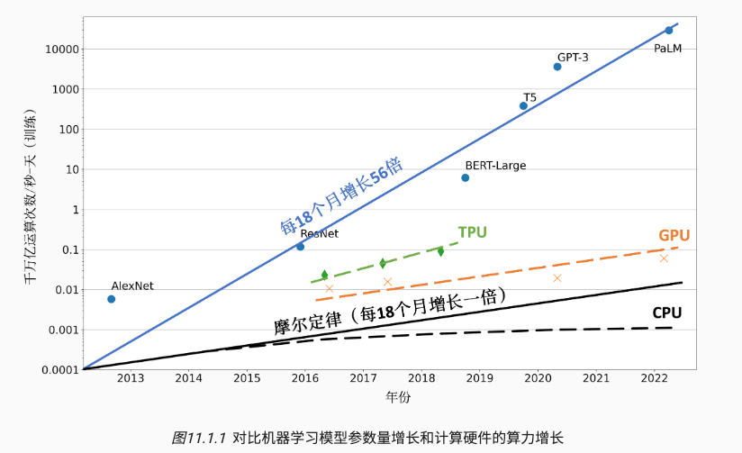
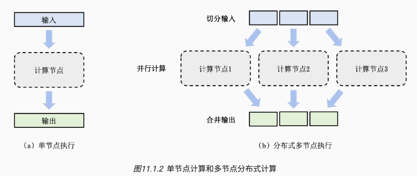

# Distributed Training System Overview

## 1 动机：解决单机性能瓶颈

随着模型大型化，比如目前的 Chatgpt 等大模型，其含有大量参数和复杂的结构。

大模型的训练过程需要海量的内存和计算资源，而单机性能明显不能满足。

所以需要构建分布式训练系统，将机器学习的任务拆分成为多个子任务，并且分配到多个计算节点，从而加速训练、解决计算瓶颈。

## 2 常见的分布式训练方法

- 数据并行
- 模型并行
- 流水线并行

## 3 常见的分布式训练框架实现

- 集合通信（Collective Communication）
- 参数式服务器（Parameter Servers）

### 算力不足

单处理器的算力不足是主要原因。

一个处理器的算力可以用每秒钟浮点数操作（Floating Point Operations Per Second，FLOPS）来衡量。

- 根据摩尔定律（Moore’s Law），中央处理器的算力每18个月增长2倍。
- 针对机器学习计算的计算加速卡(如GPU和TPU)也受限于摩尔定律，增长速度停留在每18个月2倍。
- 短短数年，机器学习模型从仅能识别有限物体的AlexNet，一路发展到在复杂任务中打败人类的AlphaStar。这期间，模型对于算力需求每18个月增长了56倍。

解决处理器性能和算力需求之间鸿沟的关键就在于利用分布式计算。



Tips: 李沐的分享提到

- 算力这块，可以用别的芯片做推理；做训练的话目前还是 Nvidia 的芯片垄断，还要等几年才能够用其他的芯片。

### 内存不足

训练机器学习模型需要大量的内存。

假设一个大型神经网络模型具有1000亿的参数，每个参数都由一个32位浮点数（4个字节）表达，存储模型参数就需要400GB的内存。

```
1000,0000,0000*4/1000/1000/1000 = 400 GB
```

实际上在训练中，需要存储参数、激活值和梯度，需要的参数量是 1200 GB。

而当前的硬件加速卡（如 Nvidia 的 A100）仅仅能够提供最高 80GB 的内存。

所以我们需要分布式训练系统来调度数百张训练加速卡，从而为千亿级别的模型提供 TB 级别的内存。（1 TB = 1000 GB）

Tips: 李沐的分享提到

- 你的模型大小就是 100B 到 500B 这个样子。我觉得比较好的一线的模型就是 500B，超过 500B 不是训练不动，而是做 serving 很难。在谷歌历史上，他们就没有让 500B 以上的模型上过线。OpenAI 没有对外说，但我觉得 OpenAI 历史上没有上线过有效大小超过 500B 的模型。

### 系统架构

依靠云计算数据中心（一个数据中心管理着数百个集群，每个集群可能有几百到数千个服务器。）

在数十台服务器上搭建起分布式训练系统，并行完成机器学习模型的训练任务。

如下图所示，一组数据（如训练样本）或者任务（如算子）作为输入，一个计算节点（如GPU）生成一组输出（如梯度）。

- 单机训练中，只有一个计算节点。
- 分布式多节点任务中，采用分治思想（Divide-and-Conquer），把任务切分成多个子任务去并行计算，最后合并得到和单机等价的结果。



### 分布式训练的优势

- 系统性能更强、训练速度更快

  - 一个分布式训练系统一般用“到达目标精度所需的时间”（Time-to-Accuracy）这个指标来衡量系统性能。这个指标由两个参数决定: （1）完成一个数据周期的时间，和（2）完成一个数据周期后模型所提升的精度。而增加并行计算节点会显著减少完成一个数据周期的时间。

- 减少成本，更经济
  - 单点的算力越高散热成本越高，因此在提供同等算力的条件下，组合多个节点是经济的方法。
    - 李沐的分享里有提到，他们目前还是用空气散热，不用水冷是因为担心水冷不可靠，漏水会毁了硬件。
  
- 避免单点错误
  - 机器学习训练集群往往由商用硬件（Commodity Hardware）组成，这类硬件（例如磁盘和网卡）运行一定时间就会产生故障。
  - 分布式训练中，即使出现单点错误，也可以把其子任务转给其他节点进行计算，而不影响模型的整体训练。


### 分布式训练的缺点

引入分布式系统的问题

- 容错
  - 李沐：GPU 供电不足导致不稳定；租了千张 H100，一样是各种 bug，GPU 每天都出问题。 
  - Llama 3 的技术报告说他们改用 H100 后，训练一次模型被打断几百次。
- 共识
- 网络问题
  - 带宽限制
    - 李沐：让芯片靠得更近一些
      1. 我们现在的带宽是一根光纤承载 400Gigabits，下一代就是 double，变成 800Gigabits。
      2. 一台机器传输到隔壁一米之外的机器所带来的几纳秒延迟，几乎是不能忍。我们自己去设计机房的时候会考虑光纤的长度，因为一米的差距就会给分布式训练带来一个可见的性能影响。
  - 网络故障
    - 李沐：由于光纤的切开角度不对，导致通信不稳定。
  - 网络布局
    - 李沐： Nvidia 的推荐网络布局不是最有效的

## 2）常见的分布式训练方法

- 数据并行
- 模型并行
- 流水线并行

## 3）常见的分布式训练框架实现

- 集合通信（Collective Communication）
- 参数式服务器（Parameter Servers）

## 参考

1. 开源书籍《机器学习系统：设计和实现》


