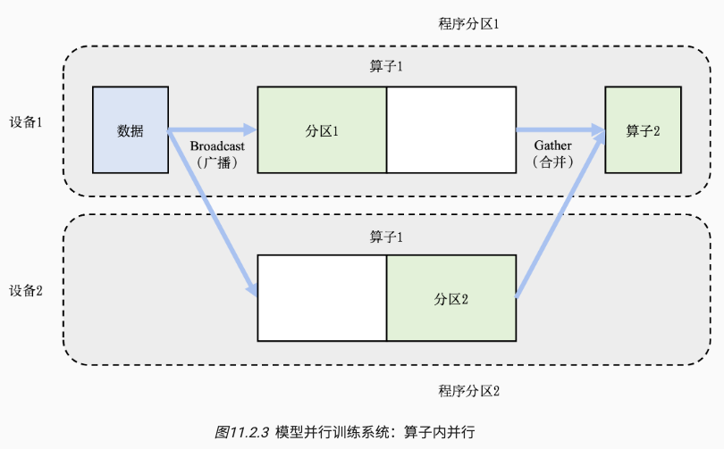

# Distributed Training Approaches

## 概述

目标是将单节点训练系统转换成等价的并行训练系统。

一个训练过程会由多个数据小批次（mini-batch）完成。

- 一个数据小批次被标示为数据。训练系统会利用数据小批次生成梯度，提升模型精度。这个过程由一个训练程序实现，其往往实现了一个多层神经网络的执行过程。
- 该神经网络的执行由一个计算图（Computational Graph）表示。这个图有多个相互连接的算子（Operator），每个算子会拥有计算参数。每个算子往往会实现一个神经网络层（Neural Network Layer），而参数则代表了这个层在训练中所更新的的权重（Weights）。

为了更新参数，计算图的执行分为前向计算和反向计算两个阶段。

- 前向计算的第一步会将数据读入第一个算子，该算子会根据当前的参数，计算出计算给下一个算子的数据，依次重复前向传递到最后一个算子。
- 反向计算中，每个算子依次计算出梯度（执行顺序：梯度3，梯度2，梯度1），并利用梯度更新本地的参数。反向计算结束标志了本次数据批次的结束，程序可以执行下一批数据继续更新。

在模型训练任务中，根据数据和程序的切分（Parttion），从而完成并行加速。

- 数据并行（Data Parallelism）：对数据进行分区，讲一个程序复制到多个设备上并执行。
- 模型并行（Model Parallelism）：对程序进行分区（模型中的算子会被分发给多个设备分别完成）
- 混合并行（Hybrid Parallelism）：训练超大型智能模型时，开发人员往往要同时对数据和程序进行切分，从而实现最高程度的并行

| 分类   | 单数据                 | 多数据                 |
| ------ | ---------------------- | ---------------------- |
| 单程序 | 单程序单数据: 单点执行 | 单程序多数据: 数据并行 |
| 多程序 | 多程序单数据: 模型并行 | 多程序多数据: 混合并行 |

## 数据并行

数据并行（Data Parallel）常用于解决单点算力不足的问题。

可见于各大训练框架中：TensorFlow DistributedStrategy、PyTorch Distributed、Horovod DistributedOptimizer等。

假设用户输入数据批大小为 N，并且希望使用 M 个并行设备来加速训练。

- 那么，这个数据会被分为 M 份，每个机器分配到 N/M 的数据。
- 每个机器的训练程序副本（网络参数）一致，独立执行，计算出局部梯度 Gi。
- 不同设备上对应的局部梯度 Gi（如设备1和设备2上各自的梯度1）会进行聚合，从而计算平均梯度。这个聚合的过程往往由集合通信的 AllReduce 操作完成。
- 平均梯度会用于修正模型参数，完成本批次训练。

## 模型并行（算子内、算子间并行）

模型并行（Model Parrallelism）常用于解决单点内存不足的问题。让每个设备负责更少的计算量，能够在内存容量的限制下完成前向计算和反向计算。

主要有两类

- 算子内并行（Intra-operator Parallelism）
  - 场景：模型中含有大型算子，例如深度神经网络中需要计算大量分类的全连接层。
  - 方案：把大型算子拆分到多个设备上，前向传播和后向传播也要做相应的变化（广播参数和合并参数）。
- 算子间并行（Inter-operator Parallelism）
  - 场景：模型的总内存需求超过了单设备的内存容量。
  - 方案：假如有 N 个算子和 M 个设备，可以将算子平摊到这 M 个设备上。让每个设备仅需负责 N/M 个算子的计算和内存开销。

算子内并行图里：假设一个神经网络具有两个算子，算子1的计算（包含正向和反向计算）需要预留16GB的内存，算子2的计算需要预留1GB的内存。而本例中的设备最多可以提供10GB的内存。为了完成这个神经网络的训练，需要对算子1实现并行。具体做法是，将算子1的参数平均分区，设备1和设备2各负责其中部分算子1的参数。

算子间并行图例：假设一个神经网络具有两个算子，算子1和算子2各自需要10GB的内存完成计算，则模型总共需要20GB的内存。而每个设备仅能提供10GB内存。用户可以把算子1放置在设备1上，算子2放置在设备2上。

## 混合并行

在训练大型模型时，常常会遇到内存和算力都不足的情况，此时需要做混合并行（数据并行+模型并行）。

在下图中

- 数据并行：上面的设备12和下面的设备34之间是数据并行，输入的数据被分区计算，最后执行 reduce，
  - 数据批次太大，单机算力不足，数据并行提高算力。
- 模型并行：设备1和2是模型并行，模型内的算子1、2被分到不同设备上。同理，设备3和4也是。
  - 模型太大，单机内存不足，模型并行解决内存瓶颈。
- 在前向计算的过程中，设备1和设备3上的算子1副本同时开始，计算结果分别发送（Send）给设备2和设备4完成算子2副本的计算。在反向计算中，设备2和设备4同时开始计算梯度，本地梯度通过AllReduce操作进行平均。反向计算传递到设备1和设备3上的算子1副本结束。

## 流水线并行

除了数据并行和模型并行以外，流水线并行是另一种常用的实现分布式训练的方法。

在大型模型并行系统中。这种系统通过算子内并行和算子间并行解决单设备内存不足的问题。

Problem: **模型并行气泡（Model Parallelism Bubble）**。

- 并行系统的运行中，计算图中的下游设备（Downstream Device）需要长期持续处于空闲状态，等待上游设备（Upstream Device）的计算完成，才可以开始计算，这极大降低了设备的平均使用率。这种现象称为模型并行气泡（Model Parallelism Bubble）。

Solution 为了减少气泡，通常可以在训练系统中构建流水线。

- 将训练数据中的每一个小批次划分为多个微批次（Micro-Batch）。假设一个小批次有 N 个训练样本，将其划分为 M 个微批次，那么一个微批次就有 N/M 个数据样本。每个微批次依次进入训练系统，完成前向计算和反向计算，计算出梯度。每个微批次对应的梯度将会缓存，等到全部微批次完成，缓存的梯度会被加和，算出平均梯度（等同于整个小批次的梯度），完成模型参数的更新。

在图例中

- 模型参数需要切分给4个设备存储。为了充分利用这4个设备，将小批次切分为两个微批次。
- 前向计算
  - 假设 Fi,j 表示第 j 个微批次的第 i 个前向计算任务。当设备 1 完成第一个微批次的前向计算后（表示为F0,0），会将中间结果发送给设备2，触发相应的前向计算任务（表示为F1,0）。与此同时，设备1也可以开始第二个微批次的前向计算任务（表示为 F0,1）。前向计算会在流水线的最后一个设备，即设备3（**捉虫，是不是设备4？**），完成。
- 后向计算
  - Bi,j 表示第 j 个微批次的第 i 个反向计算任务。在前向计算完成后设备4开始第一个微批次的后向计算 B3,0，完成后传递给设备 3 进行 B2,0，同时设备4开始计算第二个微批次的 B3,1 

其他

- 计算梯度往往需要前向计算中产生的激活值。经典模型会缓存激活值，反向计算直接用。但流水线训练系统中内存紧张，所以在反向计算中重新计算（Recomputation）。
- 流水线训练系统需要调试微批次的大小，从而达到最优的系统性能。当设备完成前向计算后，必须等到全部反向计算开始，在此期间设备会处于空闲状态。
  - 流水线气泡（Pipeline Bubble）：
    - 可以看到设备1在完成两个前向计算任务后，要等很长时间才能开始两个反向计算任务。这其中的等待时间即被称为流水线气泡（Pipeline Bubble）。为了减少设备的等待时间，一种常见的做法是尽可能地增加微批次的数量（批次小了），从而让反向计算尽可能早开始。 => 我理解是设备1虽然还是要等6个批次的计算时间，但批次小了，总体的等待时间也少了。。
    - 然而，使用非常小的微批次，可能会造成微批次中的训练样本不足，从而无法充分的利用起来硬件加速器中的海量计算核心。因此最优的微批次数量由多种因素（如流水线深度、微批次大小和加速器计算核心数量等）共同决定。