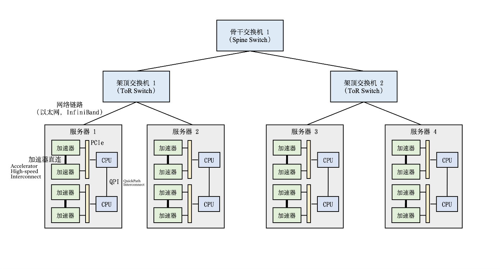

# Machine Learning Cluster Architecture

机器学习集群架构

- 在实际的机器学习集群中，实际带宽和峰值带宽的比值一般在1:4到1:16之间。因此如果将网络通信限制在机柜内，从而避免网络瓶颈成为了分布式机器学习系统的核心设计需求。
- 在计算集群中训练大型神经网络需要消耗多少网络带宽呢？假设给定一个千亿级别参数的神经网络（比如OpenAI 发布的大型语言模型GPT-3有最多将近1750亿参数），如果用32位浮点数来表达每一个参数，那么每一轮训练迭代（Training Iteration）训练中，一个数据并行模式下的模型副本（Model Replica）则需要生成700GB，即175G ∗ 4 bytes = 700GB，的本地梯度数据。
- 当前的机器学习集群一般使用以太网（Ethernet）构建不同机柜之间的网络。主流的商用以太网链路带宽一般在10Gb/s到25Gb/s之间。
- 新型机器学习集群（如英伟达的DGX系列机器）往往配置有更快的InfiniBand。单个InfiniBand链路可以提供100Gb/s或200Gb/s的带宽。
  - InfiniBand的编程接口以远端内存直接读取（Remote Direct Memory Access，RDMA）为核心，提供了高带宽，低延迟的数据读取和写入函数。
  - 人们可以用IPoIB (IP-over-InfiniBand)技术。这种技术确保了遗留应用（Legacy Application）可以保持Socket调用，而底层通过IPoIB调用InfiniBand的RDMA接口。
- 为了在服务器内部支持多个加速器，通行的做法是在服务器内部构建一个异构网络。
  - CPU之间通过QuickPath Interconnect (QPI)进行通信。
  - 在一个CPU接口（Socket）内，加速器和CPU通过PCIe总线（Bus）互相连接。
  - 由于加速器往往采用高带宽内存（High-Bandwidth Memory，HBM）。HBM的带宽（例如英伟达A100的HBM提供了1935 GB/s的带宽）远远超过PCIe的带宽（例如英伟达A100服务器的PCIe 4.0只能提供64GB/s的带宽）。
    - PCIe就会成为显著的通信瓶颈
    - 机器学习服务器往往会引入加速器高速互连（Accelerator High-speed Interconnect），例如英伟达A100 GPU的NVLink提供了600 GB/s的带宽，从而绕开PCIe进行高速通信。

> "异构网络" （Heterogeneous Network）是指在服务器内部通过不同类型的网络接口或拓扑结构，连接多个不同类型的硬件加速器（如GPU、FPGA、ASIC等）的网络架构。
>
> 这些加速器可能有各自不同的通信协议、数据传输带宽需求或拓扑结构，因此需要采用多样化的连接方式（如PCIe、NVLink、InfiniBand等）来构建一个能够高效协同工作的内部网络。这种网络被称为“异构网络”，因为它连接了异构（不同类型）组件，并且需要考虑如何高效地调度和管理这些不同组件之间的数据传输和通信。