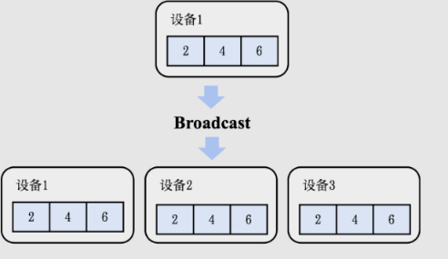

## Distributed Training Collective Communication

## 集合通信

作为并行计算的一个重要概念，集合通信经常被用来构建高性能的单程序流/多数据流（Single Program-Multiple Data, SPMD）程序。

接下来主要介绍如何使用 Allreduce 算法解决分布式训练系统的瓶颈，并且讨论 Allreduce 算法在不同网络拓扑下的差异和评价标准。

### 常见通信算子

- Broadcast
- Reduce
- AllReduce
- Gather
- AllGather
- Scatter

在分布式机器学习训练中，还有其他的集合算子，如ReduceScatter、Prefix Sum、Barrier、All-to-All等。


### 通信模型

在一个分布式机器学习的网络中，有 p 个计算设备，并有一个网络连接，每个设备都有独立内存，设备间通信通过点对点（P2P）网络通信完成。

- 每次通信只有一个发送者和接受者。一个设备某个时刻只能接收或发送一个消息。

- 传输一个 l 长的字节的消息需要花费 `a+b*l` 的时间

  - a 表示网络延时，这个值与网络的物理距离（如网线长度）有关，是发送消息时的固定延迟，不随消息长度变化。

  - b 表示每个字节的传输延时，这个值与网络带宽有关。

    > 传输延时是指发送方将消息的每个字节传输到网络介质上所需的时间。它通常与网络带宽相关联，表示数据从发送端开始传输到完全进入网络所需要的时间。

  - l 表示消息的长度，以字节为单位。

## 算子详解

### Broadcast



设有 p 个设备，正常来说要从一个设备传输数据到其他 p-1 个设备，时间复杂度为 `p-1`

更好的办法：分治思想，时间复杂度为 `logp`

- 第1次传输，设备 1 传输数据到第 p/2 的设备，接下来设备1 负责传输数据到 `1 ~ p/2-1` 的设备，而第 p/2 的设备负责传输数据到 `p/2 ~ p` 的设备
- 第2次传输，设备 1 传输数据到第 p/4 的设备，设备 p/2 传给第 3/4 的设备。再继续划分责权到目前有数据的四个设备上
- 。。
- 第 n-1 次传输， p/2 的设备各自传输到另外 p/2 的设备上
- 第 n 次传输，每个设备 i 都需要传输数据到 `[i,i]` 这个范围上的设备，达成临界条件，返回。

### Reduce


Reduce 算子要做的事情是把 p 个设备的数据进行聚合（Aggregation），聚合操作符合结合律（Associative Law）和交换律（Commutative Law），常见有加和、乘积、最大值和最小值函数。

设有 p 个设备，正常来说要从p-1个设备传输数据到1个设备，时间复杂度为 `p-1`

同样可以采用分治思想，时间复杂度为 `logp`

- `dp(target) = dp(1, n)`
- `dp(1, n) = f(dp(1, p/2-1) + dp(p/2, p))`

### AllRecuce


集合通信通过引入AllReduce算子，从而将Reduce函数𝑓的结果存至所有设备上。

结合 Reduce 和 Broadcast 算子，时间复杂度为 `logp`

1. 用 Reduce 算子把数据聚合到设备 1 上
2. 用 Broadcast 算子把数据从设备 1 传输到其他所有设备

### Gather


Gather算子可以将全部设备的数据全部收集（Gather）到编号为𝑖的设备上。

在收集函数（Gather Function）符合结合律和交换律的情况下，可以把 Reduce 算子的函数 f 改成 gather 函数实现。

但由于相对于每个单机上原有的数据规模 l，第 t 次传递的数据规模要乘以 `2^t`

所以时间复杂度为 `a*logp + (p-1)*b*l`

推导如下

- `a*logp + (1+2^1+...+2^logp)*b*l`
- `a*logp + (1-2^logp)/(1-2)*b*l`
- `a*logp + (1-p)/(1-2)*b*l`
- `a*logp + (p-1)*b*l`

### AllGather


形同 Gather 算子，不过其在 Gather 完之后需要把数据 Broadcast 到所有算子上

其时间复杂度为 Gather + Broadcast，时间复杂度为

- `a*logp + (p-1)*b*l` + `a*logp +logp*p*b*l` 因为在广播时，如果忽略链表/数组实现所带来的额外空间开销，每次通信的长度为`p*l`而不是`;`。
- 简化为 `a*logp+p*l*b*logp`
- 基于超立方体的算法还能优化成和 Gather 算子一样的复杂度 `a*logp + (p-1)*b*l`

### Scatter


Scatter 算子可以看成是 Gather 算子的逆运算，把一个存在于设备 i 上的长度为 p 的数据（信息长度为 `p*l`）的值分散到每个设备上。

和 Gather 类似，不过 Scatter 的分治是逐渐拆分数据，每个阶段 t 的数据大小为 `l*2^(m-t)` ，其中 m 是当前算法所运行的步骤。

算法复杂度也和 Gather 类似，为 `a*logp + (p-1)*b*l`

在机器学习系统中，Scatter算子经常同时被用于链式数据结构和可切分的数据结构，例如张量在一个维度上的p等分等。

## 基于AllReduce的梯度平均算法

可以考虑通过 AllReduce 算子，结合 Reduce 和 Broadcast 算子，时间复杂度为 `logp`。

但这种简单的方法存在如下问题：

- 在 Reduce 算子中负责收集所有数据的设备的算力有限，不能够高效计算出所有的平均梯度。

为了解决这个问题，可以引入AllReduce算子的Reduce-Broadcast实现来优化算法。


AllReduce算子会把梯度的计算拆分成 `M-1` 个Reduce算子和 `M-1` 个Broadcast算子（其中𝑀是节点的数量）。其中，Reduce算子用于计算出梯度的加和，Broadcast算子用于把梯度之和广播给全部的节点。

Reduce算子对梯度的分布式计算实现了以下的性能优化:

- 网络优化： 全部设备都同时在接收和发送数据，利用起了每个设备的入口（Ingress）和出口（Egress）带宽。因此在AllReduce算法的过程中，可利用的带宽是 `M*B`，其中 `M` 是节点数量，`B` 是节点带宽，从而让系统实现网络带宽上的可扩展性。
- 算力优化： 全部设备的处理器都参与了梯度相加的计算。因此在AllReduce算法的过程中，可利用的处理器是 `M*P`，其中 `M` 是节点数量，`P` 是单个设备的处理器数量，从而让系统实现计算上的可扩展性。
- 负载均衡： 由于数据分区是平均划分的，因此每次设备分摊到的通信和计算开销是相等的。

上图是AllReduce的其中一种常用实现方法。根据集群网络拓扑的不同，人们也会用以下的方法来实现AllReduce：树形结构，环形结构，二维环面结构以及CollNet。在此我们不展开讨论。

## 集合通信算法性能分析 (TODO)

上面我们有提到带宽 `b`，它又是如何计算的呢？

- 算法带宽，即计算从一个设备计算发送数据到另一个设备的带宽 `b=s/t`，s 是操作的大小，t 是传输操作的两个端点之间所经过的时间。

虽然算法带宽的计算方法既简单又高效，但很难将其拓展至对于集合通信算子的带宽计算。取决于具体算子和算法实现的不同，一个集合通信算子在执行过程中测得的算法带宽往往会远小于硬件本身的最高带宽。

为了解决这一问题，NCCL提出了总线带宽（Bus Bandwidth）这一数值化指标

## 利用集合通信优化模型训练的实践

针对不同的集群，机器学习系统往往会灵活组合不同集合通信算子来最大化通信效率。

下面提供两个案例分析：ZeRO和DALL-E。

### ZeRO

ZeRO是微软提出的神经网络优化器，在实践中成功训练了2020年世界上最大的语言模型（高达1700亿参数）。

难点

- 内存需求极大：通过简易的计算不难得出，1700亿参数的模型在32位浮点表示情况下会占用至少680GB的内存，远超于现在内存最高的加速器A100 （最高内存80GB）。需要考虑如何高效地把模型切成数份存储在不同的加速器上，以及如何高效地通过使用集合通信算子来进行模型训练和推理。

主要的优化技术

- 将数据切片参数存在单一节点上，尽量减少节点间的通信。通过观察得知，模型间不同切片之间要进行的通信远小于模型副本梯度平均的通信量。
- 基于 AllGather 的前向计算。在前向时，可以注意到某一层的计算仅依赖于其相邻层的参数。对此，可以对所有包含模型参数的加速器进行一次AllGather计算，用来提取每一层的后一层的参数，以及计算该层本身的激活值。
- ReduceScatter 用于在反向传播时计算梯度。反向计算时只需要前一层的参数来计算本层的激活值和梯度，因此只需要再次使用AllGather来完成每个加速器上的梯度计算。可以使用ReduceScatter算子直接把相应的梯度存到编号为 `i` 的加速器上，而不是通常情况下使用AllReduce算子。

### DALL-E

DALL-E是OpenAI提出的一个基于文字的图片生成模型，模型同样拥有高达120亿的参数。

除了运用到ZeRO所使用的AllGather + ReduceScatter 技巧，OpenAI团队在其他细节上做了进一步的优化。

- 矩阵分解： 集合通信算子的运行速度和信息本身的长度正相关。DALL-E 选择用矩阵分解（Matrix Factorization）的方法先把高维张量调整为一个二维矩阵，通过分解后分开用集合通信算子进行传输，从而大大减少了通信量。
- 自定义数据类型
  - 使用16位的半精度浮点数，相比正常的32位参数表示可以节省近一倍的通信量。但实践中发现低精度的数据类型会使得模型收敛不稳定，导致最终训练效果大打折扣。
  - OpenAI分析了DALL–E的模型结构，并把其中的参数根据对数据类型精度的敏感性分为了三类。
    - 对精度最敏感的一类照常使用32位浮点表示并只通过AllReduce算子来同步
    - 比较敏感的一类，例如Adam优化器其中的动能（Moments）和方差（Variance）参数，OpenAI 基于 IEEE 754 标准实现了两个全新的数据类型，在节省空间的同时保证了训练的收敛。
    - 最不敏感的参数则照常通过矩阵分解进行压缩和传输。

## 集合通信在数据并行的实践

数据并行作为最广泛使用的分布式训练方法，是集合通信首先需要支持的范式。

有两个级别的抽象

1. 机器学习系统更与硬件耦合，可以直接调用集合通信算子的库。如 PyTorch

2. 机器学习系统更偏向神经网络实现，通过内部调用集合通信算子实现分布式训练和推理的机器学习框架。如 Gloo、NCCL、MPI
   1. 作为算法工程师，通常会接触到后者的抽象（包括Horovod、KungFu、TensorFlow Distributed等），而作为集群的维护者，往往需要深入了解前者的运行原理和具体的调试方法。

以 PyTorch 举例，在torch.distributed 命名空间（Namespace）下实现了一系列方便开发者使用的分布式模型训练和推理函数。在其内部，会根据实际运行的集群调用更底层的集合通信算子库，例如MPI，NCCL（前面已有介绍，适用于GPU分布式训练），Gloo（适用于CPU分布式训练）等。

下面代码通过PyTorch自带的分布式数据并行（Distributed Data Parallel，DDP）完成了一个简单的机器学习模型计算。PyTorch Distributed并没有显式地调用集合通信算子，而是将分布式训练隐藏了起来。如果需要在不同集群上运行这段代码，只需要在setup 函数内对应地更改PyTorch使用的底层集合通信库即可。

```python
# 基于PyTorch DDP高层次封装实现AllReduce算法

def ddp_allreduce(rank, world_size):
    setup(rank, world_size)

    model = ToyModel().to(rank)
    # 通过调用DDP（分布式数据并行）方法将模型在每个处理器上完成初始化
    ddp_model = torch.nn.parallel.DistributedDataParallel(model, device_ids=[rank])

    loss_fn = nn.MSELoss()
    optimizer = optim.SGD(ddp_model.parameters(), lr=0.001)

    optimizer.zero_grad()
    outputs = ddp_model(torch.randn(20, 10))
    labels = torch.randn(20, 5).to(rank)

    # 在反向计算时，框架内部会执行AllReduce算法
    loss_fn(outputs, labels).backward()
    optimizer.step()
```

下面代码通过Gloo的Python 接口pygloo和Ray完成了一个二维张量的AllReduce计算。需要一步一步地创建通信所需要的数据结构，同时也很难和现有的模型训练框架无缝连接。

```python
# 基于pygloo底层接口实现AllReduce算法

@ray.remote(num_cpus=1)
def gloo_allreduce(rank, world_size):
    context = pygloo.rendezvous.Context(rank, world_size)
    ...

    Sendbuf = np.array([[1,2,3],[1,2,3]], dtype=np.float32)
    recvbuf = np.zeros_like(Sendbuf, dtype=np.float32)
    Sendptr = Sendbuf.ctypes.data
    recvptr = recvbuf.ctypes.data

    # 标明发送者和接收者并直接调用AllReduce算法
    pygloo.allreduce(context, Sendptr, recvptr,
                    Sendbuf.size, pygloo.glooDataType_t.glooFloat32,
                    pygloo.ReduceOp.SUM, pygloo.allreduceAlgorithm.RING)
```

## 集合通信在混合并行的实践(TODO)

前几节已总结当前常用的分布式并行训练技术方案，如数据并行、模型并行和流水线并行，在复杂场景下，往往需要不同技术点组合使用，才能达到训练大模型的高性能。


MindSpore能够自动识别不同切分方式的算子之间应该插入哪种集合通信算子，并且将该逻辑对用户隐藏。开发者可以通过合理的策略配置，来减少算子间重排布通信算子在神经网络计算图中的占比，以提升混合并行分布式训练的端到端速率。
