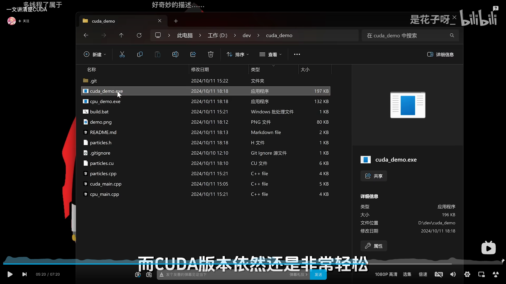

# GPU

基本概念

1. GPGPU（General-purpose Graphic Processing Unit）图形处理器通用计算
2. CUDA（Compute Unified Device Architeture）
3. 一般使用TFLOPS（Tera Floating Point Operations Per Second）来衡量GPU的浮点计算能力
4. 使用CUDA计算的大量重复性粒子轨迹计算比CPU计算快得多

