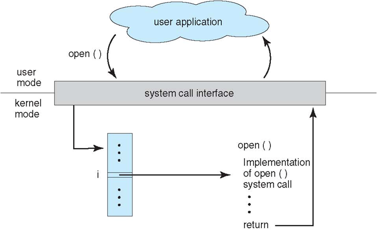
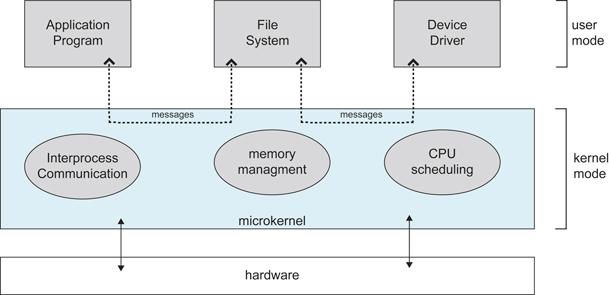

# Operating System Overview

## Basic Features

### 1. Concurrency

Concurrency means that system can run several programs at a time, while parallel means multiple operations can be run at a time.

Parallel needs hardware support, such as the pipeline, multi-cores processor, or distributed system.

Operating System introduces the process and thread to allow concurrency.

### 2. Sharing

The system's resources can be used by multiple processors in parallel.

There are two types of sharing: mutual exclusive sharing and simultaneous sharing.

Exclusive shared resources are called critical resources, such as printers, which only allow one process to access at a time. Synchronization mechanisms are needed to achieve mutually exclusive access.

### 3. Virtualization

Virtualization converts a physical entity into multiple logical entities.

There are two virtualized techniques: 

- Time-division multiplexing: Several processes can be executed in a processor. Each process takes turns occupying the processor, executes a small slice of time at a time, and switches quickly.
- Space-division multiplexing: Virtual Memory, which abstracts physical memory into address space, with each process having its own address space. Pages in address space are mapped to physical memory. The pages in the address space do not all need to be in physical address, when a page that is not in physical memory is used, a page replacement algorithm is performed to replace the page into memory.

### 4. Asynchronization

The process does not end/complete at once but walks and stops, moving at an unknowable speed.

## Basic Functionalities

### 1. Process Management

- Process Control
- Process Synchronization
- Process Communication
- Deadlock Handling
- Process Scheduling

### 2. Memory Management

- Memory Allocation
- Address Mapping
- Address Protection and Sharing
- Virtual Memory

### 3. File Management

- File Storage Space Management
- Directory Management
- File Write/Read Management and Protection

### 4. Device Management

- I/O Operation Management
- Cache Management
- Devices Allocation
- Devices Operation
- Virtual Devices Management

## System Call

If a process in user mode needs to use kernel mode functions, it makes a system call to trap into kernel, allowing the operating system to complete the task on its behalf.

Linux's main System Calls

|          Task           | Commands                    |
| :---------------------: | --------------------------- |
|     Process Control     | fork(); exit(); wait();     |
|  Process Communication  | pipe(); shmget(); mmap();   |
|     File Operation      | open(); read(); write();    |
|    Device Operation     | ioctl(); read(); write();   |
| Information Maintenance | getpid(); alarm(); sleep(); |
|        Security         | chmod(); umask(); chown();  |

## Kernel

### 1. Monolithic Kernel

A monolithic kernel integrates all operating system functions into a tightly coupled unit within the kernel.

It offers very high performance as the modules share information.

### 2. Micro Kernel

As the operating system becomes more complex, some of the OS functions are moved out of kernel to reduce its complexity. The moved-out parts are divided into several services according to the layering principle, and these services operate independently of each other.

In the microkernel architecture, the operating system is divided into small and well-defined modules. Only the micro kernel is running in kernel mode, remaining modules run in user mode.

Due to frequent switching between user mode and kernel mode, there is certain performance loss.

## Interrupt

Hardware Interrupt and Software Interrupt

### 1. Externel Interrupt

External Interrupt is caused by events outside the CPU's instruction, such as I/O complete interrupts, which indicates the device Input/output processing  has been completed, and the processes can send the next I/O request. Other example include clock interrupts, cosole interrupts, etc.

### 2. Exception

The exception is caused by internal events during CPU's instruction execution, such as illegal operation codes, address violations, arithmetic overflows, etc.

### 3. Traps

The traps is used while programs makes System Call in user mode.

