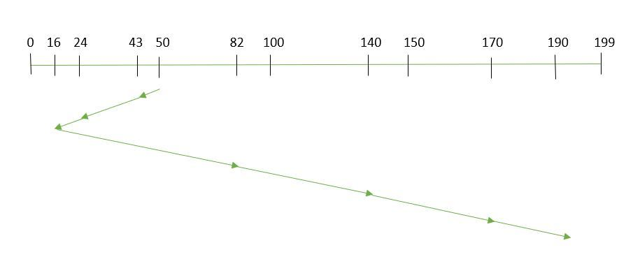

# Device Management

## Disk Structure

- **Platter (盘面)**: One disk has several platters.
- **Track (磁道)**: A circular band on the surface of a disk. A disk surface can have multiple tracks.
- **Track Sector (扇区)**: An arc segment of a track. A track can have multiple sectors, and it is the smallest physical storage unit, commonly available in sizes of 512 bytes and 4 KB.
- **Head (磁头)**: Positioned very close to the disk surface, it converts the magnetic field on the disk surface into electrical signals (read) or converts electrical signals into the magnetic field on the disk surface (write).
- **Actuator arm (制动手臂)**: Moves the head between tracks.
- **Spindle (主轴)**: Rotates the entire disk surface.

## Disk Scheduling Algorithm

The following are key factors to read/write a disk block.

- **Rotation Time.** The time taken for the spindle to rotate the disk so that the magnetic head moves to the appropriate sector.
- **Seek Time.** The time taken for the actuator arm to move the read/write head to the appropriate track.
- **Actual Data Transfer Time.**

Among these, seek time is the longest. Therefore, the primary goal of disk scheduling is to minimize the average seek time.

There are many scheduling algorithms, we will discuss the important ones.

### 1. First Come First Served (FCFS)

FCFS is the simplest soluttion.

The requests are processed based on the time they arrive in the disk time.

Pros:

1. Fair for each requests.
2. No indefinite delay

Cons:

1. The average seek time is high because it does not try to optimize the seek time.

The following is an example. 

- The current position of head is: `50 `
- Suppose the order of request is `[82,170,43,140,24,16,190]`

- So, total overhead movement  (total distance covered by the disk arm) = `(82-50)+(170-82)+(170-43)+(140-43)+(140-24)+(24-16)+(190-16) = 642`

### 2. Shortest Seek Time First (SSTF)

Prioritize the request which is nearest to the current head. 

Pros:

1. The average seek time decreases.
2. Throughput increases.

Cons:

1. Overhead to calculate seek time in advance
2. Not fair. Can cause starvation for a request with high seek time as compared to newly incoming requests.

In the following example:

- The current position of head is: `50 `
- Suppose the order of request is `[82,170,43,140,24,16,190]`

- So, total overhead movement  (total distance covered by the disk arm) = `(50-43)+(43-24)+(24-16)+(82-16)+(140-82)+(170-140)+(190-170) = 208 `

### 3. Elevator Algorithm (SCAN)

The elevator always moves in the same direction, and changes the moving direction until there are no requests in the current direction.

Pros:

1. Average response time
2. High throughput
3. Low variance of response time
4. Resolve the starvation problem in the Shortest Seek Time First algorithm (SSTF)

Cons:

1. Long waiting time for the requests with location which was just visited.

In the following example:

- The current position of head is: `50 `
- Suppose the order of request is `[82,170,43,140,24,16,190]`

- So, total overhead movement  (total distance covered by the disk arm) = `(199-50) + (199-16) = 332`

## Reference

1. [Disk Scheudling Algorithm](https://www.geeksforgeeks.org/disk-scheduling-algorithms/)
2. [Device Management](https://www.cyc2018.xyz/%E8%AE%A1%E7%AE%97%E6%9C%BA%E5%9F%BA%E7%A1%80/%E6%93%8D%E4%BD%9C%E7%B3%BB%E7%BB%9F%E5%9F%BA%E7%A1%80/%E8%AE%A1%E7%AE%97%E6%9C%BA%E6%93%8D%E4%BD%9C%E7%B3%BB%E7%BB%9F%20-%20%E8%AE%BE%E5%A4%87%E7%AE%A1%E7%90%86.html#_2-%E6%9C%80%E7%9F%AD%E5%AF%BB%E9%81%93%E6%97%B6%E9%97%B4%E4%BC%98%E5%85%88)

