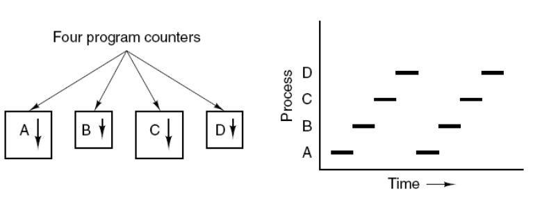
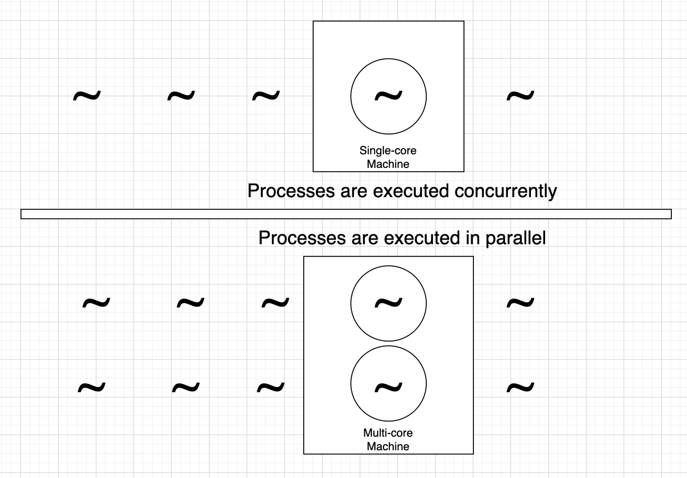
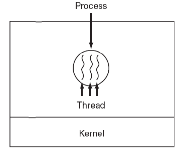
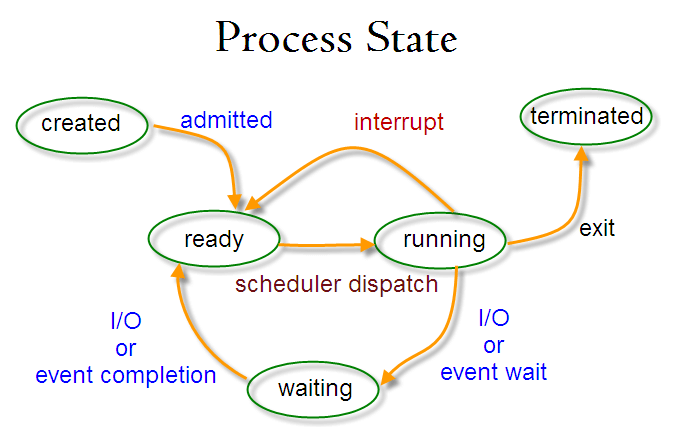
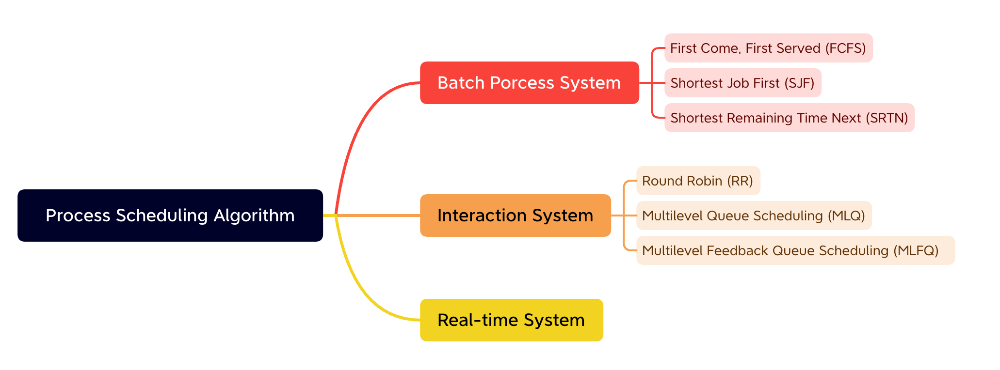

# 操作系统进程管理 Process Management

## Process and Thread

### Process

Process is the basic unit of resource allocation.

Process Control Block describes the basic info and running state of process. The so-called creation and switch of process, are operations to PCB.

In the following pic, four programs create four processes, that are executed concurrently.

> **Concurrency** is when two or more tasks can start, run, and complete in overlapping time **periods**. It doesn't necessarily mean they'll ever both be running **at the same instant**. For example, *multitasking* on a single-core machine.
>
> **Parallelism** is when tasks *literally* run at the same time, e.g., on a multicore processor.

### Thread

Thread is the basic unit of scheduling.

One process can have multiple threads, they share the resources of process.

For example:

1. `Chrome` and `iTerm` are two processes.
2. There are many threads in `Chrome` for different purposes, such as the HTTP request thread, rendering thread, event resposing thread. These threads can be executed concurrently, so it allows rendering the page while requesting HTTP resources.

### Diff between Thread and Process

1. Resources
   1. Process: The basic unit of resource allocation.
   2. Thread: Does not own the resources; Can share the data in the same process.
2. Scheduling
   1. Process: The switch of process will cause the switch of PCB.
   2. Thread: The basic unit of schedule. The switch of threads in same process does not cause switch of PCB.
3. Overhead
   1. Porcess: The overhead of creation, switch, and close of a process is high. The system needs to allocate memory space, I/O devices, etc.
   2. Thread: The effort taken to create/cancel a thread is more smaller than that of process.
4. Communication
   1. Process: Use IPC (Inter-process Communication)
   2. Thread: Read/Write the data of one process to communicate.

## Process Status Switching

Status

1. Created
2. Ready. 
   1. Ready to run.
3. Running
4. Waiting. 
   1. Hang on, waiting for resources.
5. Terminated

Note

1. Only `ready` and `running` statues can transition to each other. The process in  `running` status will transition to `ready` while it runs out of allocated CPU time. In converse, a `ready` process will transition to `running` while it is allocated CPU time.
2. Transition from `Running` to `waiting` is because of lacking neccesary resources, excluding CPU time. A shortage of CPU time will cause a transition from `running` to `ready`.

## Process Scheduling Algorithm

A process scheduling algorithm is to schedule the process to be assigned to CPU to execute. Likewise, 

The goal of the scheduling algorithm is different for different systems.

### Goals of Different Systems

1. **Batch Processing System**
   1. Batch processing systems have minimal user interaction. In these systems, the goal of the scheduling algorithm is to ensure throughput and turnaround time (the time from submission to completion).
2. **Interaction System**
   1. An interaction system needs to process numerous user operations and thus requires quick response time.
3. **Real-time System**
   1. A real-time system requires a request to be responded to within a definite time frame.
   2. Real-time systems are divided into hard real-time and soft real-time. The former needs to meet absolute deadlines, while the latter can tolerate some delays.

There are six popular process scheduling algorithms.

1. First Come, First Served (FCFS)
2. Shortest Job First (SJF)
3. Shortest Remaining Time Next (SRTN)
4. Round Robin (RR)
5. Multilevel Queue Scheduling (MLQ)
6. Multilevel Feedback Queue Scheduling (MLFQ)

### 1. First Come First Served (FCFS)

### 2. Shortest Job First (SJF)

### 3. Shortest Remaining Time Next (SRTN)

### 4. Round Robin (RR)

### 5. Multilevel Queue Scheduling (MLQ)

### 6. Multilevel Feedback Queue Scheduling (MLFQ)

## Process Synchronization

1. Critical Section （临界区段）
2. Synchronization and Mutual Exclusion
3. Semaphore
4. Monitors （管程）

## Typical Synchronization Problem

### Dining Philosophers Problem

> 五个哲学家围着一张圆桌，每个哲学家面前放着食物。哲学家的生活有两种交替活动：吃饭以及思考。当一个哲学家吃饭时，需要先拿起自己左右两边的两根筷子，并且一次只能拿起一根筷子。

Background:

Five philosophers are sitting around a round table, there is food in front of each philosopher. Philosopher needs to take both of the chopsticks to start eating, and they can take up only one chopstick at a time.

1. The problem is that, while one philosopher took one chopstick

Dining Philosophers Problem

1. Several philosophers are at the same table and ready to eat.
2. There is one chopstick on their right-hand and left-hand side.
3. Each person needs to take both of chopsticks to start eating.
4. The problem is that, while one philosopher took one chopstick

### Consumer-Producer Problem

Todo

## Inter-Process Communication

1. Pipe
2. FIFO Pipe
3. Message Queue
4. Shared Storage
5. Socket

## FAQ

1. 

## Reference

1. [time.sleep -- sleeps thread or process?](https://stackoverflow.com/questions/92928/time-sleep-sleeps-thread-or-process)
2. [Process Scheduling in Operating Systems: Balancing Efficiency and Fairness](https://www.linkedin.com/pulse/process-scheduling-operating-systems-balancing-efficiency-aritra-pain/)
3. [Inter-process Communication](https://en.wikipedia.org/wiki/Inter-process_communication)
4. [Dining Philosophers Problem](https://en.wikipedia.org/wiki/Dining_philosophers_problem)
5. [Operating System Scheduling algorithms](https://www.tutorialspoint.com/operating_system/os_process_scheduling_algorithms.htm)