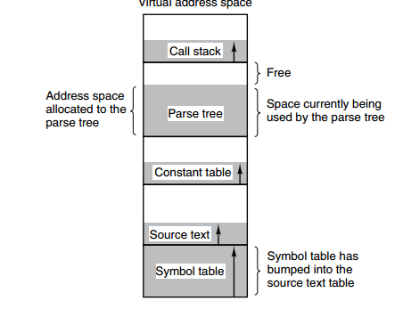

# 操作系统内存管理 Memory Management

## Virtual Memory

## Segmenting

Virtual memory applies the paging techniques, i.e. split the address space into fixed-size pages, and each page maps to memory.

The following are several tables created by the complier, four tables increase dynamically. If the paging system is using 0-indexed address space, one table's increasing space will overlap others.

Segmenting technique is to segment each table, one segment composed as an individual address space. The length of each segment can be different and can dynamically increase.

## Segment Page

程序的地址空间划分成多个拥有独立地址空间的段，每个段上的地址空间划分成大小相同的页。这样既拥有分段系统的共享和保护，又拥有分页系统的虚拟内存功能。

## 分页与分段的比较

- 对程序员的透明性：分页透明，但是分段需要程序员显式划分每个段。
- 地址空间的维度：分页是一维地址空间，分段是二维的。
- 大小是否可以改变：页的大小不可变，段的大小可以动态改变。
- 出现的原因：分页主要用于实现虚拟内存，从而获得更大的地址空间；分段主要是为了使程序和数据可以被划分为逻辑上独立的地址空间并且有助于共享和保护。

## Reference

1. [Memory Management](https://www.cyc2018.xyz/%E8%AE%A1%E7%AE%97%E6%9C%BA%E5%9F%BA%E7%A1%80/%E6%93%8D%E4%BD%9C%E7%B3%BB%E7%BB%9F%E5%9F%BA%E7%A1%80/%E8%AE%A1%E7%AE%97%E6%9C%BA%E6%93%8D%E4%BD%9C%E7%B3%BB%E7%BB%9F%20-%20%E5%86%85%E5%AD%98%E7%AE%A1%E7%90%86.html#%E5%88%86%E6%AE%B5)