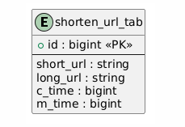

# Distributed URL Shortener

分布式、高性能短链生成服务

## 需求

1. 生成 URL 操作，写操作，每天 100M 次（每秒约 1160 次）
2. 根据短链读长链，读操作，假设为写的 10 倍，即每天  1B 次（每秒约 11600 次）
3. 假设
   1. 系统要运行 10 年，那总共生成需要 `10*365*100M = 365B` 个不冲突的 URL ID 
   2. 平均输入的 URL 长度是 100 bytes，那么 10 年的存储需求为 `100*365B~=3650TB`

## 系统架构和流程图

实体：用户、服务器、数据库、缓存、负载均衡器，etc。

1. 生成短链
   1. 用户请求生成短链 API，参数是长链
   2. 如果缓存和数据库中有该长链记录，则返回 error_duplicate
   3. 系统使用哈希算法生成相应的短链，存储记录（ID，长链，短链）数据库中，也许可以更新到缓存中
   4. 返回短链
2. 请求长链
   1. 用户请求短链重定向 API，参数是短链
   2. 如果缓存有该短链记录则返回对应长链
   3. 如果查询数据库有该短链记录则返回对应长链、刷新缓存，否则返回 error_not_found
   4. 返回长链，且 HTTP `301` 或 `302` 重定向到长链

> TODO: 系统架构图、序列图

## 细节设计

### 1）接口设计

REST-Style API

1. REST 中所有的内容都被视为资源，每个资源通过一个唯一的 URI
2. REST API 通常使用标准的 HTTP 方法（动词）来操作资源
3. 每个请求都是独立的、无状态的，这意味着服务器不会存储客户端的状态

API 设计

1. 生成短链 API
   1. `POST api/v1/data/shorten`
   2. request: long_url(string)
   3. response: shorten_url(string)
2. 短链重定向 API
   1. `GET api/v1/shorten_url`
   2. request: shorten_url(string) in the HTTP url
   3. response: long_url(string)

### 2）短链生成 URL shortening

需求

1. 每个长链都能够映射到一个短链
2. 每个短链都能够映射回长链

需要一个短链生成方法，一般使用哈希函数来完成这个事（下面详解）

- 哈希函数 `hash(long_url)=shorten_url`

> TODO: 图

### 3）URL 重定位 redirect

``GET api/v1/shorten_url`` 使用 HTTP response 的 status code 301 来进行长链的重定向

- `301` 代表永久重定向（permanent redirecting），客户端会记住这个重定向响应，后续对短链 API 的请求会自动重定向到长链上
  - 优点：节约服务资源
  - 缺点：短链服务器无法跟踪每次短链的请求，无法即时失效长链
- `302` 代表暂时重定向（temporary redirecting），客户端不会记住响应，每次都会重新请求服务器获得长链。
  - 优点：短链服务器可以跟踪每次短链的请求，可以即时失效长链
  - 缺点：消耗服务资源

### 4）短链生成方法（哈希方法）

常见方法

1. 哈希函数（带碰撞检测）
1. base62 编码

哈希函数

1. 组成：`[0-9,a-z,A-Z]` 总共 62 位，所以只需要生成 7 位，就可以支持 `62^7~= 3.5Trillion` 个哈希值，超过需求的 `365B` 个不同短链
2. 生成方法：crc32, md5, sha-1 等
3. 使用
   1. 由于生成的哈希值可能会超过 7 位，我们需要截断前 7 位哈希值
   2. 引入碰撞检测：由于前 7 位可能会碰撞，我们可以加上预先定好的 string 或数字，重新生成哈希
   3. 由于碰撞检测要查 DB 是否存在值，我们可以引入布隆过滤器（Bloom Filter）来提高检测的性能。

> TODO：流程图

base62 编码

1. 组成：`[0-9,a-z,A-Z]` 总共 62 位
2. 生成方法：不断模除 62，每次的余数都映射成 `[0-9,a-z,A-Z]` ，直到余数为 0
3. 使用
   1. 由于 base62 接受的输入是数字，我们需要使用唯一ID生成器给每个长链生成ID（要存到数据库的id键中）
   2. 基于这个ID，来

> base62 与 base 64 区别：
>
> 1. Base64 使用 64 个字符，除了包括 `A-Z`、`a-z`、`0-9`，还加上两个特殊字符 `+` 和 `/`。编码结果有时还会在末尾加上 `=` 作为填充
> 2. Base64 编码效率高，Base62 效率略低
> 3. Base64 编码将输入的二进制数据每 3 个字节（24 位）分成 4 组，每组 6 位。每个 6 位的组对应 Base64 字符集中的一个字符。不满三个字节使用 `=` 填充。

> TODO: 流程图

哈希函数和 base 62 的对比

| 方法                   | 哈希（碰撞检测） | base62 编码    |
| ---------------------- | ---------------- | -------------- |
| 是否固定长度           | YES              | NO             |
| 是否需要ID生成器       | No               | YES            |
| 是否需要解决碰撞       | YES              | NO             |
| 是否可以猜出下一个短链 | NO               | 取决于ID生成器 |

## 5）数据库设计

短链存储方式（老生常谈）

1. 单机内存中的哈希表，比如 golang 的 map，python 的 dict
2. 缓存、数据库

数据库表 `shorten_url_tab`，有三个 columns

1. id, primary key, bigint
2. short_url, string
3. long_url, string
4. c_time, bigint (if need)
5. m_time, bigint (if need)

其中 id 是否是自增（auto_increment），取决于

- 是否使用 base62 这类需要唯一 ID 生成的哈希方法
- 是否对可扩展、高性能、单点容错有需求

## 性能需求

重看开始的需求

1. 生成 URL 操作，写操作，每天 100M 次（每秒约 1160 次）
2. 根据短链读长链，读操作，假设为写的 10 倍，即每天  1B 次（每秒约 11600 次）
   1. 答：这两个需求可以通过服务器和数据库的垂直扩展、水平扩展，引入缓存、引入CDN、引入负债均衡达到
3. 假设
   1. 系统要运行 10 年，那总共生成需要 `10*365*100M = 365B` 个不冲突的 URL ID
      1. 已经在哈希函数中解答了：`[0-9,a-z,A-Z]` 总共 62 位，所以只需要生成 7 位，就可以支持 `62^7~= 3.5Trillion` 个哈希值，超过需求的 `365B` 个不同短链
   2. 平均输入的 URL 长度是 100 bytes，那么 10 年的存储需求为 `100*365B~=3650TB`
      1. 答：考虑数据库的垂直扩展、水平扩展，基于ID sharding。引入分布式数据库等等。

## Reference

1. System Design Interview by Alex
1. Bloom Filter
1. Hash Function
1. base62
1. base64
1. Unique ID Generator
