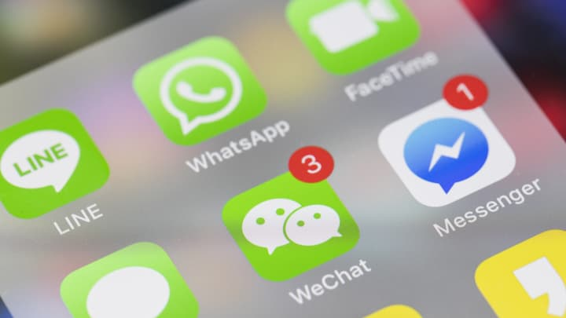
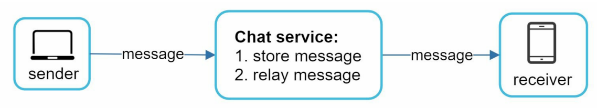
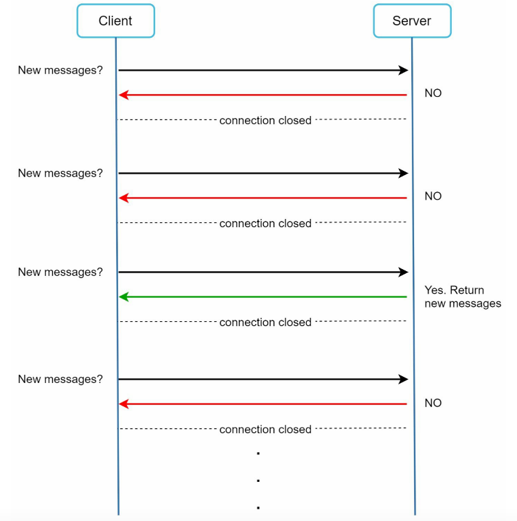
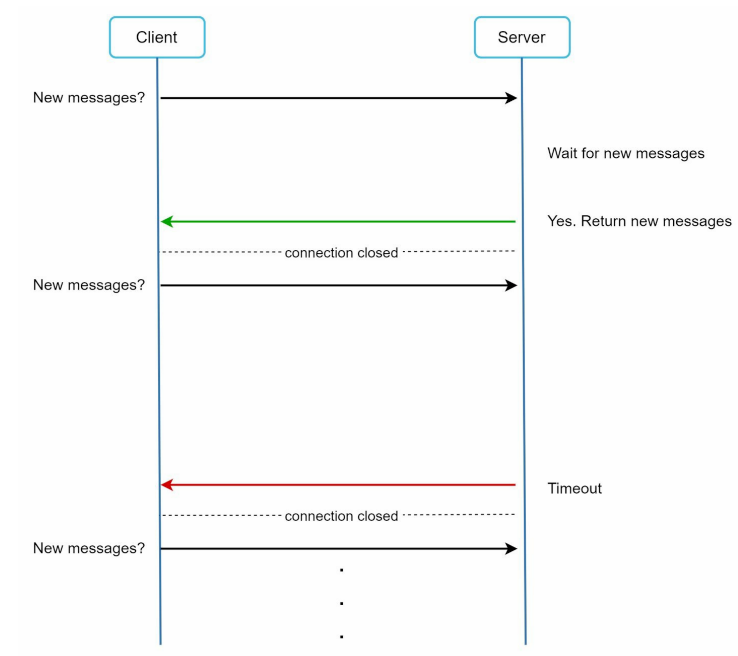
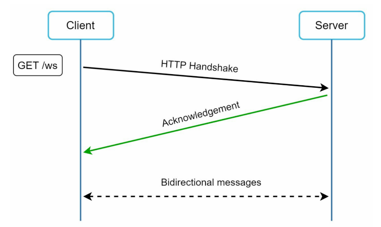
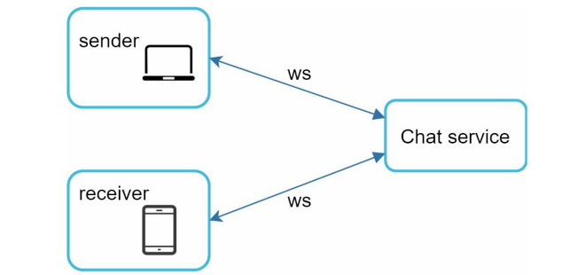
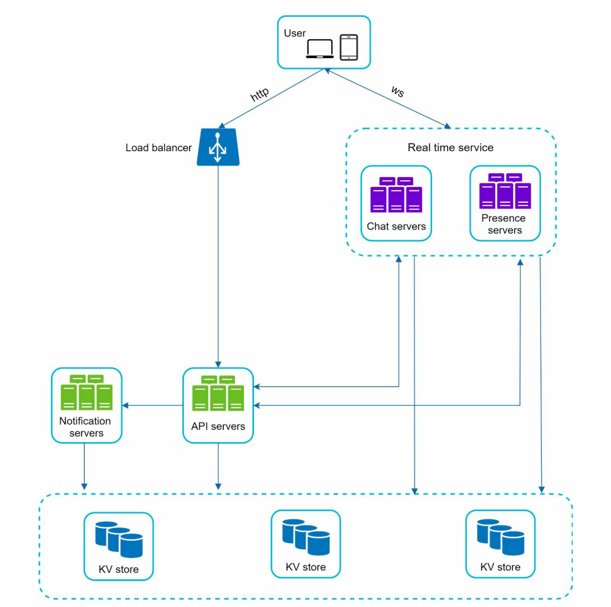

In this article, we will explore the design of chat system.

## The questions to the scope

1. Is the chat app 1 on 1 or group based?
2. Mobile app? Or web app? Or both?
3. What's the scale of the app? A startup app or massive scale?
4. Group chat member limit?
5. Message length limit?
6. End-to-end encryption required?
7. Should server store message? How long should we store the chat history? Archive?
8. Should message reception be real-time?
9. Online status?
10. Push notification?
11. Unread message?
12. Message translation?
13. Message order?
14. Etc

## Client-initiated connection techniques

Client initiate HTTP connection to server and send msg to others through servers.

The keep-alive is efficient as it reduces the number of handshakes.

## Server-initiated connection techniques

1. polling
2. long polling
3. WebSocket

### Polling

Polling is client periodically request servers for the newest messages.

Pros:

- **Straightforward**. Easy to be implemented

Cons:

- **Inefficient**. Most of the requests are useless because of no new messages. Consume precious computing resources.

### Long Polling

Client holds the long connection open until timeout or new messages coming.

Pros:

- Can 

Cons:

- **Inefficient**. There is no messages most of the time.
- Server can not tell if the client is disconnected.
- Sender and receiver may not connect to the same server.

### WebSocket

Websocket is initiated by client. It is bi-directional and persistent.

It starts as a HTTP connection and be upgraded to websocket via some well defined handshake.

Pros:

- Bi-directinal and persistent
- It works even if a firewall is in place because it utilizes port 80 and 443 which are used by HTTP/HTTPS.

Cons:

- Stateful server. Server side needs efficient conenction management.

## High Level Design

We can have a high level design consists of the follwing entities.

- Chat servers, it's `stateful` because of the persistent websocket connection.
- Presence servers, it's also `stateful` for presenting the online status.
- API servers, it includes the user management, authentication, group management, service discovery.
- Push Notification
- Load Balancing
- KV store

Why NoSQL Key-value store for the chat history?

Presence status?

Messages synchronization among different clinents?

- The max_read_index

Group messages flows

Table design

Online status fanout

**service discovery**
