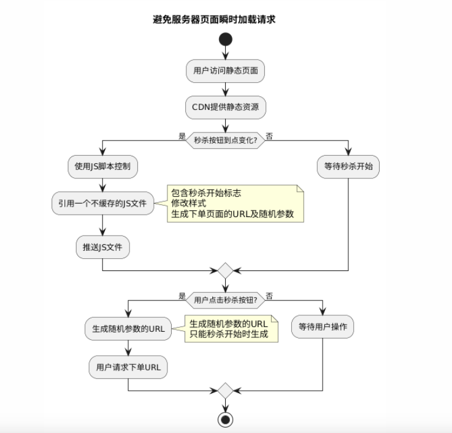

# Flash Sale System Desgin

秒杀设计

## 避免服务器页面瞬时加载请求

1. 静态页面
2. CDN Content Delivery Network
3. 秒杀按钮如何到点变化（请求页面耗时久）
   1. 使用JS脚本控制，在页面中引用一个JS文件(文件极小)，但是该文件不要被缓存。
   2. 该JS的作用是，包含秒杀开始标志，修改样式，生成下单页面的URL及随机参数。
   3. 当秒杀活动开始时推送该文件。
4. 为了避免用户直接访问下单URL,需要将URL动态化，用随机数作为参数，只能秒杀开始的时候才生成。




## 如何限流

1. 针对用户id请求计数，最多每秒请求数阈值
2. 针对请求IP请求限流，但容易误伤同IP的用户
3. 对接口限流，限制接口请求总数
4. 随机验证码
5. 滑动滑块、google的验证是否为真人按钮
6. 提高业务门槛：比如b站的会员注册需要答题、会员的等级

## 下单

1. 查询、预扣库存，避免数据库压力
   1. 缓存cache：redis
2. 缓存查询和预扣不一致？
   1. 用LUA保证原子性
3. 缓存击穿（请求的id在第一次大量的请求中还没有被cache
   1. redis分布式锁，保证只有部分请求在查询产品数据
      1. 分布式锁设计细节见下面
   2. 预热缓存，precache
4. 缓存穿透（接口传来不存在的id）
   1. 提前缓存不存在的id

## 分布式锁

1. redis中如何实现？

   1. 用SET lockKey requestID NX PX expireTime
      1. NX：只在键不存在时，才对键进行设置操作。
      2. PX：设置键的过期时间为 millisecond 毫秒。

2. 如何保证一个请求获得锁和释放锁是原子的？

   1. redis的lua脚本
   2. 把request_id放到key中

3. 如何保证秒杀效果是先来后到而不是均匀的？

   1. 问题详述：如果都是同步请求锁一次就返回，那么一万次请求中只有一次成功，下一个一万次也有一次成功？怎么变成先来后到呢？
   2. 解决方案：自旋锁
      1. 即lua脚本中，失败后等待一段时间再重试

4. 其他的方案：

   1. 除了上面的问题之外，使用redis分布式锁，还有锁竞争问题、续期问题、锁重入问题、多个redis实例加锁问题等。

      这些问题使用redisson可以解决，由于篇幅的原因，后面有机会考虑出一个专题介绍分布式锁。

## 下单、支付消息队列

1. 真实场景：秒杀->下单->支付
2. 为什么需要？
   1. 因为下单和付款的量、同步要求远小于秒杀
3. 消息丢失问题？
   1. 即：如何避免生产消息前服务出错导致的生产消息失败？
   2. 生产消息表
4. 重试生产失败的消息？
   1. 定时的cronjob
5. 重复消费问题：
   1. 即：如何避免重复消费消息？
   2. 消费消息表
      1. 在消费前查询表
      2. 如果未消费过则消费执行，否则return error
      3. 注意上面两个操作要放到一个事务中
6. 垃圾消费问题？
   1. 即，如何避免重试太多次仍旧生产失败的消息？
   2. 记录重试的次数，多于阈值直接返回

## 如何定时取消已经下单但未付款的单？

1. 借助消息队列（比如mq）的延时队列

## The UML Diagrams

```
@startuml
title 避免服务器页面瞬时加载请求

start

:用户访问静态页面;
:CDN提供静态资源;

if (秒杀按钮到点变化?) then (是)
  :使用JS脚本控制;
  :引用一个不缓存的JS文件;
  note right
    包含秒杀开始标志
    修改样式
    生成下单页面的URL及随机参数
  end note
  :推送JS文件;
else (否)
  :等待秒杀开始;
endif

if (用户点击秒杀按钮?) then (是)
  :生成随机参数的URL;
  note right
    生成随机参数的URL
    只能秒杀开始时生成
  end note
  :用户请求下单URL;
else (否)
  :等待用户操作;
endif

stop
@enduml
```

## Reference

1.   [秒杀架构](https://juejin.cn/post/7044032901662375949) 
