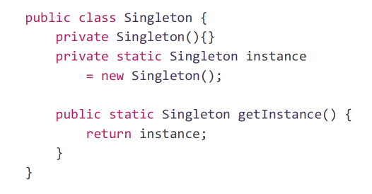
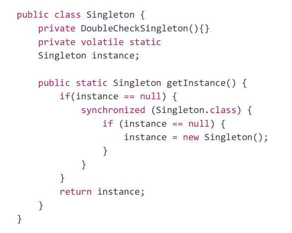

## Design Pattern

## 简述设计模式七大原则

开放封闭原则：对扩展开放，对修改关闭。在程序需要进行拓展的时候，不能去修改原有的代码，实现一个热插拔的效果。

单一职责原则：一个类、接口或方法只负责一个职责，降低代码复杂度以及变更引起的风险。

依赖倒置原则：针对接口编程，依赖于抽象类或接口而不依赖于具体实现类。

接口隔离原则：将不同功能定义在不同接口中实现接口隔离。

里氏替换原则：任何基类可以出现的地方，子类一定可以出现。

迪米特原则：每个模块对其他模块都要尽可能少地了解和依赖，降低代码耦合度。

合成复用原则：尽量使用组合(has-a)/聚合(contains-a)而不是继承(is-a)达到软件复用的目的。

## 简述设计模式的分类

创建型模式：在创建对象的同时隐藏创建逻辑，不使用 new 直接实例化对象。有工厂方法模式、抽象工厂模式、单例模式、建造者模式、原型模式。

结构型模式：通过类和接口间的继承和引用实现创建复杂结构的对象。有适配器模式、装饰器模式、代理模式、外观模式、桥接模式、组合模式、享元模式。

行为型模式：通过类之间不同通信方式实现不同行为。有策略模式、模板方法模式、观察者模式、迭代子模式、责任链模式、命令模式、备忘录模式、状态模式、访问者模式、中介者模式、解释器模式。

## 简述简单工厂模式

简单工厂模式指由一个工厂对象来创建实例,适用于工厂类负责创建对象较少的情况。例子：Spring 中 的 BeanFactory 使用简单工厂模式，产生 Bean 对象。

## 简述工厂模式

工厂方法模式指定义一个创建对象的接口，让接口的实现类决定创建哪种对象，让类的实例化推迟到子类中进行。例子：Spring 的 FactoryBean 接口的 getObject 方法也是工厂方法。

## 简述抽象工厂模式

抽象工厂模式指提供一个创建一系列相关或相互依赖对象的接口，无需指定它们的具体类。例子：java.sql.Connection 接口。

## 简述单例模式

一个单例类在任何情况下都只存在一个实例。

### 饿汉式实现

### 懒汉式实现

## 简述代理模式

代理模式为其他对象提供一种代理以控制对这个对象的访问。优点是可以增强目标对象的功能，降低代码耦合度，扩展性好。缺点是在客户端和目标对象之间增加代理对象会导致请求处理速度变慢，增加系统复杂度。

静态代理：在程序运行前就已经存在代理类的字节码文件，代理类和委托类的关系在运行前就确定了。

动态代理：程序运行期间动态的生成，所以不存在代理类的字节码文件。代理类和委托类的关系是在程序运行时确定。

## 简述适配器模式

适配器模式将一个接口转换成客户希望的另一个接口，使接口不兼容的那些类可以一起工作。

## 简述模板模式

模板模式定义了一个操作中的算法的骨架，并将一些步骤延迟到子类，适用于抽取子类重复代码到公共父类。可以封装固定不变的部分，扩展可变的部分。但每一个不同实现都需要一个子类维护，会增加类的数量。

## 简述装饰器模式

装饰者模式可以动态地给对象添加一些额外的属性或行为，即需要修改原有的功能，但又不愿直接去修改原有的代码时，设计一个Decorator套在原有代码外面。

## 简述观察者模式

观察者模式表示的是一种对象与对象之间具有依赖关系，当一个对象的状态发生改变时，所有依赖于它的对象都得到通知并被自动更新。