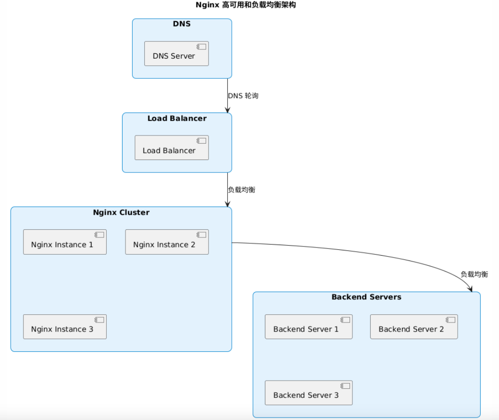
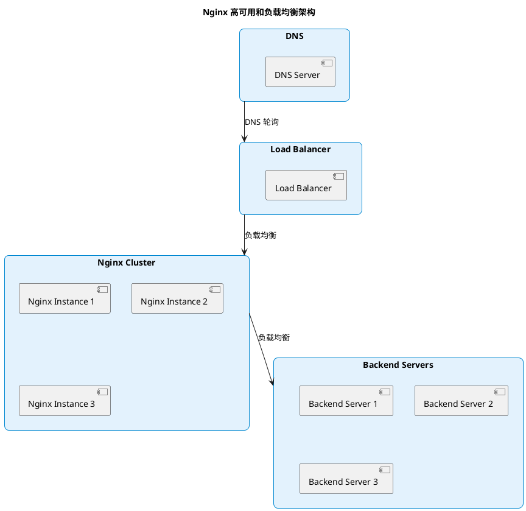

# Scale Nginx when encountering performance bottlenecks

我们用nginx做流量反向代理负载均衡，那如果nginx也成为单点瓶颈呢？怎么拆分？

这个图展示了以下几点：

1. **DNS 轮询：** DNS 服务器通过轮询将请求分发到负载均衡器。
2. **负载均衡器：** 负载均衡器（可以是硬件负载均衡器或云负载均衡器）将流量分发到多个 Nginx 实例。
3. **Nginx 集群：** 多个 Nginx 实例组成的集群，每个实例都可以处理请求并将其分发到后端服务器。
4. **后端服务器：** 后端服务器处理实际的业务逻辑和数据请求。

通过这种架构，可以有效避免 Nginx 成为单点瓶颈，提高系统的可用性和可扩展性。

在使用 Nginx 进行流量反向代理和负载均衡时，如果 Nginx 本身成为单点瓶颈，可以采取以下几种方法进行拆分和扩展：

1. **Nginx 高可用集群 (HA Cluster)：**
   - 使用 **Keepalived** 或 **Heartbeat** 等工具配置虚拟 IP 地址 (VIP)，通过虚拟 IP 地址来提供高可用性。多个 Nginx 实例可以共享一个 VIP，当主节点失效时，备节点可以接管 VIP，从而实现高可用性。

2. **水平扩展 Nginx：**
   - 部署多个 Nginx 实例，通过 DNS 轮询 (DNS Round Robin) 或者使用一个高可用的负载均衡器（如 AWS ELB, Google Cloud Load Balancer, 或者硬件负载均衡器）来分发流量到多个 Nginx 实例。

3. **使用容器化和编排工具：**
   - 使用 Docker 容器化 Nginx，并使用 Kubernetes、Docker Swarm 等容器编排工具来管理和扩展 Nginx 实例。Kubernetes 提供了内置的负载均衡和服务发现功能，可以方便地扩展和管理 Nginx 实例。

4. **CDN (内容分发网络)：**
   - 使用 CDN 来缓存和分发静态内容，减少 Nginx 的压力。CDN 可以将流量分发到多个边缘节点，从而减轻原始服务器的负载。

5. **分层负载均衡：**
   - 在 Nginx 前面再增加一层负载均衡器（例如 HAProxy、F5、云负载均衡器），这样可以将流量先分发到多个 Nginx 实例，再由这些 Nginx 实例进行后端服务器的负载均衡。

6. **优化 Nginx 配置：**
   - 优化 Nginx 配置以提高性能，例如调整 worker 进程数、使用更高效的负载均衡算法（如 least_conn、ip_hash）、启用缓存等。

7. **监控和自动伸缩：**
   - 实施监控解决方案（如 Prometheus + Grafana），实时监控 Nginx 的性能和负载，根据流量动态调整 Nginx 实例的数量，自动进行伸缩。

通过以上方法，可以有效地拆分和扩展 Nginx，避免其成为单点瓶颈，并提高系统的高可用性和可扩展性。

## Reference

1.   [代理与反向代理 Proxy VS Reverse Proxy](https://doc.fenglyulin.com/docs/computer-networks/proxy-vs-reverse-proxy)