# 即时通信系统 Chat System

In this article, we will explore the design of chat system including the following points.

- Chat server for real-time messaging
- Support group chat
- Presence servers for online/offline status
- Service discovery supports load balancing.
- Key-value stores for chat history
- Push notification services for sending push notification.

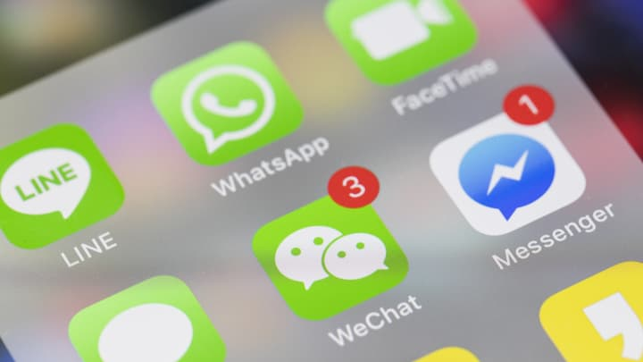

## The questions about the scope

1. Is the chat app 1 on 1 or group-based?
2. Mobile app? Or a web app? Or both?
3. What's the scale of the app? A startup app or massive scale?
4. Group chat member limit?
5. Message length limit?
6. Is end-to-end encryption required?
7. Should server store message? How long should we store the chat history? Archive?
8. Should message reception be real-time?
9. Online status?
10. Push notification?
11. Unread message?
12. Message translation?
13. Message order?
14. Etc

## Client-initiated connection techniques

Client initiates HTTP connection to server and send msg to others through servers.

The keep-alive is efficient as it reduces the number of handshakes.

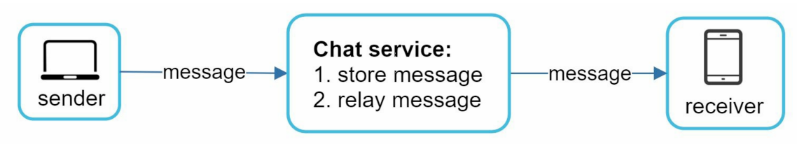

## Server-initiated connection techniques

1. polling
2. long polling
3. WebSocket

### Polling

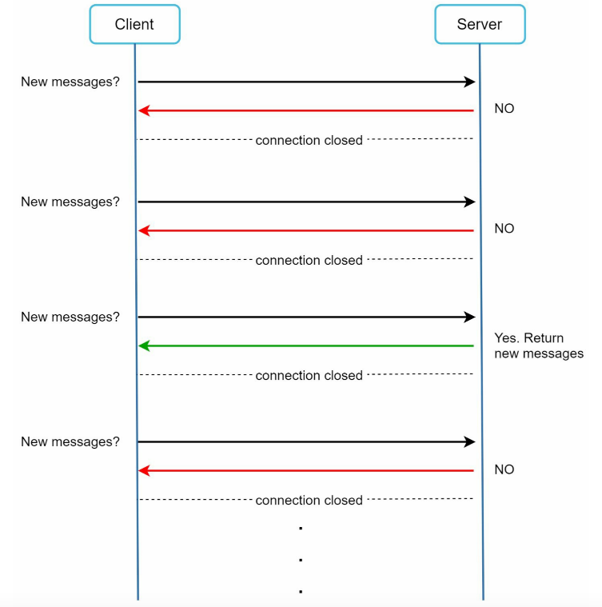

Polling is client periodically request servers for the newest messages.

Pros:

- **Straightforward**. Easy to be implemented

Cons:

- **Inefficient**. Most of the requests are useless because of no new messages. Consume precious computing resources.

### Long Polling

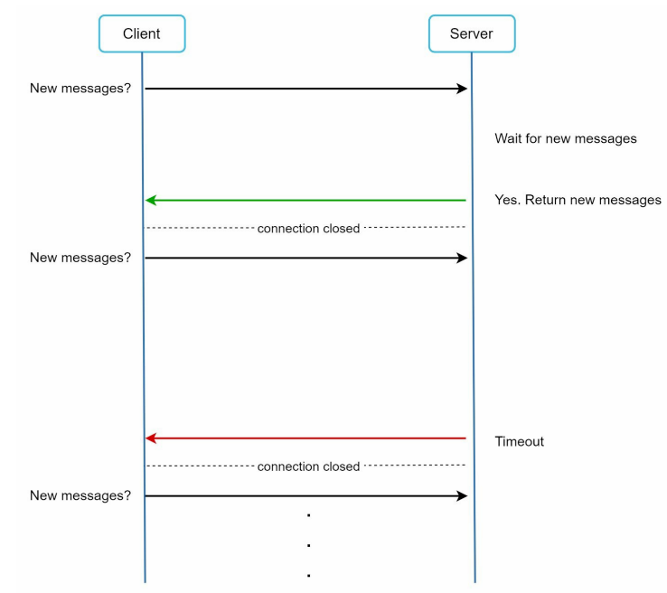

Client holds the long connection open until timeout or new messages coming.

Pros:

- Real-time.
- Reduce the latency to establish connection.

Cons:

- **Inefficient**. There is no messages most of the time.
- Server can not tell if the client is disconnected.
- Sender and receiver may not connect to the same server.

### WebSocket

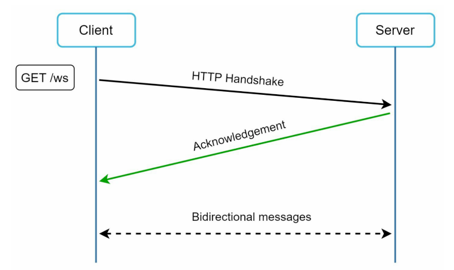

Websocket is initiated by client. It is bi-directional and persistent.

It starts as a HTTP connection and be upgraded to websocket via some well-defined handshake.

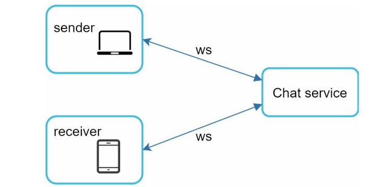

Pros:

- Bi-directional and persistent
- It works even if a firewall is in place because it utilizes port 80 and 443 which are used by HTTP/HTTPS.

Cons:

- Stateful server. Server side needs efficient conenction management.

## High Level Design

We can have a high level design consists of the follwing entities.

- Chat servers, it's `stateful` because of the persistent websocket connection.
- Presence servers are also `stateful` for presenting the online/offline status.
- API servers. Handling everything, including the user, authentication, group management, service discovery, etc.
- Push Notification
- Load Balancing
- KV store

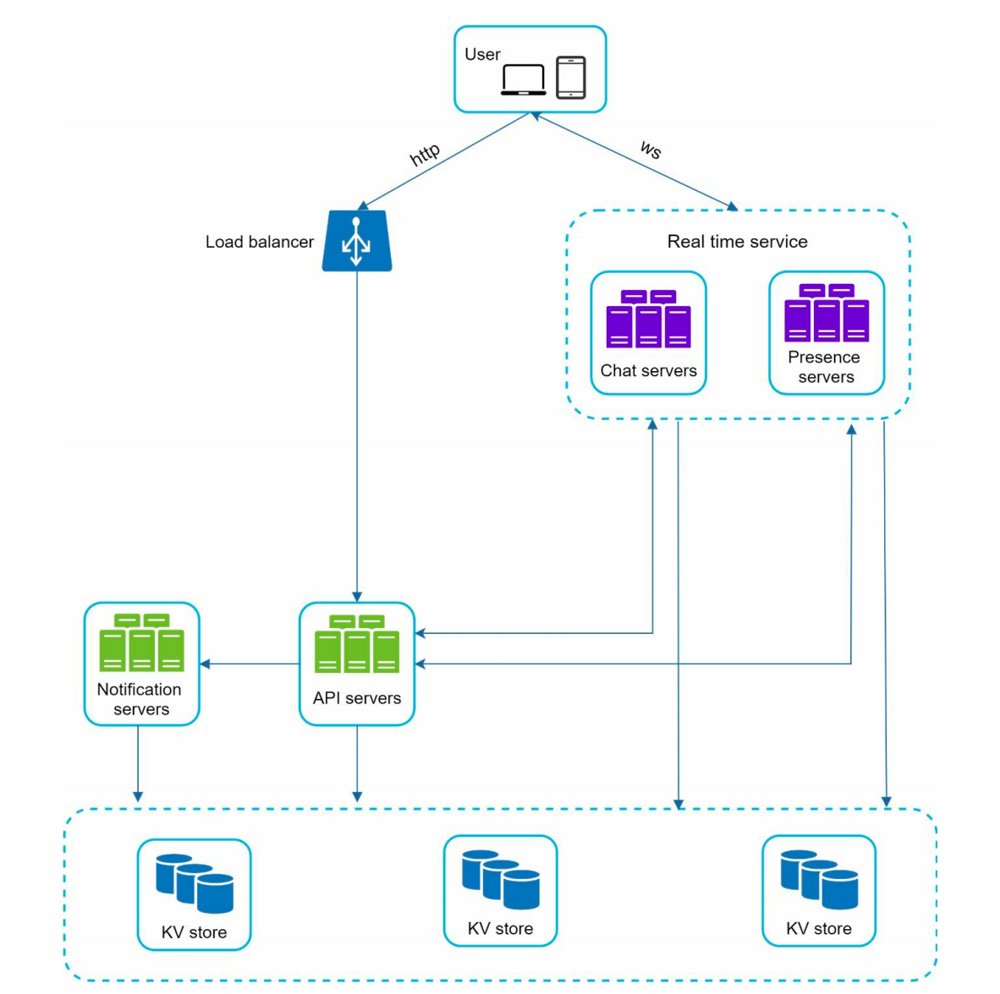

### Why chose key-value store for the chat history?

The generic data such as user profile, setting, user friend list are stored in robust and reliable relational databases.

In terms of chat history, it's pattern is a bit different:

1. The amount of data is enormous. For example, Whatsapp process 60 billion messages a day.
2. Recent chats are accessed frequently.
3. Random access to data. Users might use features such as search, view your mentioned, view history, jump to specific messages, etc.
4. The read-to-write ratio is about 1:1 on 1 chat systems

Here, we choose key-value store for the following reasons:

1. Key-value stores are low latency, high performance.
2. Allow easy horizontal scaling.
3. Support random search features while relational databases do not handle long tail of data well (random access is expensive) because indexes grows large.
4. It has been adopted by proven reliable chat applications. For example, both Facebook messenger (HBase) and discord (Cassandra) use key-value stores.

### Data models

**Message table for 1 on 1 chat**

The message_id can be used to order messages. We won't use create_time because two messages can be created at the same time.

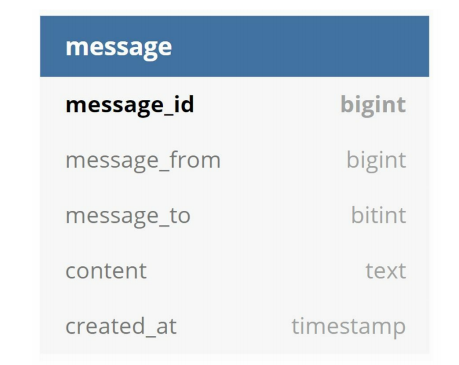

**Message table for group chat**

We use the composite primary consists of channel_id and message_id. 

channel_id is the group id, so we can know this message should be sent to which group.

user_id is the sender.

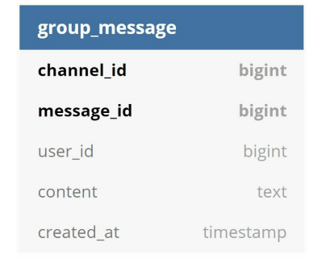

**How to generate message_id?**

It's an important topic worth exploring. message_id must satisfy the following two requirements:

1. IDs must be unique
2. IDs should be sortable by time, meaning ID of new messages should be newer than old ones.

There are solutions come to mind:

1. Use the `auto_increment` keyword in MySQL. However, NoSQL doesn't provide such a feature. 
2. Use UUID generator to generate global 64-bit sequence numbers like Snowflake.
3. Use a local sequence number generator.
   1. Local means the message_id is only unique and ordered within a channel_id.
   2. This approach is easier than the global UUID generator.

## Design Deep Dive

### Service discovery

The service discovery will pick up the best services for clients based on predefined criteria.

1. Geographical location, find the servers closest to the clients
2. Server Capacity, for load balancing.

> What's the diff between this and load balancer?

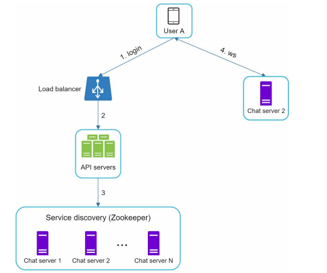

### Message Flow

**1 on 1 chat flow**

- Message sync queue

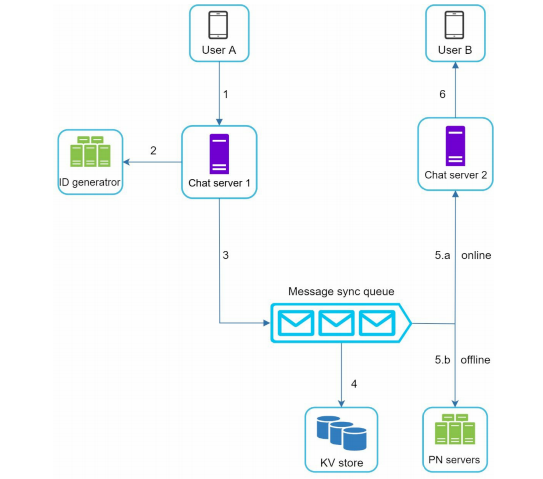

- Message synchronization across multiple devices
  - The max_read_index on app of devices

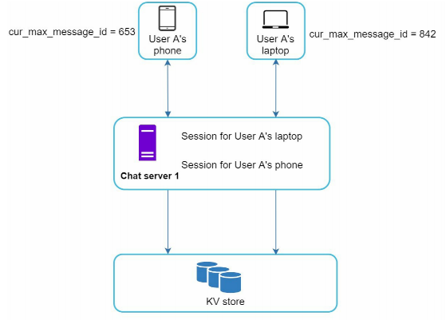

**small group chat flow**

available for a 500 ppl small group chat

### Presence status: online/offline

login 

- set status as online

logout

- set status as offline

disconnect

- Heartbeat
- Set status as offline while timeout

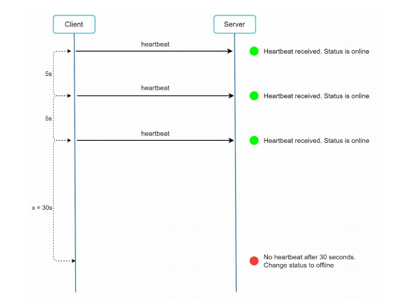

Online status fanout

- publish-subscribe channel

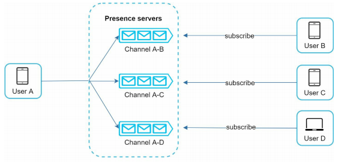

## Wrap Up

Additional talking points

- Exetend the chat system to support photos and videos.
- End-to-end encryption.
- Caching messages on the client side.
- Improve load time.
- Fault tolerance.
  - Service single ponint of failure. State machine replication.
  - Message lost. Messsage resent mechanism.

