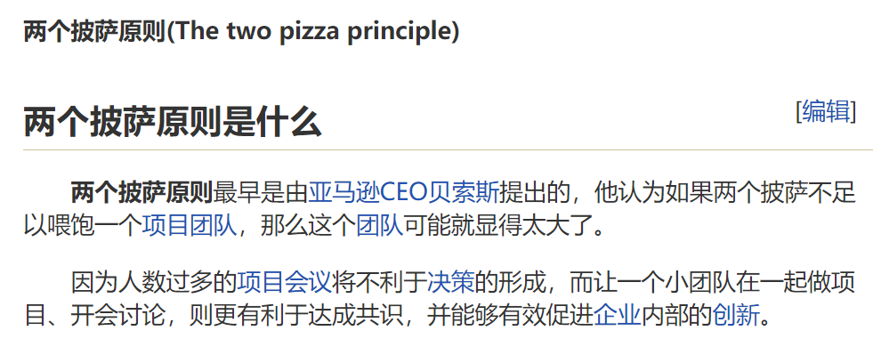
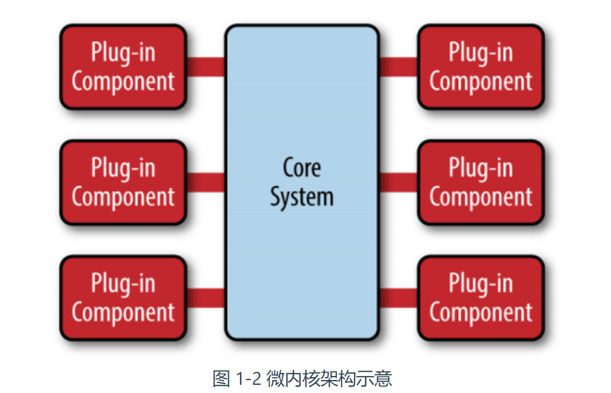
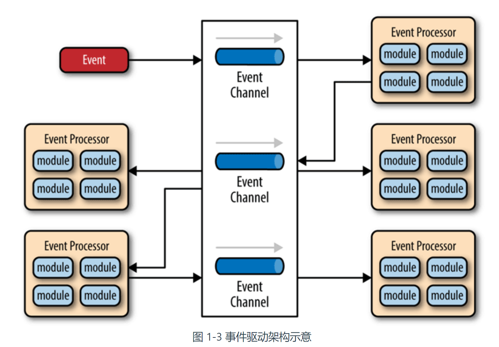
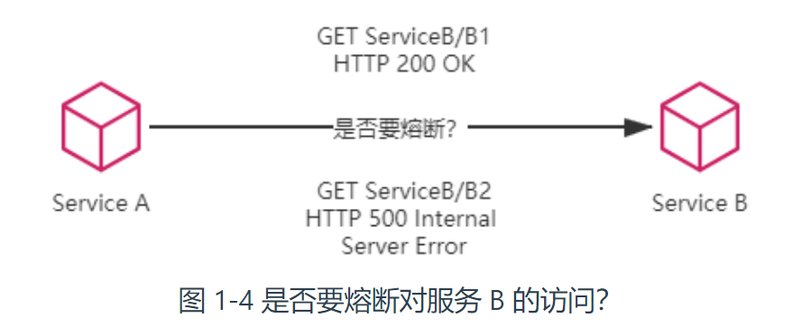
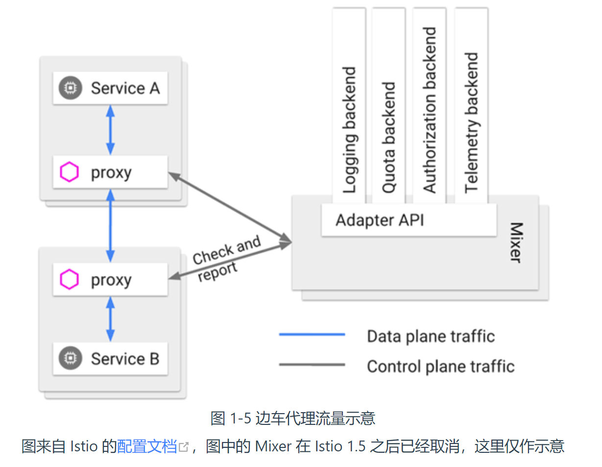

# 网络架构的演变 The Evolution of Web Service Architecture

凤凰架构

> A server should be like a phoenix, regularly rising from the ashes.[[1\]](https://martinfowler.com/bliki/PhoenixServer.html#footnote-etymology)
>
> [Martin Fowler ](https://martinfowler.com/)  https://martinfowler.com/bliki/PhoenixServer.html

# 架构的演进

## 原始分布式时代

目标：构建 “符合 UNIX 的设计哲学的” “如同本地调用一般简单透明的” 分布式系统

结果：迫于现实，这个目标在一定时期内被妥协、被舍弃。但是，到了三十多年以后的将来（即 **2016 年服务网格重新提出透明通信的**时候），随着分布式架构的逐渐成熟完善，取代单体成为大型软件的主流架构风格以后，这个美好的愿景终将还是会重新被开发者拾起。

>   UIUD

UUID 是 通用唯一识别码（Universally Unique Identifier）的缩写。其目的，是让分布式系统中的所有元素，都能有唯一的辨识信息，而不需要通过中央控制端来做辨识信息的指定。

>   远程方法调用和本地方法调用是不一样的

且不说远程方法不能再依靠本地方法那些以内联为代表的传统编译优化来提升速度，光是“远程”二字带来的网络环境下的新问题，譬如，远程的服务在哪里（服务发现），有多少个（负载均衡），网络出现分区、超时或者服务出错了怎么办（熔断、隔离、降级），方法的参数与返回结果如何表示（序列化协议），信息如何传输（传输协议），服务权限如何管理（认证、授权），如何保证通信安全（网络安全层），如何令调用不同机器的服务返回相同的结果（分布式数据一致性）等一系列问题，全部都需要设计者耗费大量心思。

>   AFS 分布式文件系统

源自 AFS 的分布式文件系统（Distributed File System，DFS）规范，当时被称为[DCE/DFS](https://en.wikipedia.org/wiki/DCE_Distributed_File_System)

>原始分布式时代的教训
>
>Just because something **can** be distributed doesn’t mean it **should** be distributed. Trying to make a distributed call act like a local call always ends in tears
>
>一个东西可以分布式不代笔它必须要分布式，可能还不如本地调用

UNIX 的分布式设计哲学

>   Simplicity of both the interface and the implementation are more important than any other attributes of the system — including correctness, consistency, and completeness
>
>   保持接口与实现的简单性，比系统的任何其他属性，包括准确性、一致性和完整性，都来得更加重要。
>
>   —— [Richard P. Gabriel](https://en.wikipedia.org/wiki/Richard_P._Gabriel)，[The Rise of 'Worse is Better'](https://en.wikipedia.org/wiki/Worse_is_better)，1991

## 单体架构（Monolithic）

>   两个披萨原则

单体架构的问题：

在“拆分”这方面，**单体系统**的真正缺陷不在如何拆分，而**在拆分之后的隔离与自治能力上的欠缺**。

>   1.   难以阻断错误传播：由于所有代码都运行在同一个进程空间之内，所有模块、方法的调用都无须考虑网络分区、对象复制这些麻烦的事和性能损失
>
>   2.   不便于动态更新程序：同样，由于所有代码都共享着同一个进程空间，不能隔离（1）也就无法（其实还是有办法的，譬如使用 OSGi 这种运行时模块化框架，但是很别扭、很复杂）做到单独停止、更新、升级某一部分代码。(2) 面临难以技术异构的困难，每个模块的代码都通常需要使用一样的程序语言，乃至一样的编程框架去开发。   
>
>   
>
>        作者认为最重要的原因：随着软件架构演进，构筑可靠系统从 “追求尽量不出错”，到正视 “出错是必然” 的观念转变，才是微服务架构得以挑战并逐步开始取代运作了数十年的单体架构的底气所在。

在比较微服务、单体架构哪种更好用、更优秀？

>   1.   微服务：沃尔玛将超市分为仓储部、采购部、安保部、库存管理部、巡检部、质量管理部、市场营销部等，可以划清职责，明确边界，让管理能力能支持企业的成长规模；
>   2.   单体架构：但如果你家楼下开的小卖部，爸、妈加儿子，再算上看家的中华田园犬小黄一共也就只有四名员工，再去追求“先进管理”，划分仓储部、采购部、库存管理部……那纯粹是给自己找麻烦。

## SOA 时代（Service-Oriented Architecture）

[烟囱式架构](https://en.wikipedia.org/wiki/Information_silo)（Information Silo Architecture）

>    信息烟囱又名信息孤岛（Information Island），指的是一种完全不与其他相关信息系统进行互操作或者协调工作的设计模式。这样的系统其实并没有什么“架构设计”可言。

[微内核架构](https://en.wikipedia.org/wiki/Microkernel)（Microkernel Architecture）

>   微内核架构也被称为插件式架构（Plug-in Architecture）
>
>   将这些主数据，连同其他可能被各子系统使用到的公共服务、数据、资源集中到一块，成为一个被所有业务系统共同依赖的核心（Kernel，也称为 Core System）

[事件驱动架构](https://en.wikipedia.org/wiki/Event-driven_architecture)（Event-Driven Architecture）

>   为了能让子系统互相通信，一种可行的方案是在子系统之间建立一套**事件队列管道（Event Queues）**，来自系统外部的消息将以事件的形式发送至管道中，各个子系统从管道里获取、处理和发送事件消息

2006 年情况才有所变化，由 IBM、Oracle、SAP 等公司共同成立了 OSOA 联盟（Open Service Oriented Architecture），2007 年，在[结构化资讯标准促进组织](https://en.wikipedia.org/wiki/OASIS_(organization))（Organization for the Advancement of Structured Information Standards，OASIS）的倡议与支持下，OSOA 由一个软件厂商组成的松散联盟，转变为一个制定行业标准的国际组织，联合 OASIS 共同新成立了的[Open CSA](http://www.oasis-opencsa.org/) 组织（Open Composite Services Architecture），这便是 SOA 的官方管理机构。

很多思想开始萌生：软件架构来到 SOA 时代，许多概念、思想都已经能在今天微服务中找到对应的身影了，服务之间的松散耦合、注册、发现、治理，隔离、编排

SOA 在 21 世纪最初的十年里曾经盛行一时，有 IBM 等一众行业巨头厂商为其呐喊冲锋，吸引了不少软件开发商、尤其是企业级软件的开发商的跟随，最终却还是偃旗息鼓，沉寂了下去。

 SOAP 协议被逐渐边缘化的本质原因：**过于严格的规范定义带来过度的复杂性。**

## 微服务时代 (Microservices)

“微服务”一词并不是 Peter Rodgers 直接凭空创造出来的概念，最初的微服务可以说是 SOA 发展时催生的产物，就如同 EJB 推广过程中催生了 Spring 和 Hibernate 那样

2014年，Martin Fowler 与 James Lewis 合写的文章《[Microservices: A Definition of This New Architectural Term](https://martinfowler.com/articles/microservices.html)》中给出了现在微服务的定义：

“**微服务是一种通过多个小型服务组合来构建单个应用的架构风格，这些服务围绕业务能力而非特定的技术标准来构建。各个服务可以采用不同的编程语言，不同的数据存储技术，运行在不同的进程之中。服务采取轻量级的通信机制和自动化的部署机制实现通信与运维**。”

文中列举了微服务的九个核心的业务与技术特征：

1.   **围绕业务能力构建**（Organized around Business Capability）。当团队、产品磨合调节稳定之后，团队与产品就会拥有一致的结构。
2.   **分散治理**（Decentralized Governance）。服务的开发团队可以自己选择异构的技术，但其要对自己的服务质量负责。
3.   **通过服务来实现独立自治的组件**（Componentization via Services）。
4.   **产品化思维**（Products not Projects）。以前在单体架构下，程序的规模决定了无法让全部人员都关注完整的产品，组织中会有开发、运维、支持等细致的分工的成员，各人只关注于自己的一块工作，但在微服务下，要求开发团队中每个人都具有产品化思维，关心整个产品的全部方面是具有可行性的。
5.   **数据去中心化**（Decentralized Data Management）。微服务明确地提倡数据应该按领域分散管理、更新、维护、存储。
6.   **强终端弱管道**（Smart Endpoint and Dumb Pipe）。微服务提倡类似于经典 UNIX 过滤器那样简单直接的通信方式，RESTful 风格的通信在微服务中会是更加合适的选择。
7.   **容错性设计**（Design for Failure）。接受服务总会出错的现实。要求有对依赖服务故障检测、出错时进行隔离，服务恢复时重新联通的能力。所以要有“断路器”。 可靠系统完全可能由会出错的服务组成，这是微服务最大的价值所在，也是这部开源文档标题“凤凰架构”的含义。
8.   **演进式设计**（Evolutionary Design）。一个设计良好的服务，应该是能够报废的（演进的），而不是长存永生。
9.   **基础设施自动化**（Infrastructure Automation）。基础设施自动化，如 CI/CD 的长足发展，显著减少了构建、发布、运维工作的复杂性。因为运维的对象相对于单体架构时期多了。

微服务追求更加自由的架构风格，提倡以“实践标准”代替“规范标准”。

正因没有了统一的规范和约束，对于SOA所解决的分布式服务的问题（服务的注册发现、跟踪治理、负载均衡、故障隔离、认证授权、伸缩扩展、传输通信、事务处理，等等，这些问题），在微服务中不再会有统一的解决方案。

>   比如 Java 中为服务的远程调用问题。解决方案的候选清单就有：RMI（Sun/Oracle）、Thrift（Facebook）、Dubbo（阿里巴巴）、gRPC（Google）、Motan2（新浪）、Finagle（Twitter）、brpc（百度）、Arvo（Hadoop）、JSON-RPC、REST，等等；
>
>   光一个服务发现问题，可以选择的就有：Eureka（Netflix）、Consul（HashiCorp）、Nacos（阿里巴巴）、ZooKeeper（Apache）、Etcd（CoreOS）、CoreDNS（CNCF），等等。
>
>   其他领域的情况也是与此类似，总之，完全是八仙过海，各显神通的局面。

技术中的矛盾（也许也是生活中的矛盾）：最复杂的不见得就是最好的，最好的也许就是最简单的。

>   微服务时代中，软件研发本身的复杂度应该说是有所降低。一个简单服务，并不见得就会同时面临分布式中所有的问题，也就没有必要背上 SOA 那百宝袋般沉重的技术包袱。

作为一个普通的服务开发者，作为一个“螺丝钉”式的程序员，微服务架构是友善的。

微服务对架构者是满满的恶意，对架构能力要求已提升到史无前例的程度，笔者在这部文档的多处反复强调过，技术架构者的第一职责就是做决策权衡，**有利有弊才需要决策，有取有舍才需要权衡**，如果架构者本身的知识面不足以覆盖所需要决策的内容，**不清楚其中利弊，恐怕也就无可避免地陷入选择困难症的困境之中。**

**结语**：软件架构不会止步于自由，微服务仍不是架构探索终点。

>   有微服务的自由权利，但又不必承担自行解决分布式问题的责任。
>
>   如果有下一个时代，笔者希望是信息系统能同时拥有微服务的自由权利，围绕业务能力构建自己的服务而不受技术规范管束，但同时又不必以承担自行解决分布式的问题的责任为代价。

## 后微服务时代 (Cloud Native) 云原生（kubernetes）

一直以来存在的问题：注册发现、跟踪治理、负载均衡、传输通信等

这些问题一定要由软件系统自己来解决吗？

如果不局限于采用软件的方式，这些问题几乎都有对应的硬件解决方案。

>   经过计算机科学多年的发展，这些问题大多有了专职化的基础设施去解决。
>
>   譬如，某个系统需要伸缩扩容，通常会购买新的服务器，部署若干副本实例来分担压力；如果某个系统需要解决负载均衡问题，通常会布置负载均衡器，选择恰当的均衡算法来分流；如果需要解决传输安全问题，通常会布置 TLS 传输链路，配置好 CA 证书以保证通信不被窃听篡改；如果需要解决服务发现问题，通常会设置 DNS 服务器，让服务访问依赖稳定的记录名而不是易变的 IP 地址，等等。

之所以微服务时代，人们选择在软件的代码层面而不是硬件的基础设施层面去解决这些分布式问题，很大程度上是因为由硬件构成的基础设施，跟不上由软件构成的应用服务的灵活性的无奈之举。

硬件难道就不可以通过敲键盘就变出相应的应用服务器、负载均衡器、DNS 服务器、网络链路这些设施吗？

### kubernetes，虚拟化，容器化

接下来要说的是[虚拟化](https://en.wikipedia.org/wiki/Virtualization)技术和[容器化](https://en.wikipedia.org/wiki/OS-level_virtualization)技术了。

尽管 2014 年微服务开始崛起的时候，Docker Swarm（2013 年）和 Apache Mesos（2012 年）就已经存在，更早之前也出现了[软件定义网络](https://en.wikipedia.org/wiki/Software-defined_networking)（Software-Defined Networking，SDN）、[软件定义存储](https://en.wikipedia.org/wiki/Software-defined_storage)（Software-Defined Storage，SDS）等技术，但是，被业界广泛认可、普遍采用的通过虚拟化基础设施去解决分布式架构问题的开端，应该要从 2017 年 Kubernetes 赢得容器战争的胜利开始算起。

这场已经持续了三、四年时间，以 Docker Swarm、Apache Mesos 与 Kubernetes 为主要竞争者的“容器编排战争”终于有了明确的结果

表 1-1 传统 Spring Cloud 与 Kubernetes 提供的解决方案对比

|          | Kubernetes              | Spring Cloud          |
| -------- | ----------------------- | --------------------- |
| 弹性伸缩 | Autoscaling             | N/A                   |
| 服务发现 | KubeDNS / CoreDNS       | Spring Cloud Eureka   |
| 配置中心 | ConfigMap / Secret      | Spring Cloud Config   |
| 服务网关 | Ingress Controller      | Spring Cloud Zuul     |
| 负载均衡 | Load Balancer           | Spring Cloud Ribbon   |
| 服务安全 | RBAC API                | Spring Cloud Security |
| 跟踪监控 | Metrics API / Dashboard | Spring Cloud Turbine  |
| 降级熔断 | N/A                     | Spring Cloud Hystrix  |

一旦虚拟化的硬件能够跟上软件的灵活性，那些与业务无关的技术性问题便有可能从软件层面剥离，悄无声息地解决于硬件基础设施之内，**让软件得以只专注业务，真正“围绕业务能力构建”团队与产品。**

### 云原生：

>   （从软件层面独力应对分布式架构所带来的各种问题，发展到）
>
>   **应用代码与基础设施软、硬一体，合力应对架构问题的时代，现在常被媒体冠以“云原生”这个颇为抽象的名字加以宣传。**
>
>   云原生时代与此前微服务时代中追求的目标并没有本质改变，在服务架构演进的历史进程中，笔者更愿意称其为“后微服务时代”。

新的问题，基础设施是针对整个容器来管理的，粒度相对粗旷，只能到容器层面，对单个远程服务就很难有效管控。

类似的情况不仅仅在断路器上出现，服务的监控、认证、授权、安全、负载均衡等都有可能面临细化管理的需求，譬如服务调用时的负载均衡，往往需要根据流量特征，调整负载均衡的层次、算法，等等，而 DNS 尽管能实现一定程度的负载均衡，但通常并不能满足这些额外的需求。

>   微服务 A 调用了微服务 B 的两个服务，称为 B1和 B2，假设 B1表现正常但 B2出现了持续的 500 错，那在达到一定阈值之后就应该对 B2进行熔断，以避免产生[雪崩效应](https://en.wikipedia.org/wiki/Snowball_effect)。如果仅在基础设施层面来处理，这会遇到一个两难问题，切断 A 到 B 的网络通路则会影响到 B1的正常调用，不切断的话则持续受 B2的错误影响。

### **服务网格**

为了解决这一类问题，虚拟化的基础设施很快完成了第二次进化，引入了今天被称为“[服务网格](https://en.wikipedia.org/wiki/Service_mesh)”（Service Mesh）的“边车代理模式”（Sidecar Proxy）

这个场景里指的具体含义是由系统自动在服务容器（通常是指 Kubernetes 的 Pod）中注入一个通信代理服务器，相当于那个挎斗，以类似网络安全里中间人攻击的方式进行流量劫持，在应用毫无感知的情况下，悄然接管应用所有对外通信。

服务网格在 2018 年才火起来，今天它仍然是个新潮的概念，仍然未完全成熟，甚至连 Kubernetes 也还算是个新生事物。

服务网格将会成为微服务之间通信交互的主流模式，把“选择什么通信协议”、“怎样调度流量”、“如何认证授权”之类的技术问题隔离于程序代码之外，取代今天 Spring Cloud 全家桶中大部分组件的功能

上帝的归上帝，凯撒的归凯撒，业务与技术完全分离，远程与本地完全透明，也许这就是最好的时代了吧？

## 无服务架构（Serverless）

如果说微服务架构是分布式系统这条路的极致，那无服务架构，**也许就是“不分布式”的云端系统这条路的起点。**

2012 年，[Iron.io 公司](https://www.iron.io/)率先提出了“无服务”（Serverless，应该翻译为“无服务器”才合适，但现在称“无服务”已形成习惯了）的概念，2014 年开始，亚马逊发布了名为 Lambda 的商业化无服务应用，并在后续的几年里逐步得到开发者认可，发展成目前世界上最大的无服务的运行平台

无服务现在还没有一个特别权威的“官方”定义，但它的概念并没有前面各种架构那么复杂，本来无服务也是以“简单”为主要卖点的，它只涉及两块内容：后端设施（Backend）和函数（Function）。

-   **后端设施**
-   **函数** 这里函数的概念与粒度，都已经很接近于程序编码角度的函数了，其区别是无服务中的函数运行在云端

无服务的愿景是让开发者只需要纯粹地关注业务，

1.   不需要考虑技术组件，后端的技术组件是现成的，可以直接取用，
2.   没有采购、版权和选型的烦恼；
3.   不需要考虑如何部署，部署过程完全是托管到云端的，工作由云端自动完成；
4.   不需要考虑算力，有整个数据中心支撑，算力可以认为是无限的；
5.   也不需要操心运维，维护系统持续平稳运行是云计算服务商的责任而不再是开发者的责任。

在 UC Berkeley 的论文中，把无服务架构下开发者不再关心这些技术层面的细节，类比成当年软件开发从汇编语言踏进高级语言的发展过程

作者观点：很难成为普适的架构模式

1.   优点：无服务架构对一些适合的应用确实能够降低开发和运维环节的成本
2.   缺点1：但另一方面，对于那些信息管理系统、网络游戏等应用，又或者说所有具有业务逻辑复杂，依赖服务端状态，响应速度要求较高，需要长链接等这些特征的应用，至少目前是相对并不适合的。
3.   缺点2：函数会有冷启动时间，响应的性能不可能太好（目前无服务的冷启动过程大概是在数十到百毫秒级别，对于 Java 这类启动性能差的应用，甚至能到接近秒的级别）。

## 结语

如果说微服务架构是分布式系统这条路当前所能做到的极致，那无服务架构，也许就是“不分布式”的云端系统这条路的起点。

今天已经能初步看见一些使用无服务的云函数去实现微服务架构的苗头了，将无服务作为技术层面的架构，将微服务视为应用层面的架构，把它们组合起来使用是完全合理可行的。

>   We can only see a short distance ahead, but we can see plenty there that needs to be done.
>
>   尽管目光所及之处，只是不远的前方，即使如此，依然可以看到那里有许多值得去完成的工作在等待我们。
>
>   —— [Alan Turing](https://en.wikipedia.org/wiki/Alan_Turing)，[Computing Machinery and Intelligence](https://en.wikipedia.org/wiki/Computing_Machinery_and_Intelligence)，1950

## 发展进程

1. 单体系统

2. 原始分布式时代的探索：构建 “符合 UNIX 的设计哲学的” “如同本地调用一般简单透明的”分布式系统，但受限于当时的算力和网络带宽不了了之。

3. 大型单体系统时代：**单体系统**的真正缺陷不在如何拆分，而**在拆分之后的隔离与自治能力上的欠缺

4. SOA 时代（Service Oriented Architecture）

   2007 年左右，很多思想开始萌生，软件架构来到 SOA 时代，许多概念、思想都已经能在今天微服务中找到对应的身影了，服务之间的松散耦合、注册、发现、治理，隔离、编排。

   SOA 在 21 世纪最初的十年里曾经盛行一时，有 IBM 等一众行业巨头厂商为其呐喊冲锋，吸引了不少软件开发商、尤其是企业级软件的开发商的跟随，最终却还是偃旗息鼓，沉寂了下去。

    SOAP 协议被逐渐边缘化的本质原因：**过于严格的规范定义带来过度的复杂性。**

5. 微服务时代

   2014年，Martin Fowler 与 James Lewis 合写的文章《[Microservices: A Definition of This New Architectural Term](https://martinfowler.com/articles/microservices.html)》中给出了现在微服务的定义：

   “**微服务是一种通过多个小型服务组合来构建单个应用的架构风格，这些服务围绕业务能力而非特定的技术标准来构建。各个服务可以采用不同的编程语言，不同的数据存储技术，运行在不同的进程之中。服务采取轻量级的通信机制和自动化的部署机制实现通信与运维**。”

   微服务追求更加自由的架构风格，提倡以“实践标准”代替“规范标准”。

   作为一个普通的服务开发者，作为一个“螺丝钉”式的程序员，微服务架构是友善的。

6. 云原生时代 

   一直以来存在的问题：注册发现、跟踪治理、负载均衡、传输通信等 这些问题一定要由软件系统自己来解决吗？如果不局限于采用软件的方式，这些问题几乎都有对应的**硬件解决方案**。

   所以云原生就是 **应用代码与基础设施软、硬一体，合力应对架构问题的时代，现在常被媒体冠以“云原生”这个颇为抽象的名字加以宣传。**

   硬件级的虚拟化、容器化、还有服务网格的概念。

7. 无服务架构（serverless）

   把无服务架构下开发者不再关心这些技术层面的细节，类比成当年软件开发从汇编语言踏进高级语言的发展过程，开发者可以不去关注寄存器、信号、中断等与机器底层相关的细节，从而令生产力得到极大地解放。

   可能的方向： Serverless+API

   并不是分布式的继承者，**如果说微服务架构是分布式系统这条路当前所能做到的极致，那么无服务架构是“不分布式”的云端系统这条路的起点**。笔者相信软件开发的未来不会只存在某一种“最先进的”架构风格，多种具针对性的架构风格同时并存，是软件产业更有生命力的形态。

