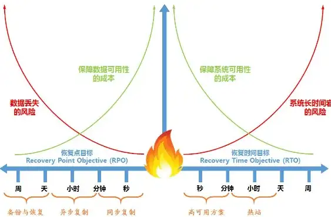
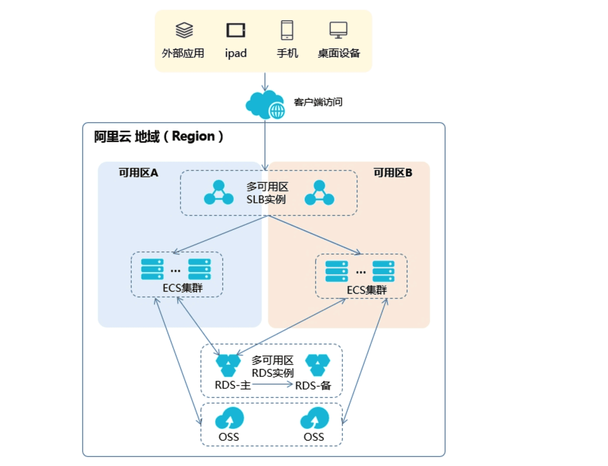
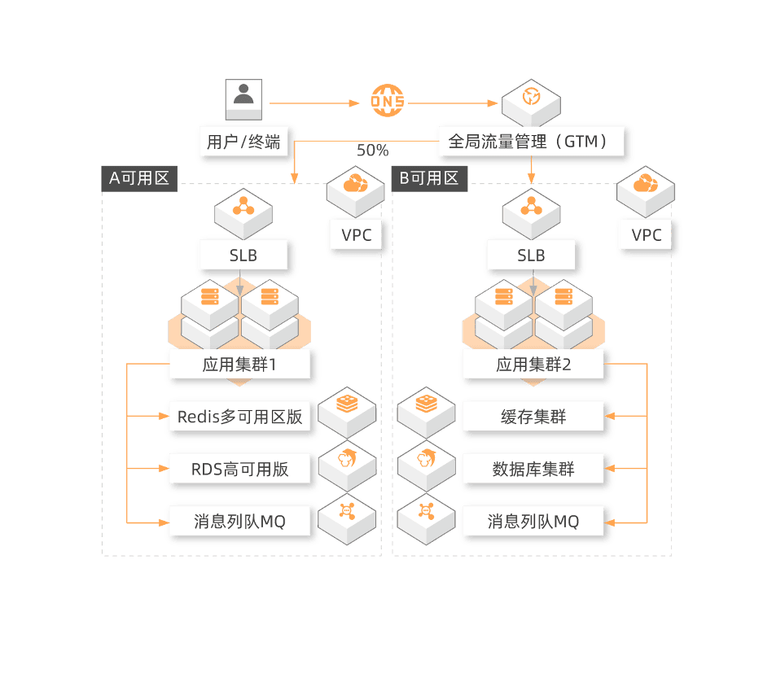
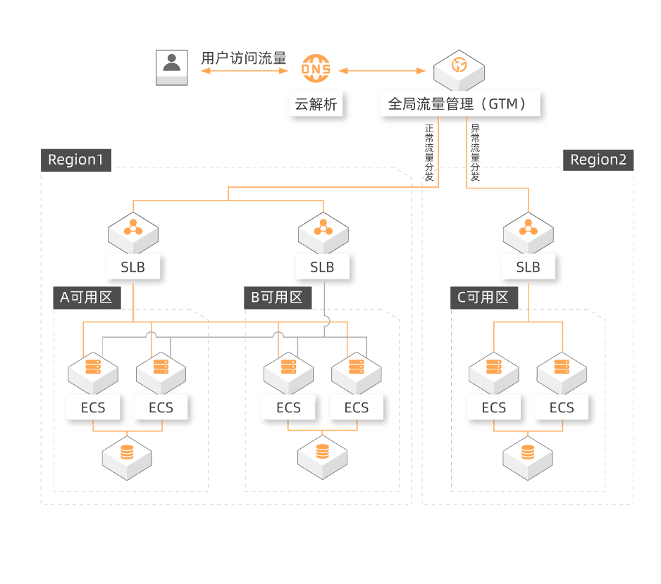

# 容灾与备份 Disaster Tolerance, Backup, Failover

https://pdai.tech/md/arch/arch-y-backup.html

> 容灾系统更加强调处理外界环境对系统的影响，特别是灾难性事件对整个IT节点的影响，提供节点级别的系统恢复功能。
>
> 故障转移（failover），即当活动的服务或应用意外终止时，快速启用**冗余**或备用的服务器、系统、硬件或者网络接替它们工作。
>
> 故障恢复是在计划内或计划外中断解决后**切换回主站点**的过程。

## 什么是容灾和备份？

容灾备份实际上是两个概念:

- **容灾**是为了在遭遇灾害时能保证信息系统能正常运行，帮助企业实现业务连续性的目标；
- **备份**是为了应对灾难来临时造成的数据丢失问题。

### 容灾的分类

从其对系统的保护程度来分，可以将容灾系统分为:

- **数据级容灾**是指通过建立异地容灾中心，做数据的远程备份，在灾难发生之后要确保原有的数据不会丢失或者遭到破坏，但在数据级容灾这个级别，发生灾难时应用是会中断的。
- **应用级容灾**是在数据级容灾的基础之上，在备份站点同样构建一套相同的应用系统，通过同步或异步复制技术，这样可以保证关键应用在允许的时间范围内恢复运行，尽可能减少灾难带来的损失，让用户基本感受不到灾难的发生，这样就使系统所提供的服务是完整的、可靠的和安全的。
- **业务级容灾**是全业务的灾备，除了必要的IT相关技术，还要求具备全部的基础设施。

### 容灾的技术指标

> 主要有RPO（数据恢复点目标）和 RTO（恢复时间目标）, 从客户的角度而言就是RPO需要为0（没有数据丢失），RTO越接近0越好（恢复时间越短越好）。

- **RPO（Recovery Point Objective）**：即数据恢复点目标，主要指的是业务系统所能容忍的数据丢失量。

- **RTO（Recovery Time Objective）**：即恢复时间目标，主要指的是所能容忍的业务停止服务的最长时间，也就是从灾难发生到业务系统恢复服务功能所需要的最短时间周期。

RPO针对的是数据丢失，而RTO针对的是服务丢失，二者没有必然的关联性。RTO和RPO的确定必须在进行风险分析和业务影响分析后根据不同的业务需求确定。对于不同企业的同一种业务，RTO和RPO的需求也会有所不同。

### 容灾和容错的区别

- **容灾（Disaster Tolerance）**：就是在上述的灾难发生时，在保证生产系统的数据尽量少丢失的情况下，保持生存系统的业务不间断地运行。容灾通常是通过冗余方式来实现的。

- **容错（fault tolerance）**: 发生故障时，系统还能继续运行。容错的目的是，发生故障时，系统的运行水平可能有所下降，但是依然可用，不会完全失败。

### 容灾备份的等级

国际标准SHARE 78 对容灾系统的定义有七个层次：从最简单的仅在本地进行磁带备份，到将备份的磁带存储在异地，再到建立应用系统实时切换的异地备份系统，恢复时间也可以从几天到小时级到分钟级、秒级或零数据丢失等。目前针对这七个层次，都有相应的容灾方案，所以，用户在选择容灾方案时应重点区分它们各自的特点和适用范围，结合自己对容灾系统的要求判断选择哪个层次的方案。

- **0级：无异地备份**
  - 异地没有可用的备份中心、备份数据处理系统和备份网络通信系统，未制定灾难恢复计划
- **1级：实现异地备份**
  - 运用本地备份管理软件，可以在本地发生毁灭性灾难后，恢复从异地运送过来的备份数据到本地，进行业务恢复
- **2级：热备份站点备份**
  - 利用异地的热备份系统，可以在本地发生毁灭性灾难后，快速进行业务恢复
- **3级：在线数据恢复**
  - 通过网络将关键数据进行备份并存放至异地，用电子数据传输取代交通工具传输备份数据，从而提高了灾难恢复的速度。由于备份站点要保持持续运行，对网络的要求较高，因此成本相应有所增加。
  - 优点：需要的关键数据通过网络可迅速恢复，通过网络切换，关键应用恢复时间可降低到一天或小时级。
  - 缺点：由于备份站点要保持持续运行，对网络的要求较高，因此成本相应有所增加。
- **4级：定时数据备份**
  - 在第3级容灾方案的基础上，利用备份管理软件自动通过通信网络将部分关键数据定时备份至异地，并制定相应的灾难恢复计划。一旦灾难发生，利用备份中心已有资源及异地备份数据恢复关键业务系统运行。
  - 优：根据备份策略的不同，数据的丢失与恢复时间达到天或小时级。由于对备份管理软件设备和网络设备的要求较高，因此投入成本也会增加
  - 缺：由于该级别备份的特点，业务恢复时间和数据的丢失量还不能满足关键行业对关键数据容灾的要求。
- **5级：实时数据备份**
  - 在前面几个级别的基础上使用了硬件的镜像技术和软件的数据复制技术，也就是说，可以实现在应用站点与备份站点的数据都被更新。数据在两个站点之间相互镜像
  - 优：
    - 在灾难发生时，仅仅很小部分的数据被丢失，恢复的时间被降低到了分钟级或秒级
    - 由于既能保证不影响当前交易的进行，又能实时复制交易产生的数据到异地，所以这一层次的方案是目前应用最广泛的一类，
  - 缺：对存储系统和数据复制软件的要求较高，所需成本也大大增加。
- **6级：零数据丢失**
  - 利用专用的存储网络将关键数据同步镜像至备份中心，数据不仅在本地进行确认，而且需要在异地（备份）进行确认。数据是镜像地写到两个站点
  - 优：零数据损失，完全一致性。
  - 缺：于对存储系统和存储系统专用网络的要求很高，用户的投资巨大。由于完全同步的方式对生产系统的运行效率会产生很大影响，所以适用于生产交易较少或非实时交易的关键数据系统，目前采用该级别容灾方案的用户还很少。

## 容灾备份的解决方案

### ECS的容灾备份

- **备份恢复**
  - 阿里云ECS可通过**快照**与**镜像**对系统盘、数据盘进行备份。
- **容灾应用**
  - ECS可以从架构上实现容灾场景下的应用。例如，在应用前端购买SLB产品，后端相同应用部署至少两台ECS服务器，或者是使用阿里云的弹性伸缩技术，根据自定义ECS自身资源的使用规则进行弹性扩容。

### 同城容灾

> 来源于阿里云[官方文档在新窗口打开](https://help.aliyun.com/document_detail/419804.html?spm=a2c4g.26937906.0.0.763f292cjWILT6)

**同城容灾**指应用服务部署是**多机房、单地域**时，当其中一机房出现故障时，系统可实现业务7*24小时稳定运行，即使单机房故障也不影响业务的可持续性，保障用户访问连续不间断。

- **同城双活容灾**架构，是指在同城建立两个可独立承担关键系统运行的数据中心，双中心具备基本等同的业务处理能力并通过高速链路实时同步数据，日常情况下可同时分担业务及管理系统的运行，并可切换运行。

### 异地容灾(两地三中心)

**异地容灾**是指应用服务部署在不同地域时，当其中一地出现故障时，系统可以将出现故障地域的用户访问流量，调度至异地灾备中心，保障用户访问连续不间断。

- **两地三中心容灾**架构，是指在同城双中心的基础上，在异地的城市建立一个备份的灾备中心，用于双中心的数据备份，当双中心出现自然灾害等原因而发生故障时，异地灾备中心可以用备份数据进行业务的恢复。

## 故障转移和恢复

### 什么是故障转移

> 故障转移（failover），即当活动的服务或应用意外终止时，快速启用冗余或备用的服务器、系统、硬件或者网络接替它们工作。

要使故障转移正常工作，必须有一个数据备份裸机服务器或虚拟机充当恢复站点系统，以便在发生故障时替换主站点。由于故障转移是灾难恢复中必不可少的步骤，因此数据备份系统本身必须不受故障影响。

### 如何进行故障转移

有两种方法可以设置故障转移系统

- 在**主动-主动**设置中，多个节点同时运行。

- **主动-被动**（主动-备用）设置还包括多个节点，但并非所有节点都同时处于活动状态。一旦主动节点停止工作，被动节点就会被激活并充当故障转移节点。

无论采用哪种故障转移方法，两种配置都要求至少两个节点（服务器或虚拟机），每个节点具有相同的配置。这确保了在站点之间切换时的一致性和稳定性。

### 什么是故障恢复

> 故障恢复是在计划内或计划外中断解决后**切换回主站点**的过程。故障恢复通常在故障转移之后作为灾难恢复计划的一部分。

故障恢复不是完成故障转移的唯一方法。使用虚拟机时，您可以执行永久故障回复，使数据备份虚拟机成为新的主站点。

### 如何进行故障恢复

成功执行故障回复需要一些准备。在切换回主站点之前，请考虑以下步骤：

1. 检查与主站点的连接的质量和网络带宽。
2. 检查备份站点上的所有数据是否存在潜在错误。这对于关键文件和文档尤其重要。
3. 在开始故障恢复之前彻底测试所有主系统。
4. 准备并实施故障恢复计划，以最大限度地减少停机时间和用户不便。

## 冷热备份的区别

根据备份的方法可以分为：

### Hot Backup（热备）

1. Hot Backup是指在数据库运行中直接备份，对正在运行的数据库没有任何影响。这种方式在MySQL官方手册中称为Online Backup（在线备份）。
2. 实例：对于事务型的数据库，如SQL Server数据库、Oracle数据库，热备的原理与上述大致相同。可以发现，在备份期间不会对数据库本身有任何影响，所做的操作只是拷贝数据库文件，因此任何对数据库的操作都是允许的，不会出现阻塞情况。

### Cold Backup（冷备）

1. Cold Backup是指在数据库停止的情况下进行备份，这种备份最为简单，一般只需要拷贝相关的数据库物理文件即可。这种方式在MySQL官方手册中称为Offline Backup（离线备份）
2. 实例：对InnoDB存储引擎的冷备非常简单，只需要备份MySQL数据库的frm文件、共享表空间文件、独立表空间文件（*.ibd）、重做日志文件。另外，定期备份MySQL数据库的配置文件my.cnf，这样有利于恢复操作。

### Warm Backup（温备）

1. Warm Backup备份同样是在数据库运行时进行，但是会对当前数据库的操作有所影响，例如加一个全局读锁以保证备份数据的一致性。

## 逻辑备份和裸文件备份

如果按照备份后文件的内容，又可以分为：

1. 逻辑备份
   1. 在MySQL数据库中，逻辑备份是指备份后的文件内容是可读的，通常是文本文件，内容一般是SQL语句，或者是表内的实际数据，如mysqldump和SELECT * INTO OUTFILE的方法。这类方法的好处是可以看到导出文件的内容，一般适用于数据库的升级、迁移等工作，但是恢复所需要的时间往往较长。
2. 裸文件备份
   1. 裸文件备份是指拷贝数据库的物理文件，数据库既可以处于运行状态（如ibbackup、xtrabackup这类工具），也可以处于停止状态。这类备份的恢复时间往往较逻辑备份短很多。

## 按照备份数据库的内容区分

1. 完全备份
   1. 完全备份是指对数据库进行一个完整的备份。
2. 增量备份
   1. 增量备份是指在上次的完全备份基础上，对更新的数据进行备份。
   2. 对于MySQL数据库来说，官方没有提供真正的增量备份的方法，大部分是通过二进制日志来实现的。这种方法与真正的增量备份相比，效率还是很低的。通过二进制日志来完成备份，可能同一个页需要多次执行SQL语句来完成重做的工作。对于真正的增量备份来说，只需要记录当前每个页最后的检查点的LSN。如果大于之前完全备份时的LSN，则备份该页，否则不用备份。这大大加快了备份的速度以及缩短了恢复的时间，同时这也是xtrabackup工具增量备份的原理。
3. 日志备份
   1. 日志备份主要是指对MySQL数据库二进制日志的备份，通过对一个完全备份进行二进制日志的重做来完成数据库的point-in-time的恢复工作。
   2. MySQL数据库复制（Replication）的原理就是异步实时进行二进制日志重做。

## 备份的一致性

对于InnoDB存储引擎来说，因为其支持MVCC(多版本控制)功能，因此实现备份一致比较容易。可以先开启一个事务，然后导出一组相关的表，最后提交。当然，事务隔离级别必须是REPEATABLE READ的，这样的做法就可以给你一个完美的一致性备份。

对于mysqldump备份工具来说，可以通过添加-single-transaction选项来获得InnoDB存储引擎的一致性备份，这时的备份是在一个执行时间很长的事务中完成的。

# Reference

1. https://www.cnblogs.com/wade-luffy/p/6306396.html
2. [架构之高可用：容灾备份,故障转移](https://pdai.tech/md/arch/arch-y-backup.html)
3. 