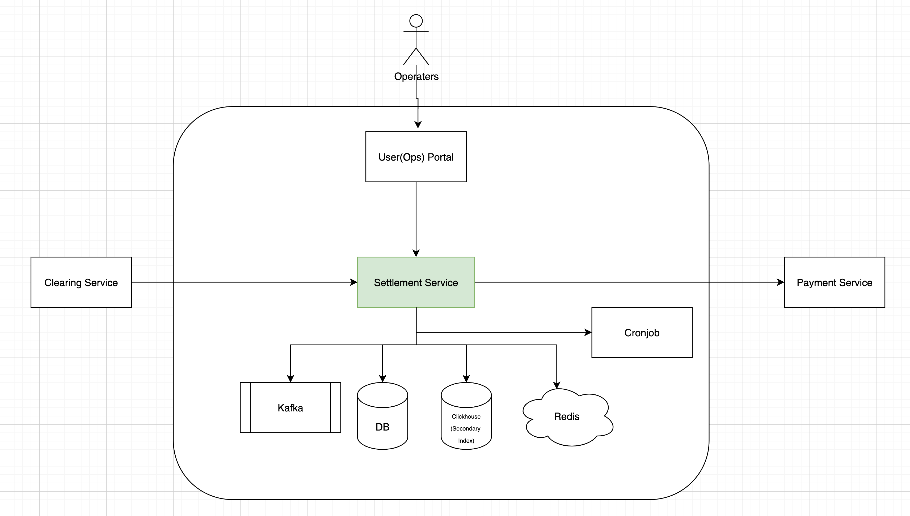

# [TD] Settlement 订单结算系统（简化）

## 需求 Requirement

在电商系统中，在订单的清算（tax、fee、invoice）完成后，需要给订单的卖家打款。

打款有两种类型，一种是即时的，还有一种周期性的。

即时打款可以直接调用打款渠道，相对简单只用留一个记录就好。

这里主要讨论的是周期性的打款，周期性的打款流程如下

1. 订单完成后会由清算（clearing）系统请求结算（Settlement）系统创建账单
2. 结算系统需要周期性的（每天、每周或双周）把每个卖家的账单的amount和currency汇总成为打款账单
3. 结算系统在周期结束后基于打款账单创建实际打款项目
4. 结算系统会生成每个打款渠道的实际打款金额，并会生成相关report发给运营
5. 运营确认打款金额等无误，对各个打款渠道进行充值
6. 运营发布打款

## 领域驱动设计 DDD

在结算系统中，有如下实体：

1. 一笔订单的账单项目（billing item）：对应于一笔订单的具体账单明细，包括：
   1. 记录了订单号 order_id
   2. 记录了账单的金额 amount、币种 currency
   3. 状态：statemented -> paid/failed
2. 一个卖家在一个周期内的打款账单（statement）：针对单个卖家在某个结算周期内的综合账单，汇总其所有相关账单项目。
3. 一个卖家在一个周期内的实际打款项目（payout 或 payment）：指卖家在某个结算周期最终收到的款项。
   1. 状态：created -> ongoing -> paid/failed/failed_no_retry

4. 打款渠道（payment method）
5. 打款渠道充值（funding）
6. 打款发布明细（release summary）
   1. 状态：created -> funded -> released

7. 打款规则（rule）
8. 卖家实体（account, shop），主要存储使用的打款渠道，卖家所使用的规则（rule）等

由于不同的卖家的打款有不同的周期、是否可以自动打款（或需要手动打款）、配置打款阈值、甚至需要暂停（hold）某个卖家的打款等需求，需要设计一套规则（rule）系统，rule实体的具体属性如下

1. 打款周期（cycle）daily, weekly, monthly, etc
2. 自动打款或手动打款（auto_payment）
3. 打款阈值（payment_threshold）
4. 打款币种（payment_currency）
5. 是否暂停（is_hold）

## 系统架构 System Architecture

## 时序图 Sequence Diagram

略

## 集成 Integration

## 接口设计 API Design

仅介绍重点API的技术需求

### get_account_by_id

- QPS低
- 需求
  - 对于新的shop_id，在读取数据库发现account不存在时，需要即时create，计算shop_id对应的rule等
  - 需要幂等性设计，在DB表中把shop_id设为unique key

### create_billing_item

- QPS低
- 需求
  - 需要幂等性设计，在DB表中把shop_id设为unique key
- 流程
  1. 检验请求是否有效
  2. 业务更新操作（更新statement amount、更新用户balance、插入billing_item）需要放在同一个DB事务中完成

### get_biling_item_by_ids

- QPS高
- 说明
  - 由于指定了billing_item_id，但如果billing_item_tab不是按

### get_billing_item_by_filters

- QPS中
- 需求
  - 涉及到非主键、且不含sharding key的查询，需要二级索引引擎

### release_payouts

## 数据库设计 DB Design

1. 场景分析
2. TIDB
3. TIDB migration
   1. 迁移的几个阶段
      1. 读写原
      2. 先写原、再写新，读原
      3. 先写新、再写原，读新
      4. 读写新

   2. db sharding, even？
   3. db slave latency
   4. transaction design queuing

4. 二级索引存储 Secondary Index Storage
   1. clickhouse
   2. elastic search

## 状态机与对账任务 State Machine and Reconcile Jobs

对于每个状态（转移），都应当有对应的reoncile jobs定时监测、修复可能存在的不一致的状态

1. biling_item
2. statement
3. payout
   1. `created`  
      1. 监测payout的total_amount和其总的billing_item一致
      2. 和payment系统对账，监测payout是否已经已经发出去，需要转为`ongoing`
   2. `ongoing`
   3. `failed`
      1. 
   4. `failed_no_retry`

## 监控告警 Monitors and Alerts

- 系统监控
  - 关键接口P99时延、QPS、错误率；
  - 实例healthy（health check）、CPU使用率、内存占用；
  - 数据库时延、QPS、超时；
  - Kafka Topic消费堆积

- 业务监控：
  - billing_item创建amount；
  - payout创建量波动；
  - billing_item、payout状态转移；

## 事故分析、性能调优

1. duplicate id due to disaster tolerance deployment
   1. the instance's INDEX is not unique across the deployment
2. clickhouse FINAL performance problem
3. billing_item_tab sharding by a shop not even
4. kafka 消费慢？
   1. 理解
   2. 理解kafka多partition消费

5. 

## 技术亮点

1. DDD设计
2. 对于状态机有完整的reconcile job
3. 使用了event driven的开发模式
4. 使用了Clickhouse作为secondary index

