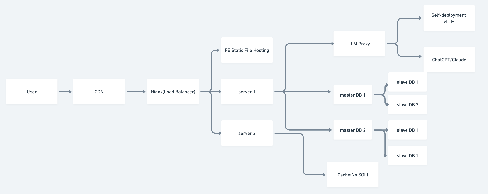

# [System Design] AI Chatbot

# Requirement

### Functional Requirement

1.  Chat
    1.  Persistent Chat  History
    2.  Biz Knowledge Chat
    3.  Multiple Chat Window
2.  Natural Language Understanding and Reply
3.  Features
    1.  Task Detection
    2.  Tool
    3.  Long/short term user behavior memory
    4.  Web Search

### Non-Functional Requirement

1.  Scalability
    1.  100M Users
    2.  **(More?)**
2.  High Availability
    1.  99.99% SLA
3.  Low Latency
    1.  `<`1s response latency

## Architecture

1.  Singleton Service
2.  Backend Frontend Separate
3.  Microservice



## Feature Implementation

1.  Single Chat
    1.  Persistent Chat  History ⇒ RDB/No SQL/Object Storage(Multi-media storage)
    2.  Biz Knowledge Chat ⇒ (RAG, retrieval augmented generation)
2.  Natural Language Understanding and Reply ⇒ (Rule Based NLP ⇒ LLM)
3.  Features
    1.  Task Detection ⇒ LLM
    2.  Tool ⇒ MCP? LLM Tool/Function Calling
    3.  Long/short term user behavior memory ⇒ DB
    4.  Web Search ⇒ web search tool

## Persistent Chat  History

### Table Design

```
chat_tab {
  chat_id uint64 primary_key,
  user_id uint64 index,
  title char(16),
  c_time uint64,
  m_time uint64
}

message_tab {
  message_id uint64 primary_key,
  chat_id uint64 index,
  user_id uint64,
  content text(~10,000),
  c_time uint64,
  m_time uint64
}
```

### Storage

one chat, 10 messages(5 users, 5 bots, avg content length 500bytes)

50 bytes + 600 bytes * 10 ~= 6000 bytes ⇒ 10KB


100M users, 20% DAU, 10 chat a day

100M * 10 * 10KB * 20% = 2TB


365 * 2TB = 730 TB / year

### db sharding

chat_tab by user_id

message_tab by chat_id

### db partitioning

by user_id?

## Chat

### API interface

/api/v1/chat

```
request_body {
  user_id,
  chat_id(optional),
  messages,
  stream
}

respone_body {
  chat_id
  messages,
}
```

### connection type

1.  HTTP polling
2.  HTTP long polling(one HTTP longactive connection
3.  Websocket

### QPS

one chat, 10 messages

100M users, 20% DAU, 10 chat a day


avg QPS

```
100M * 20 % * 10 * 5 /86400 = 1B /100k = 10K/sec
```

peak(5 times)

```
50k/sec
```

### latency

1.  200ms server-client latency
2.  100ms server processing
3.  600ms LLM ttft(time to first token)

### High Availability

-   load balancer
-   cache

## Trade-off

Large model VS Small model

-   Cost VS Accuracy/Inference

API provider VS Local deployment

-   Cost VS Latency/Efficiency

