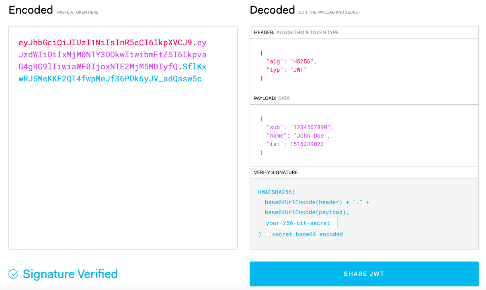

# Authentication, Authorization, Token and JWT

本文主要讲解以下的知识

1. 认证（Authentication）
2. 授权（Authorization）
3. 认证凭证（Token）

## 认证

认证指的是验证访问者的身份。比如登陆微信，用户名密码登录网站，短信验证码认证，人脸识别登录等。

依登陆形式的不同，认证可以分为

1. 单点登录（SSO Single Sign On)。
2. OAuth 2.0。一个行业的标准授权协议，用于授权第三方登录，比如用 Google 账户登陆其他网站，用 Github 账户登录其他平台。

### 单点登录

用户登陆多个子系统的其中一个就有权访问与其相关的其他系统。比如登录了 Google Gmail 后，就等于登录了 Google Sheet, Google Map 等。

## 授权

授权用于管理用户的权利范围，比如管理员权限。

常见的授权形式

1. ACL（Access Control List）访问控制组。ACL中包含用户、资源、资源操作三个关键要素。
2. RBAC （Role-Based Access Control ）基于角色的访问控制。对用户进行角色分类，授权给角色。
3. ABAC（Attribute Base Access Control）基于属性的访问控制。基于计算属性来确定权限。

> TODO: 画图

## 认证凭证

在认证后，服务端传回一个凭证，用户后续用这个凭证即可保持连接。

依据凭证的存储形式不同可以分为三种

1. 单机存储的 token。Token 信息存在服务器单机内存中。
2. 分布式存储的 token。把 Session 存储到数据库中，所有服务器都可以访问。
3. 无需存储的 token。典型方案为 JWT（Java Web Token），只存在客户端。

> TODO: 画图

### Cookie 与 Session

Cookie 数据保存在客户端（如浏览器），Session 数据保存在服务器端。Session 的主要作用就是通过服务端记录用户的状态，比如用户的购物车状态。

1. 用户向服务器发送用户名和密码。
2. 服务器验证通过后，在当前对话（session）里面保存相关数据，比如用户角色、登录时间等等。
3. 服务器向用户返回一个 session_id，写入用户的 Cookie。用户随后的每一次请求，都会通过 Cookie，将 session_id 传回服务器。
4. 服务器收到 session_id，找到前期保存的数据，由此得知用户的身份。

> TODO: 画图

Tips: token 是否都该存在 Cookie 中？不一定，可以储存在 Cookie 里面，也可以储存在 localStorage。

### JWT 原理

JWT 是目前最流行的跨域认证解决方案，由下面三个部分拼接即可得到 Token，`Header.Payload.Signature` ，每个部分之间由 ”点“ 分隔。

- Header（头部），这部分主要表明所使用的签名算法 alg 默认是 HMAC SHA256），和这个 token 的类型（type）。对应下图右边的 `HEADER` 部分。
- Payload（负载），这部分主要是一些签发时间，生效时间等载荷字段，用户也可以自行定义需要的字段。
- Signature（签名），这部分主要是用服务器的指定密钥（secret） 对 token 内容（Header 和 Payload） 进行签名，避免 token 内容受到篡改。对应下图右边的 `VERIFY SIGANTURE` 部分。

一些特性

1. 服务器持有签名算法的密钥（secret），用于对 token 内容签名。也需要用这个密钥对客户端传来的 JWT 进行完整性验证（即再算一次 `VERIFY SIGANTURE`）。
2. `VERIFY SIGANTURE` 中的 base64UrlEncode 是指在 base64 编码后，再使用 UrlEncode 转义 URL 相关的特殊字符。
3. JWT 可以配置生效时间，这部分服务器进行验证。
4. 默认是不加密的，有一个签名防止数据篡改。
5. JWT 不需要存储在服务器端，可以大大减少服务器的存储资源。
6. 由于不依赖服务器端存储，所以签发后无法失效，除非服务器在 payload 指定某些字段来过期旧的 JWT。
7. 不仅可以用于认证，也可以用于交换信息。

## 参考

1. [浅析认证授权的三种方式（session、token、JWT）](https://juejin.cn/user/2629687546230631/posts)
2. [13个认证授权常见知识点总结](https://juejin.cn/post/6974709931064688670#heading-1)
3. [架构安全性，凤凰架构](https://icyfenix.cn/architect-perspective/general-architecture/system-security/)
4. [Legacy: OAuth 2.0 for legacy Slack apps](https://api.slack.com/legacy/oauth)
5. [JSON Web Token 入门教程 by 阮一峰](https://www.ruanyifeng.com/blog/2018/07/json_web_token-tutorial.html)
