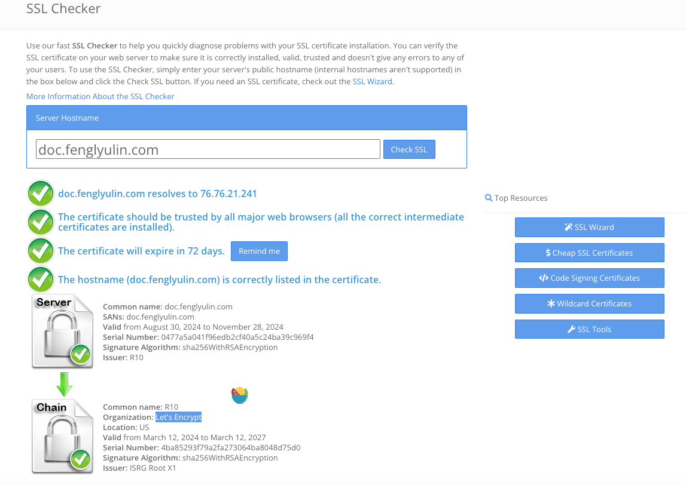

# Encryption, Signature, and Hash

## 加密算法

1. 对称加密
2. 非对称加密
   1. RSA
   1. SHA256

## 签名算法

> TODO

## 哈希摘要算法

>  TODO

## 实践

### HTTP API 内的认证

两个企业的 HTTPS API 对接，主要使用非对称加密。

双方各自生成非对称密钥对、申请证书，双方交换证书（证书中含有公钥）。

当企业 A 请求企业 B 时

1. 加密。如需对内容加密。可以用企业 B 的公钥加密，加密后的内容只有拥有私钥的企业 B 才能够解密。
2. 签名。如需对内容生成校验码。可以用企业 A 的私钥加密，加密后的内容可以用企业 A 的公钥才能够解密，并且可以和传递的内容作对比校验。由于只有企业 A 有私钥，所以其他企业都无法篡改这个校验码。

> TODO

## SSL Checker



## Let's Encrypt

>   在 Let's Encrypt 上创建证书的过程可以通过其官方推荐的工具 **Certbot** 来实现。Certbot 是一个自动化的工具，可以帮助你轻松获取和更新 SSL/TLS 证书。以下是使用 Certbot 创建 Let's Encrypt 证书的步骤：
>
>   ### 1. 安装 Certbot
>   首先，根据你的服务器类型（如 Apache、Nginx）以及操作系统（如 Ubuntu、CentOS）来安装 Certbot。
>
>   - **Ubuntu（使用 Apache 作为示例）**：
>     ```bash
>     sudo apt update
>     sudo apt install certbot python3-certbot-apache
>     ```
>
>   - **CentOS（使用 Nginx 作为示例）**：
>     ```bash
>     sudo yum install certbot python3-certbot-nginx
>     ```
>
>   ### 2. 使用 Certbot 创建证书
>   假设你已经安装好 Certbot，并且有域名指向你的服务器。使用以下命令来获取证书：
>
>   - **Apache**：
>     ```bash
>     sudo certbot --apache
>     ```
>
>   - **Nginx**：
>     ```bash
>     sudo certbot --nginx
>     ```
>
>   Certbot 会自动检测你的 Web 服务器，并引导你完成证书生成的过程。你需要输入一些信息，比如你的电子邮件地址，并选择你想要获取证书的域名。Certbot 还会自动为你配置 HTTPS。
>
>   ### 3. 验证和续订
>   Let's Encrypt 的证书默认有效期是 90 天，但 Certbot 可以帮你自动续订证书。你可以运行以下命令来测试自动续订是否有效：
>
>   ```bash
>   sudo certbot renew --dry-run
>   ```
>
>   如果你想手动续订证书，可以使用以下命令：
>
>   ```bash
>   sudo certbot renew
>   ```
>
>   ### 4. 配置自动续订
>   Certbot 通常会自动安装一个定时任务（cron job），每隔一段时间检查并自动续订证书。如果你想手动检查这些任务，可以运行以下命令：
>
>   ```bash
>   sudo systemctl list-timers
>   ```
>
>   通过这些步骤，你可以在 Let's Encrypt 上创建并管理证书，从而为你的服务器启用 HTTPS 加密。

## More

> TODO

- HMAC（AK/SK）认证

- HMAC SHA256 签名验证
=======
- HTTPS SSH 认证
- SSL 证书，letsencrypt get free certificate https://letsencrypt.org/ and auto-refresh tools
- SSH vs SSL？
- SSL 证书之于 HTTPS
- Https SSH 认证

- Let's encrypt is using sha256WithRSAEncryption

- Kafka's SCRAM-SHA-512

## Reference

1.   [一文搞懂SSH、SSL和HTTPS](https://juejin.cn/post/6998422276311908360)
2.   SSL Checker
3.   [SSH、SSL与HTTPS的联系](https://www.cnblogs.com/xdyixia/p/12201982.html)
4.   Let's Encrypt 非盈利证书机构
