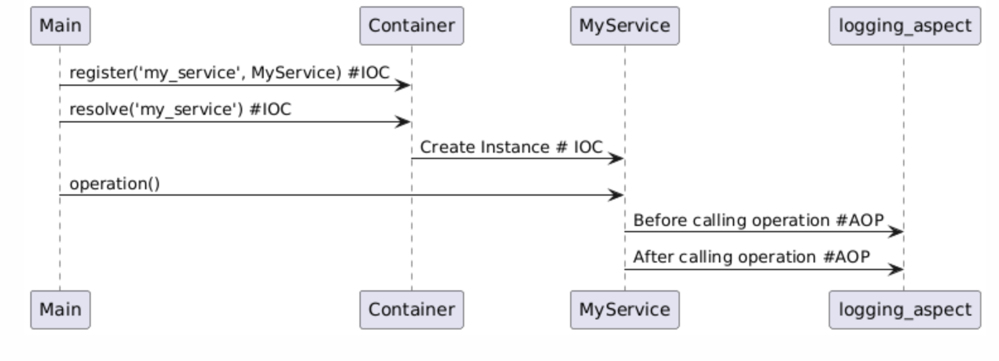

# IoC (Inversion of Control) and AOP (Aspect Oriented Programming)

设计思想

-   IOC 控制反转
-   AOP 面向切面编程

## IoC 控制反转

IOC （inversion of Control）要解决的是传统的 OOP 中对象生命周期管理（创建，销毁）的问题，把对象生命周期管理的权利交给 IoC。

-   传统的开发模式：要创建一个对象 A，其有多个依赖（B、C、D、E），我们需要在代码中一个一个创建并传给 A。
-   使用 IoC 思想的开发模式：不通过 new 来创建对象，通过 IoC 容器来帮助我们实例化对象，需要哪个对象，直接从 IoC 容器里面过去即可。

实现方法

1.   IoC 容器（可以参考下面的代码 demo），本质上是一个字典，key 是对象名，value 是创建的对象实例。
     1.   register 方法可以注册对象键值对
     2.   resolve 方法可以从 IoC 容器中获得对象实例
     3.   tips:
          1.   可以实现成单例模式或者工厂模式。Spring IoC 容器设计不需要显式地在代码中区分单例（Singleton）和多实例（Prototype），而是通过配置或注解来管理这些细节。
2.   DI （Dependency Injection）依赖注入

### DI 依赖注入

DI （Dependency Injection）依赖注入本质上是一种 IoC 的实现

-   静态依赖注入：通过代码生成在编译时注入依赖，如 Golang 的 `wire` 库就是一种 DI 工具，通过在 `wire.Build` 中提供所有依赖对象的生成方法，运行 `wire` 后会把这些方法都编排切来生成一个 `wire_gen.go`
-   动态依赖注入：在运行时根据配置动态注入依赖。Spring 中的 @Autowired 就是一个典型的例子。

## AOP 面向切面编程

OOP （Object Oriented Programming）面向对象编程可以做到对统一的操作抽象，比如 Animal 类都可以有 `eat()`, `sleep()` 方法，但是 OOP 不能解决一个问题，即代码横切面通用的操作，比如在进行某操作前后添加相同的 log。

所以 AOP 解决的问题就是，增强横切逻辑代码，解耦合，避免横切逻辑代码重复。

-   切面指的是多个方法同时共享一段相同的逻辑，可以把这些共同的逻辑抽象成为一个切面

常见用例如下所示

1.   验证参数
2.   前置日志
3.   后置日志


## 代码 demo

chatgpt prompt: 

```
python一个文件内，写一个简易版本的AOP和ioc的例子，要能实际运行，我要的是一个demo，你也可以最后给出代码的 uml 序列图，我们好讨论。 中文回复
```

以下是一个在单个 Python 文件中实现的简单 AOP（面向切面编程）和 IoC（控制反转）的示例。这个例子使用了 Python 装饰器和简单的工厂模式来模拟 AOP 和 IoC 的功能。之后，我也会为这段代码提供一个 UML 序列图。

### 示例代码

```python
# 简单的 IoC 容器
class Container:
    def __init__(self):
        self._services = {}

    def register(self, name, service):
        self._services[name] = service

    def resolve(self, name):
        service = self._services.get(name)
        if not service:
            raise Exception(f"Service '{name}' not registered.")
        return service

# AOP 切面装饰器
def logging_aspect(func):
    def wrapper(*args, **kwargs):
        print(f"Before calling {func.__name__}")
        result = func(*args, **kwargs)
        print(f"After calling {func.__name__}")
        return result
    return wrapper

# 服务接口类
class Service:
    def operation(self):
        pass

# 实现类
class MyService(Service):
    @logging_aspect
    def operation(self):
        print("Executing MyService operation.")

# 客户端代码
if __name__ == "__main__":
    # 创建 IoC 容器并注册服务
    container = Container()
    container.register('my_service', MyService())

    # 从容器中获取服务实例
    service = container.resolve('my_service')

    # 执行服务的方法
    service.operation()
```

### 代码解释
1. **IoC 容器**：`Container` 类是一个简单的 IoC 容器，用来注册和解析服务。`register` 方法用来注册服务，`resolve` 方法用来获取服务实例。

2. **AOP 切面**：`logging_aspect` 是一个简单的装饰器，它在目标函数执行前后打印日志，以模拟 AOP 的切面功能。

3. **服务接口**：`Service` 类是一个服务接口，提供了 `operation` 方法。

4. **服务实现**：`MyService` 类实现了 `Service` 接口，并使用 `@logging_aspect` 装饰器对 `operation` 方法进行增强。

5. **客户端代码**：在 `if __name__ == "__main__"` 块中，创建 IoC 容器，注册 `MyService` 服务，并通过容器获取服务实例，最终调用服务的方法。调用方法时，切面（`logging_aspect`）会在方法前后打印日志。

### UML 序列图

为了更好地理解代码运行过程，以下是代码的 UML 序列图描述：

1. **序列图描述**：
    - `Main` 代表主程序，调用 `Container` 的 `register` 方法注册服务。
    - `Main` 调用 `Container` 的 `resolve` 方法获取 `MyService` 实例。
    - `Main` 调用 `MyService` 的 `operation` 方法。
    - `logging_aspect` 在 `operation` 执行前后插入日志打印。

2. **生成的序列图**：

```plaintext
@startuml
Main -> Container: register('my_service', MyService) #IOC
Main -> Container: resolve('my_service') #IOC
Container -> MyService: Create Instance # IOC
Main -> MyService: operation()
MyService -> logging_aspect: Before calling operation #AOP
MyService -> logging_aspect: After calling operation #AOP
@enduml
```

这段代码和序列图一起展示了一个简单的 AOP 和 IoC 的用法，主要使用装饰器来模拟 AOP，使用简单的工厂模式实现 IoC。



## Reference

1.   [Spring IoC 和 AOP的通俗理解](https://blog.csdn.net/qq_39144436/article/details/123394242)
2.   Chatgpt
3.   [AOP面向切面编程](https://www.cnblogs.com/junlinsky/p/12828122.html)