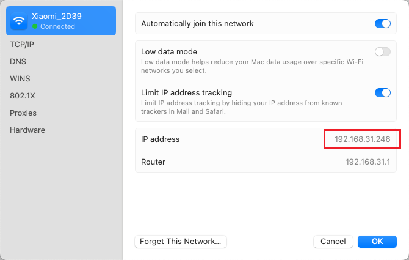

## WIFI Port Redirect public requests to my laptop

需求

- 带公网IP的宽带：Broadband with public IP

一般来说家用路由器局域网IP地址为196.168.xxx.xxx，每个连上路由器WIFI的设备都会被分配一个IP地址。

看一下电脑分配到的IP地址是多少，下面是我Mac查看WIFI网络的配置信息。红框是Mac分配的IP地址 192.168.31.246，下方则是路由器的IP地址192.168.31.1



假设在Mac上起了一个python http 服务（当然其他的所有TCP/UDP服务也是可以的），在8000端口

```python
from http.server import SimpleHTTPRequestHandler, HTTPServer

# 配置服务器地址和端口
HOST = '0.0.0.0'  # 监听所有网络接口
PORT = 8080        # 服务的端口号

class MyHandler(SimpleHTTPRequestHandler):
    def do_GET(self):
        """处理 GET 请求"""
        # 自定义返回内容
        self.send_response(200)  # 返回状态码 200 OK
        self.send_header('Content-type', 'text/html')  # 设置响应头
        self.end_headers()  # 结束头部
        # 返回的 HTML 内容
        self.wfile.write(b"<h1>Hello, World!</h1><p>Welcome to my Python server!</p>")

# 启动服务器
if __name__ == "__main__":
    with HTTPServer((HOST, PORT), MyHandler) as server:
        print(f"Server running on {HOST}:{PORT}")
        server.serve_forever()

```

运行这个代码后，可以在 localhost:8080 上看到启动的http服务


我们登陆路由器来设置端口转发

- 内部端口设置为 8080
- 内部IP设置为Mac的IP 192.168.31.246
- 外部端口也设置为 8080


或配置DMZ（即将所有端口映射到指定内网IP上）


配置完后我们即可在公网IP访问我们的服务了，由于没有配置https，所以需要使用http协议访问

http://116.88.237.167:8080

成功


