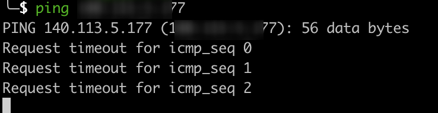
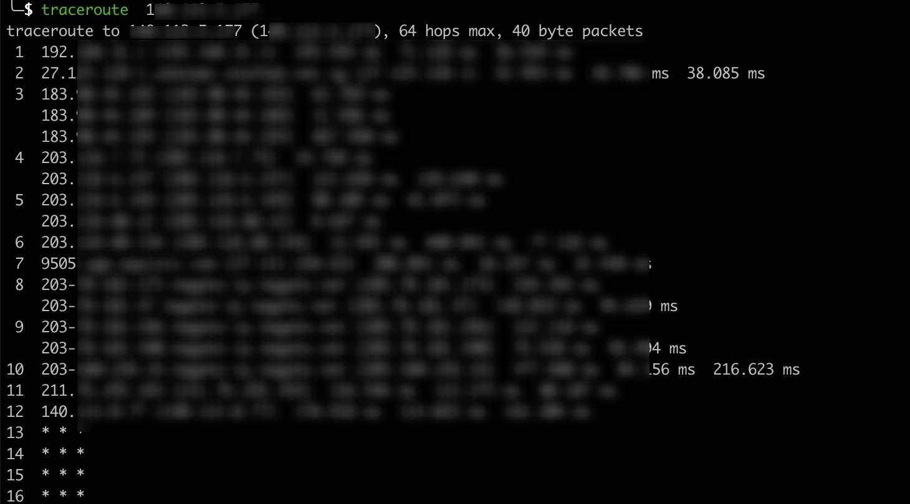

# 部署常见问题

## 配置域名如何DEBUG

-   DNS 反查：`nslookup` / `dig -x`

-   ARP 查看：`arp -a`

-   存活扫描：`nmap -sn`（Ping 扫描）、`nmap -Pn`（绕过 Ping）

-   路由追踪：`traceroute` / `tracert`

-   端口连通：`nc` / `telnet`

### 无法访问https

-   需要配置证书，参考 https://doc.fenglyulin.com/docs/web-full-stack/backend/dns-certificate#dns

## IP路由追踪

如果遇到ping ip timeout



可以使用traceroute命令看看ICMP报文卡在了哪里

```
traceroute 10.xxx.xx.xx
```



mtr命令

```
mtr -4 -c 100 -r 10.xxx.xx.xx
```

## 工作中部署MCP的卡点

1.  纠结于选择语言更符合前后端开发的习惯，python还是typescript，最后选了Python
    1.  人生苦短，我选python
2.  纠结于是否创建服务、还是和原有服务共用instance并且设置alb域名映射到新端口
    1.  直接创建了新服务
3.  不明白sse和http的区别，看文档看到最后才知道sse是为了server-to-client，以后只会推streamable-http
4.  对于health_check的理解生疏了，应该配到`0.0.0.0`（监听本机所有IP地址，接收本机所有网卡发送到本进程端口的请求），而不是`127.0.0.1`（localhost, 也即环回地址）
    1.  简单来说想让外网通过访问，需要配置到`0.0.0.0`
5.  不明白FastMCP如何配置host，读了很多次官方文档没找到，最后直接读源码才看到。。
    1.  这个应该属于早期文档不完善，用例不清晰的问题
6.  MCP在配置了全局sse的host为`/api/mcp/v1/`之后，其有个messages接口仍旧没有改变，需要单独更改
7.  对于ALB（Nginx）只会把`/api/mcp/v1/*`稳定映射，而不会映射`/api/mcp/v1*`的事实不清楚

