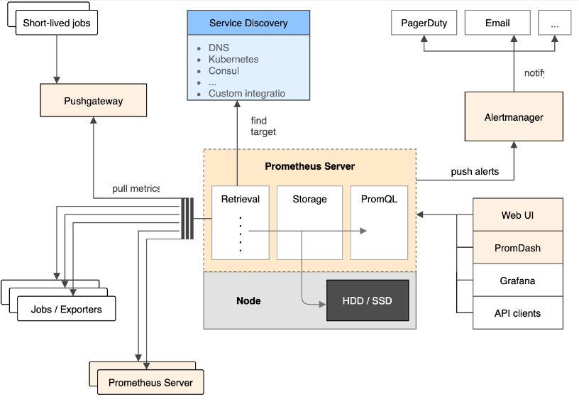

## Grafana 架构图

对于这种工具、lib 我们应该先做实验学会用，再去探讨其原理。

有几个重要的部分

-   Prometheus Server：负责数据（metrics）的定时收集、查询和存储功能。同时也是一个向量数据库。需要主动拉取 Exporter 和 Pushgateway 的 metrics 数据。
-   Pushgateway：对于存活时间比较短的 cronjob，其数据无法长久保留在机器上，所以需要 job 主动把数据推送到 pushgateway 上。
-   Node Exporters
    -   Node Exporter 是一个专门的工具，用于收集系统级别的指标（如 CPU 使用率、内存使用情况、磁盘 I/O、网络统计.
    -   作为一个独立的守护进程运行，通常在每台需要监控的机器上部署。
    -   Node Exporter 启动后，会在一个指定的端口（默认是 `9100`）上暴露 `/metrics` 端点，Prometheus 服务器可以定期抓取这个端点以获取系统指标。
-   Prometheus 客户端
    -   客户端库直接被集成到你的应用程序代码中，通过编程接口定义和操作指标。
    -   Prometheus 客户端库用于在应用程序内部定义和操作各种指标（如计数器、直方图、摘要等）。这些指标会通过 HTTP 端点（通常是 `/metrics`）暴露出来，供 Prometheus 服务器定期抓取。

