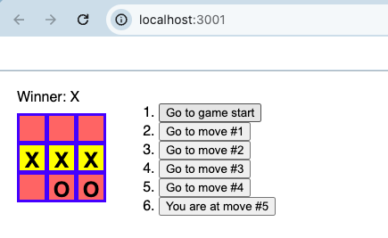

# React 五子棋入门项目 Tic-Tac-Toe

[Tutorial: Tic-Tac-Toe](https://react.dev/learn/tutorial-tic-tac-toe)

Features:

1. interactive tic-tac-toe game with React.
2. Build the square, board, and game components from scratch
3. Use the status to store and calculate the winner
4. History
   1. Storing a history of moves
   2. Showing the past moves
   3. Allow to travel to previous moves
5. Extra Features
   - [x] Refresh the History immediately while going back
   - [x] For the current move only, show “You are at move #…” instead of a button.
   - [x] Rewrite `Board` to use two loops to make the squares instead of hardcoding them.
   - [ ] Add a toggle button that lets you sort the moves in either ascending or descending order.
   - [x] When someone wins, highlight the three squares that caused the win (and when no one wins, display a message about the result being a draw).
   - [ ] Display the location for each move in the format (row, col) in the move history list.

