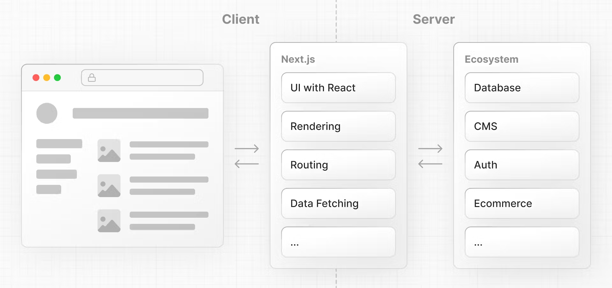
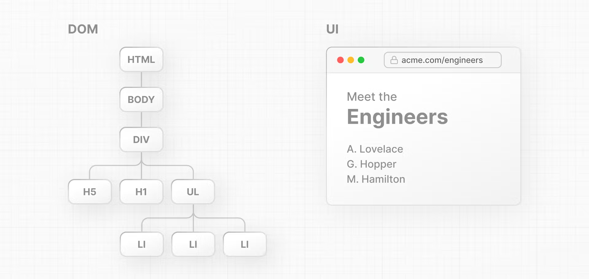
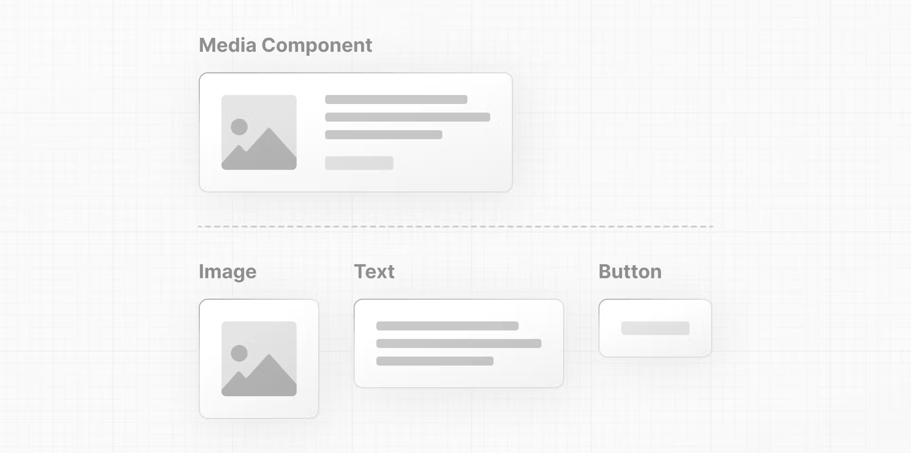
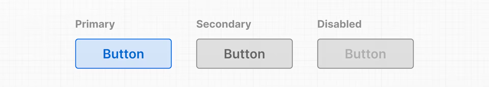
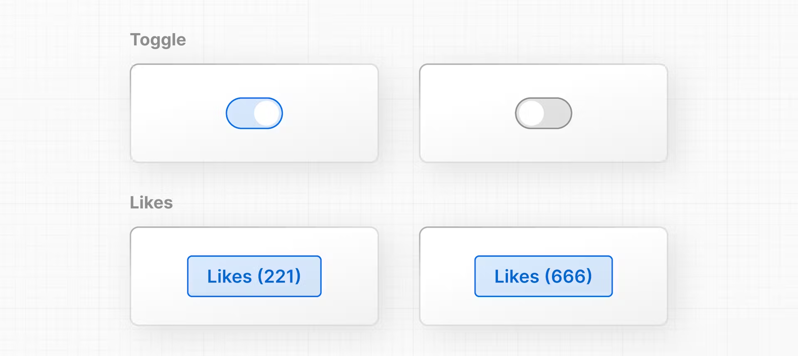
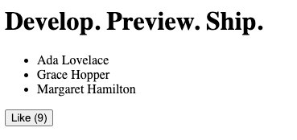
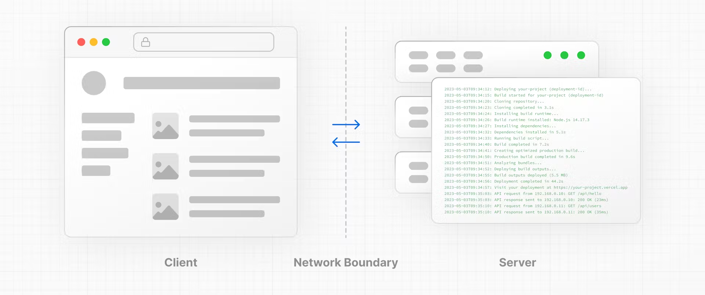
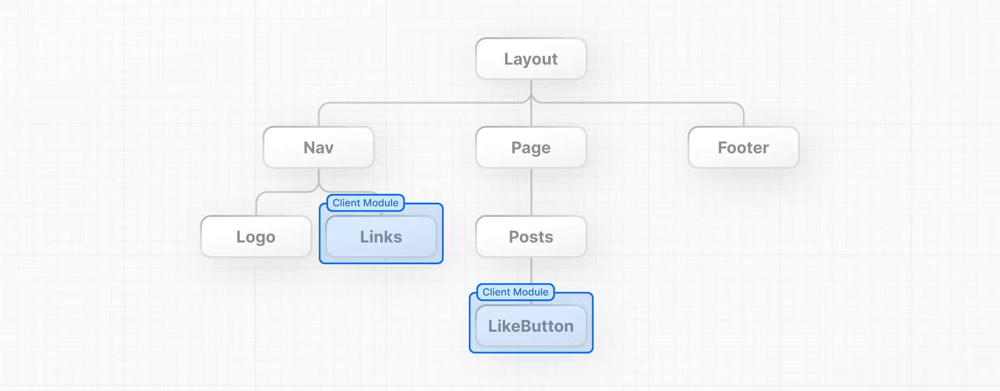
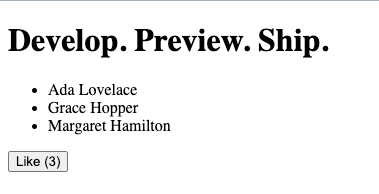

# React Nextjs Foundation

https://nextjs.org/learn/react-foundations/what-is-react-and-nextjs#building-blocks-of-a-web-application

### [What is React?](https://nextjs.org/learn/react-foundations/what-is-react-and-nextjs#what-is-react)

[React](https://react.dev/) is a JavaScript **library** for building **interactive user interfaces**.

### [What is Next.js?](https://nextjs.org/learn/react-foundations/what-is-react-and-nextjs#what-is-nextjs)

Next.js is a React **framework** that gives you building blocks to create web applications.

By framework, we mean Next.js handles the tooling and configuration needed for React, and provides additional structure, features, and optimizations for your application.



You can use React to build your UI, then incrementally adopt Next.js features to solve common application requirements such as routing, data fetching, and caching - all while improving the developer and end-user experience.

## Rendering User Interfaces (UI)

To understand how React works, we first need a basic understanding of how browsers interpret your code to create (or render) user interfaces (UI).

The browser then reads the HTML and constructs the Document Object Model (DOM).

The DOM is an object representation of the HTML elements. It acts as a bridge between your code and the user interface, and has a tree-like structure with parent and child relationships.



You can use DOM methods and JavaScript, to listen to user events and [manipulate the DOM](https://developer.mozilla.org/docs/Learn/JavaScript/Client-side_web_APIs/Manipulating_documents) by selecting, adding, updating, and deleting specific elements in the user interface. 

## Updating UI with Javascript

Then give the `div` a unique `id` so that you can target it later.

```html
<html>
  <body>
    <div id="app"></div>
  </body>
</html>
```

inside the `script` tag, you can use a DOM method, [`getElementById()`](https://developer.mozilla.org/en-US/docs/Web/API/Document/getElementById), to select the `<div>` element by its `id`:

```html
<html>
  <body>
    <div id="app"></div>
    <script type="text/javascript">
      const app = document.getElementById('app');
    </script>
  </body>
</html>
```

You can continue using DOM methods to create a new `<h1>` element:

```html
<html>
  <body>
    <div id="app"></div>
    <script type="text/javascript">
      // Select the div element with 'app' id
      const app = document.getElementById('app');
 
      // Create a new H1 element
      const header = document.createElement('h1');
 
      // Create a new text node for the H1 element
      const text = 'Develop. Preview. Ship.';
      const headerContent = document.createTextNode(text);
 
      // Append the text to the H1 element
      header.appendChild(headerContent);
 
      // Place the H1 element inside the div
      app.appendChild(header);
    </script>
  </body>
</html>
```

### Difference between HTML and DOM

The DOM of the page is different from the source code - or in other words, the original HTML file you created.

the HTML represents the **initial page content**, whereas the DOM represents the **updated page content** which was changed by the JavaScript code you wrote.

### Problem

Updating the DOM with plain JavaScript is very powerful but verbose. You've written all this code to add an `<h1>` element with some text:

Solution: But wouldn't it be nice to describe **what** you want to show and let the computer figure out **how** to update the DOM?

### Imperative vs. declarative programming

- In other words, **imperative programming** is like giving a chef step-by-step instructions on how to make a pizza. => Raw DOM
  - "Knead the dough, roll the dough, add tomato sauce, add cheese, add ham, add pineapple, bake at 200 degrees celsius in a stone oven for..."

- **Declarative programming** is like ordering a pizza without being concerned about the steps it takes to make the pizza. 🍕 => React
  - "A Hawaiian pizza please."

## React Introduction

To use React in your newly created project, load two React scripts from an external website called [unpkg.com](https://unpkg.com/):

- **react** is the core React library.
- **react-dom** provides DOM-specific methods that enable you to use React with the DOM.

### [What is JSX?](https://nextjs.org/learn/react-foundations/getting-started-with-react#what-is-jsx)

JSX is a syntax extension for JavaScript that allows you to describe your UI in a familiar *HTML-like* syntax. The nice thing about JSX is that apart from following [three JSX rules](https://react.dev/learn/writing-markup-with-jsx#the-rules-of-jsx), you don't need to learn any new symbols or syntax outside of HTML and JavaScript.

> Three Rules
>
> 1. Return a single root element
> 2. Close all the tags
> 3. camelCase all most of the things!

But browsers don't understand JSX out of the box, so you'll need a JavaScript compiler, such as a [Babel](https://babeljs.io/), to transform your JSX code into regular JavaScript.

### Comparing React and JS

```html
<html>
  <body>
    <div id="app"></div>
    <script src="https://unpkg.com/react@18/umd/react.development.js"></script>
    <script src="https://unpkg.com/react-dom@18/umd/react-dom.development.js"></script>
    <!-- Babel Script -->
    <script src="https://unpkg.com/@babel/standalone/babel.min.js"></script>
    <script type="text/jsx">
      const domNode = document.getElementById('app');
      const root = ReactDOM.createRoot(domNode);
      root.render(<h1>Develop. Preview. Ship.</h1>);
    </script>
  </body>
</html>
```

previous js

```js
<script type="text/javascript">
  const app = document.getElementById('app');
  const header = document.createElement('h1');
  const text = 'Develop. Preview. Ship.';
  const headerContent = document.createTextNode(text);
  header.appendChild(headerContent);
  app.appendChild(header);
</script>
```

And this is exactly what React does, it's a library that contains reusable snippets of code that perform tasks on your behalf - in this case, updating the UI.

### Three React core concepts

There are three core concepts of React that you'll need to be familiar with to start building React applications. These are:

- Components
- Props
- State

## [Components](https://nextjs.org/learn/react-foundations/building-ui-with-components#components)

User interfaces can be broken down into smaller building blocks called **components**.



This modularity allows your code to be more maintainable as it grows because you can add, update, and delete components without touching the rest of our application.

Sample: In React, components are **functions.** Inside your `script` tag, create a new function called `header`:

- React components should be capitalized to distinguish them from plain HTML and JavaScript
- use React components the same way you'd use regular HTML tags, with angle brackets `<>`

```html
<script type="text/jsx">
  const app = document.getElementById("app")
 
	function Header() {
     return (<h1>Develop. Preview. Ship.</h1>)
   }
 
  const root = ReactDOM.createRoot(app);
  root.render(<Header />);
</script>
```

Nesting components

- You can nest React components inside each other like you would regular HTML elements.
- Nest a `Nav` component inside a `Layout` component: 
  - `<Layout><Nav /></Layout>`

```html
function Header() {
  return <h1>Develop. Preview. Ship.</h1>;
}
 
function HomePage() {
  return (
    <div>
      {/* Nesting the Header component */}
      <Header />
    </div>
  );
}
 
const root = ReactDOM.createRoot(app);
root.render(<Header />);
```

Component Trees

You can keep nesting React components this way to form component trees.

## Props: Displaying Data

Regular HTML elements have attributes that you can use to pass pieces of information that change the behavior of those elements. For example, 

- changing the `src` attribute of an `` element changes the image that is shown. 
- Changing the `href` attribute of an `<a>` tag changes the destination of the link.

In the same way, you can pass pieces of information as properties to React components. These are called `props`.



Similar to a JavaScript function, you can design components that accept custom arguments (or props) that change the component's behavior or what is visibly shown when it's rendered to the screen. 

- In React, data flows down the component tree. 

- This is referred to as *one-way data flow*.

### [Using variables in JSX](https://nextjs.org/learn/react-foundations/displaying-data-with-props#using-variables-in-jsx)

In your `HomePage` component, you can pass a custom `title` prop to the `Header` component, just like you'd pass HTML attributes:

Since props is an object, you can use [**object destructuring**](https://developer.mozilla.org/docs/Web/JavaScript/Reference/Operators/Destructuring_assignment) to explicitly name the values of props inside your function parameters:

```html
function Header({ title }) {
  console.log(title);
  return <h1>title</h1>;
}

function HomePage() {
  return (
    <div>
      <Header title="React" />
    </div>
  );
}
```

You can think of curly braces as a way to enter "JavaScript land" while you are in "JSX land". You can add any **JavaScript expression** (something that evaluates to a single value) inside curly braces. For example:

An **object property** with dot notation:

```js
function Header(props) {
  return <h1>{props.title}</h1>;
}
```

A  **template literal**:

```js
function Header({ title }) {
  return <h1>{`Cool ${title}`}</h1>;
}
```

The **returned value of a function**:

```js
function createTitle(title) {
  if (title) {
    return title;
  } else {
    return 'Default title';
  }
}
 
function Header({ title }) {
  return <h1>{createTitle(title)}</h1>;
}
```

### [Iterating through lists](https://nextjs.org/learn/react-foundations/displaying-data-with-props#iterating-through-lists)

You can then use the `array.map()` method to iterate over the array and use an **arrow function** to map a name to a list item:

Notice how you've used curly braces to weave in and out of "JavaScript" and "JSX" land.

```html
function HomePage() {
  const names = ['Ada Lovelace', 'Grace Hopper', 'Margaret Hamilton'];
 
  return (
    <div>
      <Header title="Develop. Preview. Ship." />
      <ul>
        {names.map((name) => (
          <li>{name}</li>
        ))}
      </ul>
    </div>
  );
}
```

If you run this code, React will give us a warning about a missing `key` prop. This is because React needs something to uniquely identify items in an array so it knows which elements to update in the DOM.

it's recommended to use something guaranteed to be unique, like an item ID.

```js
function HomePage() {
  const names = ['Ada Lovelace', 'Grace Hopper', 'Margaret Hamilton'];
 
  return (
    <div>
      <Header title="Develop. Preview. Ship." />
      <ul>
        {names.map((name) => (
          <li key={name}>{name}</li>  // <------
        ))}
      </ul>
    </div>
  );
}
```

## State: Adding Interactivity

### Listening to events

To make the button do something when clicked, you can use the `onClick` event

In React, event names are camelCased. The `onClick` event is one of many possible events you can use to respond to user interaction. For example, you can use `onChange` for input fields or `onSubmit` for forms.

```html
function HomePage() {
  // ...
  return (
    <div>
      {/* ... */}
      <button onClick={}>Like</button>
    </div>
  );
}
```

### Handling events

You can define a function to "handle" events whenever they are triggered. Create a function before the return statement called `handleClick()`:

```js
function HomePage() {
  // 	...
  function handleClick() {
    console.log('increment like count');
  }
 
  return (
    <div>
      {/* ... */}
      <button onClick={handleClick}>Like</button>
    </div>
  );
}
```

### State and hooks

React has a set of functions called [hooks](https://react.dev/learn). Hooks allow you to add additional logic such as **state** to your components.



The React hook used to manage state is called: `useState()`

Add `useState()` to your project. It returns an array, and you can access and use those array values inside your component using **array destructuring**:

- The first item in the array is the state `value`
- The second item in the array is a function to `update` the value.

```js
function HomePage() {
  // ...
  const [likes, setLikes] = React.useState(0);
 
  function handleClick() {
    setLikes(likes + 1);
  }
 
  return (
    <div>
      {/* ... */}
      <button onClick={handleClick}>Likes ({likes})</button>
    </div>
  );
}
```

Clicking the button will now call the `handleClick` function, which calls the `setLikes` state updater function with a single argument of the current number of likes + 1.

More:

- https://react.dev/learn/adding-interactivity#queueing-a-series-of-state-updates

## Migrate From React to Next.js

This is what the final code looked like. If you're starting from here, paste this code into an `index.html` file in your code editor.



```html
<html>
  <body>
    <div id="app"></div>
 
    <script src="https://unpkg.com/react@18/umd/react.development.js"></script>
    <script src="https://unpkg.com/react-dom@18/umd/react-dom.development.js"></script>
    <script src="https://unpkg.com/@babel/standalone/babel.min.js"></script>
 
    <script type="text/jsx">
      const app = document.getElementById("app")
 
      function Header({ title }) {
        return <h1>{title ? title : "Default title"}</h1>
      }
 
      function HomePage() {
        const names = ["Ada Lovelace", "Grace Hopper", "Margaret Hamilton"]
 
        const [likes, setLikes] = React.useState(0)
 
        function handleClick() {
          setLikes(likes + 1)
        }
 
        return (
          <div>
            <Header title="Develop. Preview. Ship." />
            <ul>
              {names.map((name) => (
                <li key={name}>{name}</li>
              ))}
            </ul>
 
            <button onClick={handleClick}>Like ({likes})</button>
          </div>
        )
      }
 
      const root = ReactDOM.createRoot(app);
      root.render(<HomePage />);
    </script>
  </body>
</html>
```

There are also newer React features, like Server and Client Components, that require a framework. The good news is that Next.js handles much of the setup and configuration and has additional features to help you build React applications.

- Next, we'll migrate the example from React to Next.js
- discuss how Next.js works
- introduce you to the differences between Server and Client Components.

### [Installing Next.js](https://nextjs.org/learn/react-foundations/installation)

When you use Next.js in your project, you do not need to load the `react` and `react-dom` scripts from [unpkg.com](http://unpkg.com/) anymore. Instead, you can install these packages locally using `npm` or your preferred package manager.

- create a new file in the same directory as your `index.html` file, called `package.json` with an empty object `{}`.
  - once `npm install react@latest react-dom@latest next@latest` done, you should be able to see your project dependencies listed inside your `package.json` file:

- a new file called `package-lock.json` file that contains detailed information about the exact versions of each package.

### File-system routing

Next.js uses file-system routing. This means that instead of using code to define the routes of your application, you can use folders and files.

Here's how you can create your first page in Next.js:

Here's how you can create your first page in Next.js:

1. Create a new folder called [app](https://nextjs.org/docs/app/building-your-application/routing#the-app-router) and move the `index.js` file inside it.
2. Rename your `index.js` file to `page.js`. This will be the main page of your application.
3. Add `export default` to your `<HomePage>` component to help Next.js distinguish which component to render as the main component of the page.

```js
import { useState } from 'react';
 
function Header({ title }) {
  return <h1>{title ? title : 'Default title'}</h1>;
}
 
export default function HomePage() {
  const names = ['Ada Lovelace', 'Grace Hopper', 'Margaret Hamilton'];
 
  const [likes, setLikes] = useState(0);
 
  function handleClick() {
    setLikes(likes + 1);
  }
 
  return (
    <div>
      <Header title="Develop. Preview. Ship." />
      <ul>
        {names.map((name) => (
          <li key={name}>{name}</li>
        ))}
      </ul>
 
      <button onClick={handleClick}>Like ({likes})</button>
    </div>
  );
}
```

 Add a `"next dev"` script to your `package.json` file:

```html
{
  "scripts": {
    "dev": "next dev"
  },
  "dependencies": {
    "next": "^14.0.3",
    "react": "^18.3.1",
    "react-dom": "^18.3.1"
  }
}
```

### Server Component

while you run the previous codes with `npm run dev`, an error will show as below

```
Error: 
  × You're importing a component that needs useState. It only works in a Client Component but none of its parents are marked with "use client", so they're Server Components by default.
```

This is because Next.js uses React Server Components, a new feature that allows React to render on the server. Server Components don't support `useState`, so you'll need to use a Client Component instead.

In the next chapter, we'll discuss the main differences between **Server and Client Components** and fix this error.

- Client Components
- Server Components
  - cannot use `useState`

A new file called `layout.js` was automatically created inside the `app` folder. This is the main layout of your application. You can use it to add UI elements that are shared across all pages (e.g. navigation, footer, etc).

```js
export const metadata = {
  title: 'Next.js',
  description: 'Generated by Next.js',
};
 
export default function RootLayout({ children }) {
  return (
    <html lang="en">
      <body>{children}</body>
    </html>
  );
}
```

## [Server and Client Components](https://nextjs.org/learn/react-foundations/server-and-client-components)

- The [environments](https://nextjs.org/learn/react-foundations/server-and-client-components#server-and-client-environments) your application code can be executed in: the server and the client.
- The [network boundary](https://nextjs.org/learn/react-foundations/server-and-client-components#network-boundary) that separates server and client code.

### Server and Client Environments

In the context of web applications:



- The **client** refers to the browser on a user’s device that 
  - sends a request to a server for your application code. 
  - It then turns the response it receives from the server into an interface the user can interact with.
- The **server** refers to the computer in a data center that 
  - stores your application code, 
  - receives requests from a client, 
  - does some computation, 
  - and sends back an appropriate response.

Each environment has its own set of capabilities and constraints.

Therefore, the code you write for the server and the client is not always the same. Certain operations (e.g. data fetching or managing user state) are better suited for one environment over the other.

### [Network Boundary](https://nextjs.org/learn/react-foundations/server-and-client-components#network-boundary)

The **Network Boundary** is a conceptual line that separates the different environments. In React, you choose where to place the network boundary in your component tree. 

- For example, you can fetch data and render a user's posts on the server (using Server Components), then render the interactive `LikeButton` for each post on the client (using Client Components).
- Similarly, you can create a `Nav` component that is rendered on the server and shared across pages, but if you want to show an active state for links, you can render the list of `Links` on the client.



The **server module graph (or tree)** contains all the Server Components that are rendered on the server, and the **client module graph (or tree)** contains all Client Components.

After Server Components are rendered, a special data format called the **React Server Component Payload (RSC)** is sent to the client. The RSC payload contains:

1. The rendered result of Server Components.
2. Placeholders (or holes) for where Client Components should be rendered and references to their JavaScript files.

### Using Client Components

As you learned in the last chapter, Next.js uses Server Components by default - this is to improve your application's performance and means you don't have to take additional steps to adopt them.

In the previous error, Next.js is warning you that you're trying to `useState` inside a Server Component. You can fix this by moving the interactive "Like" button to a Client Component.


Create a new file called `like-button.js` inside the `app` folder that exports a `LikeButton` component:

```js
import { useState } from 'react';
 
export default function LikeButton() {
  const [likes, setLikes] = useState(0);
 
  function handleClick() {
    setLikes(likes + 1);
  }
 
  return <button onClick={handleClick}>Like ({likes})</button>;
}
```

Now, to make the `LikeButton` a Client Component, add the React `'use client'` directive at the top of the file. This tells React to render the component on the client.

```js
'use client';
 
import { useState } from 'react';
//...
```

Then Back in your `page.js` file, import the `LikeButton` component into your page:

```js
import LikeButton from './like-button';
 
function Header({ title }) {
  return <h1>{title ? title : 'Default title'}</h1>;
}
 
export default function HomePage() {
  const names = ['Ada Lovelace', 'Grace Hopper', 'Margaret Hamilton'];
 
  return (
    <div>
      <Header title="Develop. Preview. Ship." />
      <ul>
        {names.map((name) => (
          <li key={name}>{name}</li>
        ))}
      </ul>
      <LikeButton />
    </div>
  );
}
```

Now it works again based on `Next.js`



### Fast Rresh

This feature is called [Fast Refresh](https://nextjs.org/docs/architecture/fast-refresh). It gives you instantaneous feedback on any edits you make and comes pre-configured with Next.js.

## Next Steps

### [Continue learning React](https://nextjs.org/learn/react-foundations/next-steps#continue-learning-react)

Over the years, many courses, videos, and articles have been created to help developers learn React. While it's hard to recommend resources that will fit your learning style, one invaluable reference is the [React Documentation](https://react.dev/) which contains interactive sandboxes to help you practice the topics.

### [Learn Next.js by building a dashboard app](https://nextjs.org/learn/react-foundations/next-steps#learn-nextjs-by-building-a-dashboard-app)

Continue learning Next.js by [creating a dashboard app](https://nextjs.org/learn/dashboard-app) - this course will introduce you to the **main** Next.js features and get you practicing by building a more complex project.
