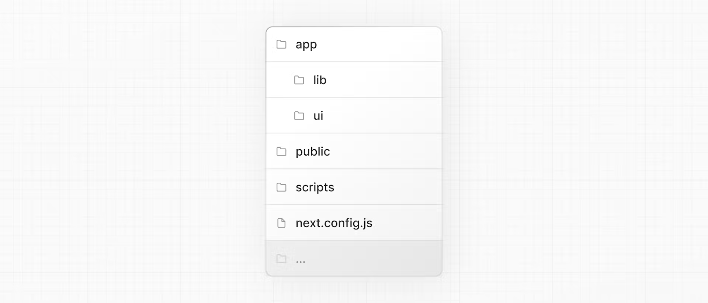
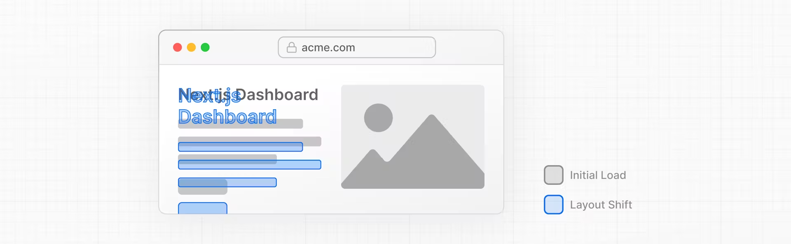
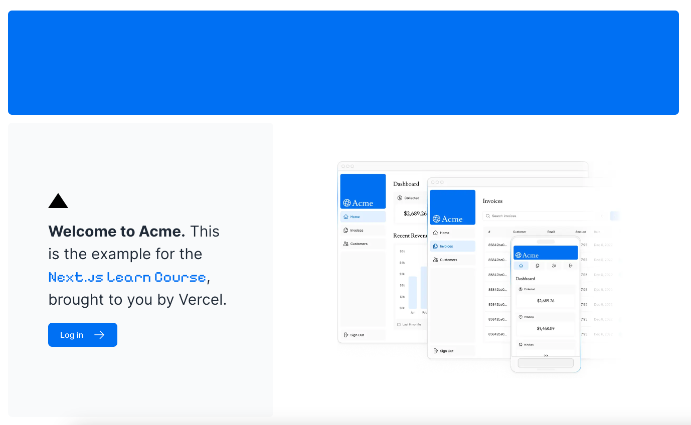
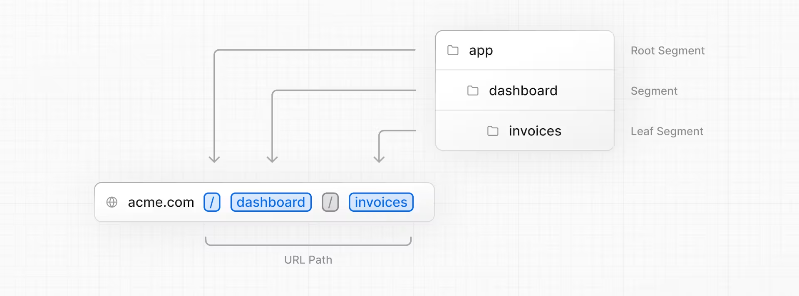
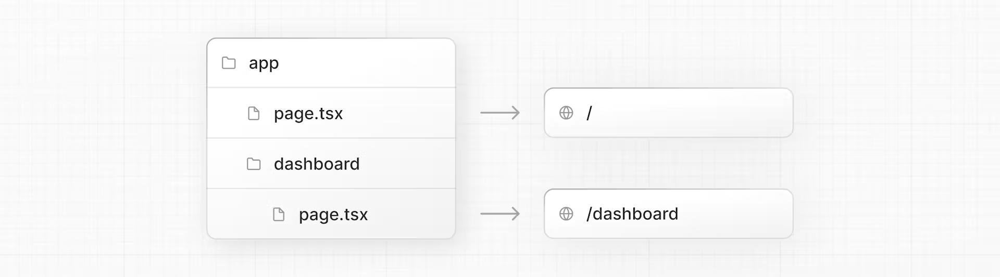
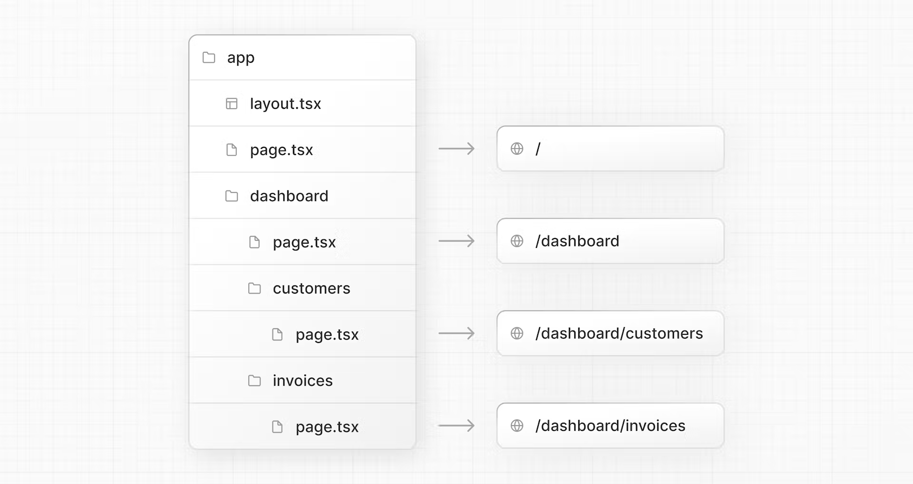
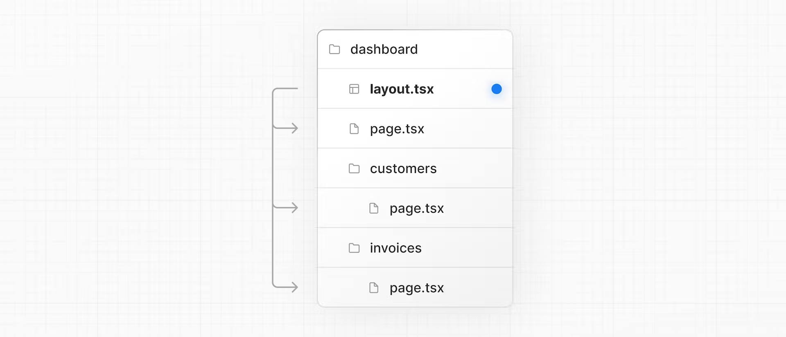

# Nextjs Project Dashboard 01

https://nextjs.org/learn/dashboard-app

## [Overview](https://nextjs.org/learn/dashboard-app#overview)

Here's an overview of features you'll learn about in this course:

- **Styling**: The different ways to style your application in Next.js.
- **Optimizations**: How to optimize images, links, and fonts.
- **Routing**: How to create nested layouts and pages using file-system routing.
- **Data Fetching**: How to set up a database on Vercel, and best practices for fetching and streaming.
- **Search and Pagination**: How to implement search and pagination using URL Search Params.
- **Mutating Data:** How to mutate data using React Server Actions, and revalidate the Next.js cache.
- **Error Handling:** How to handle general and `404` not found errors.
- **Form Validation and Accessibility:** How to do server-side form validation and tips for improving accessibility.
- **Authentication**: How to add authentication to your application using [`NextAuth.js`](https://next-auth.js.org/) and Middleware.
- **Metadata**: How to add metadata and prepare your application for social sharing.

## 1) Getting Started

https://nextjs.org/learn/dashboard-app/getting-started

- create the project based on a template

```shell
npx create-next-app@latest nextjs-dashboard --example "https://github.com/vercel/next-learn/tree/main/dashboard/starter-example"
```

This command uses [`create-next-app`](https://nextjs.org/docs/app/api-reference/create-next-app), a Command Line Interface (CLI) tool that sets up a Next.js application for you.

### Exploring the project

folder structure



- **`/app`**: Contains all the routes, components, and logic for your application, this is where you'll be mostly working from.
- **`/app/lib`**: Contains functions used in your application, such as reusable utility functions and data fetching functions.
- **`/app/ui`**: Contains all the UI components for your application, such as cards, tables, and forms. To save time, we've pre-styled these components for you.
- **`/public`**: Contains all the static assets for your application, such as images.
- **`/scripts`**: Contains a seeding script that you'll use to populate your database in a later chapter.
- **Config Files**: You'll also notice config files such as `next.config.js` at the root of your application. Most of these files are created and pre-configured when you start a new project using `create-next-app`. You will not need to modify them in this course.

### Placeholder data

When you're building user interfaces, it helps to have some placeholder data. If a database or API is not yet available, you can:

- Use placeholder data in JSON format or as JavaScript objects.
- Use a 3rd party service like [mockAPI](https://mockapi.io/).

For this project, we've provided some placeholder data in `app/lib/placeholder-data.js`. Each JavaScript object in the file represents a table in your database. 

### TypeScript

You may also notice most files have a `.ts` or `.tsx` suffix. This is because the project is written in TypeScript. 

By using TypeScript, you can ensure you don't accidentally pass the wrong data format to your components or database, like passing a `string` instead of a `number` to invoice `amount`.

> We're manually declaring the data types, but for better type-safety, we recommend [Prisma](https://www.prisma.io/), which automatically generates types based on your database schema.

### Running the development server

install

```shell
pnpm i
```

start development server

```shell
pnpm dev
```

`pnpm dev` starts your Next.js development server on port `3000`. You can optionally use `npm` or your preferred package manager instead of `pnpm`.

## 2) CSS Styling

Our targets:

1. How to add a global CSS file to your application.
2. Two different ways of styling: Tailwind and CSS modules.
3. How to conditionally add class names with the `clsx` utility package.

### Global styles

If you look inside the `/app/ui` folder, you'll see a file called `global.css`

You can import `global.css` in any component in your application, but it's usually good practice to add it to your top-level component. In Next.js, this is the [root layout](https://nextjs.org/docs/app/building-your-application/routing/pages-and-layouts#root-layout-required) (more on this later).

Add global styles to your application by navigating to `/app/layout.tsx` and importing the `global.css` file:

```js
import '@/app/ui/global.css'; //<--- here
 
export default function RootLayout({
  children,
}: {
  children: React.ReactNode;
}) {
  return (
    <html lang="en">
      <body>{children}</body>
    </html>
  );
}
```

If you take a look inside `global.css`, you'll notice some `@tailwind` directives:

```css
@tailwind base;
@tailwind components;
@tailwind utilities;
```

### Tailwind

https://nextjs.org/docs/app/building-your-application/styling/tailwind-css

[Tailwind](https://tailwindcss.com/) is a CSS framework that speeds up the development process by allowing you to quickly write [utility classes](https://tailwindcss.com/docs/utility-first) directly in your TSX markup.

In Tailwind, you style elements by adding class names. For example, adding the class `"text-blue-500"` will turn the `<h1>` text blue:

```html
<h1 className="text-blue-500">I'm blue!</h1>
```

Let's play with Tailwind! Copy the code below and paste it above the `<p>` element in `/app/page.tsx`:

```js
<div
  className="h-0 w-0 border-b-[30px] border-l-[20px] border-r-[20px] border-b-black border-l-transparent border-r-transparent"
/>
```

### CSS Modules

Inside `/app/ui`, create a new file called `home.module.css` and add the following CSS rules:

```css
.shape {
  height: 0;
  width: 0;
  border-bottom: 30px solid black;
  border-left: 20px solid transparent;
  border-right: 20px solid transparent;
}
```

Then, inside your `/app/page.tsx` file import the styles and replace the Tailwind class names from the `<div>` you've added with `styles.shape`:

```js
import AcmeLogo from '@/app/ui/acme-logo';
import { ArrowRightIcon } from '@heroicons/react/24/outline';
import Link from 'next/link';
import styles from '@/app/ui/home.module.css';
 
export default function Page() {
  return (
    <main className="flex min-h-screen flex-col p-6">
      <div className={styles.shape} />
    // ...
  )
}
```

**Tailwind and CSS modules are the two most common ways of styling Next.js applications**. Whether you use one or the other is a matter of preference - you can even use both in the same application!

### Using the `clsx` library to toggle class names: Conditionally Style

[`clsx`](https://www.npmjs.com/package/clsx) is a library that lets you toggle class names easily. We recommend taking a look at [documentation](https://github.com/lukeed/clsx) for more details, but here's the basic usage:

- Suppose that you want to create an `InvoiceStatus` component which accepts `status`. The status can be `'pending'` or `'paid'`.
- If it's `'paid'`, you want the color to be green. If it's `'pending'`, you want the color to be gray.

You can use `clsx` to conditionally apply the classes, like this:

```js
import clsx from 'clsx';
 
export default function InvoiceStatus({ status }: { status: string }) {
  return (
    <span
      className={clsx(
        'inline-flex items-center rounded-full px-2 py-1 text-sm',
        {
          'bg-gray-100 text-gray-500': status === 'pending',
          'bg-green-500 text-white': status === 'paid',
        },
      )}
    >
    // ...
)}
```

## 3) Optimizing Fonts and Images

1. How to add custom fonts with `next/font`.
2. How to add images with `next/image`.
3. How fonts and images are optimized in Next.js.

### Why optimize fonts?

Fonts play a significant role in the design of a website, but using custom fonts in your project can affect performance if the font files need to be fetched and loaded.

[Cumulative Layout Shift](https://web.dev/cls/) is a metric used by Google to evaluate the performance and user experience of a website.



Next.js automatically optimizes fonts in the application when you use the `next/font` module. It downloads font files at build time and hosts them with your other static assets. This means when a user visits your application, there are no additional network requests for fonts which would impact performance.

### Adding a primary font

In your `/app/ui` folder, create a new file called `fonts.ts`. 

Import the `Inter` font from the `next/font/google` module - this will be your primary font. Then, specify what [subset](https://fonts.google.com/knowledge/glossary/subsetting) you'd like to load. In this case, `'latin'`:

```js
import { Inter } from 'next/font/google';
 
export const inter = Inter({ subsets: ['latin'] });
```

Finally, add the font to the `<body>` element in `/app/layout.tsx`:

By adding `Inter` to the `<body>` element, the font will be applied throughout your application. Here, you're also adding the Tailwind [`antialiased`](https://tailwindcss.com/docs/font-smoothing) class which smooths out the font. It's not necessary to use this class, but it adds a nice touch.

```js
import '@/app/ui/global.css';
import { inter } from '@/app/ui/fonts';
 
export default function RootLayout({
  children,
}: {
  children: React.ReactNode;
}) {
  return (
    <html lang="en">
      <body className={`${inter.className} antialiased`}>{children}</body>
    </html>
  );
}
```

### Practice: Adding a secondary font

Now it's your turn! In your `fonts.ts` file, import a secondary font called `Lusitana` and pass it to the `<p>` element in your `/app/page.tsx` file. In addition to specifying a subset like you did before, you'll also need to specify the font **weight**.

二级字体的意思

```
          <p className={`${pixelifySans.className} text-xl text-gray-800 md:text-3xl md:leading-normal`}>
```

### Why optimize images?

With regular HTML, you would add an image as follows:

- Ensure your image is responsive on different screen sizes.
- Specify image sizes for different devices.
- Prevent layout shift as the images load.
- Lazy load images that are outside the user's viewport.

Image Optimization is a large topic in web development that could be considered a specialization in itself. Instead of manually implementing these optimizations, you can use the `next/image` component to automatically optimize your images.

## The `<Image>` component

The `<Image>` Component is an extension of the HTML `` tag, and comes with automatic image optimization, such as:

- Preventing layout shift automatically when images are loading.
- Resizing images to avoid shipping large images to devices with a smaller viewport.
- Lazy loading images by default (images load as they enter the viewport).
- Serving images in modern formats, like [WebP](https://developer.mozilla.org/en-US/docs/Web/Media/Formats/Image_types#webp) and [AVIF](https://developer.mozilla.org/en-US/docs/Web/Media/Formats/Image_types#avif_image), when the browser supports it.

### Adding the desktop hero image

Let's use the `<Image>` component. If you look inside the `/public` folder, you'll see there are two images: `hero-desktop.png` and `hero-mobile.png`. 

```html
import AcmeLogo from '@/app/ui/acme-logo';
import { ArrowRightIcon } from '@heroicons/react/24/outline';
import Link from 'next/link';
import { lusitana } from '@/app/ui/fonts';
import Image from 'next/image';
 
export default function Page() {
  return (
    // ...
    <div className="flex items-center justify-center p-6 md:w-3/5 md:px-28 md:py-12">
      {/* Add Hero Images Here */}
      <Image
        src="/hero-desktop.png"
        width={1000}
        height={760}
        className="hidden md:block"
        alt="Screenshots of the dashboard project showing desktop version"
      />
    </div>
    //...
  );
}
```

Here, you're setting the `width` to `1000` and `height` to `760` pixels. It's good practice to set the `width` and `height` of your images to avoid layout shift, these should be an aspect ratio **identical** to the source image.

You'll also notice the class `hidden` to remove the image from the DOM on mobile screens, and `md:block` to show the image on desktop screens.



### Practice: Adding the mobile hero image

Under the image you've just added, add another `<Image>` component for `hero-mobile.png`.

- The image should have a `width` of `560` and `height` of `620` pixels.
- It should be shown on mobile screens, and hidden on desktop - you can use dev tools to check if the desktop and mobile images are swapped correctly.

> - `block`：使元素在所有屏幕尺寸上默认显示为块级元素。
>
> 在 CSS 中，`block` 是一个常用的显示（display）属性值，它将元素设为块级元素。块级元素的特点是：
>
> 1. **独占一行**：块级元素通常会占据其父容器的整个宽度，并独占一行。换句话说，块级元素会自动换行到下一行。
> 2. **宽度自动填充**：默认情况下，块级元素的宽度会自动填充其父容器的宽度，除非你明确指定了它的宽度。
> 3. **高度自动调整**：块级元素的高度会根据其内容自动调整。
>
> 使用 `block` 可以让内联元素（如 `<span>`、`<a>` 等）表现得像块级元素。常见的块级元素包括 `<div>`、`<p>`、`h1`-`h6` 等。
>
> 
>
> 在使用 Tailwind CSS 这样的实用优先的 CSS 框架时，`md` 是指中等（medium）屏幕尺寸的断点。Tailwind CSS 中的断点用于创建响应式设计，具体如下：
>
> - `sm`：表示小屏幕（small），最小宽度通常是 640px。
> - `md`：表示中等屏幕（medium），最小宽度通常是 768px。
> - `lg`：表示大屏幕（large），最小宽度通常是 1024px。
> - `xl`：表示超大屏幕（extra large），最小宽度通常是 1280px。
> - `2xl`：表示超超大屏幕（2 extra large），最小宽度通常是 1536px。
>
> `md:hidden` 意味着在中等及更大屏幕上隐藏元素（768px 及更大）。
>
> `md:block` 意味着在中等及更大屏幕上显示为块级元素（768px 及更大）。

所以 ` className="block md:hidden"` 意思是在中等及更大屏幕上隐藏元素，其他的显示为块级元素

## [3) Creating Layouts and Pages](https://nextjs.org/learn/dashboard-app/creating-layouts-and-pages)

1. Create the `dashboard` routes using file-system routing.
2. Understand the role of folders and files when creating new route segments.
3. Create a nested layout that can be shared between multiple dashboard pages.
4. Understand what colocation, partial rendering, and the root layout are.

### Nested routing

Next.js uses file-system routing where **folders** are used to create nested routes. Each folder represents a **route segment** that maps to a **URL segment**.



You can create separate UIs for each route using `layout.tsx` and `page.tsx` files.

You can create separate UIs for each route using `layout.tsx` and `page.tsx` files.

`page.tsx` is a special Next.js file that exports a React component, and it's required for the route to be accessible. In your application, you already have a page file: `/app/page.tsx` - this is the home page associated with the route `/`.

To create a nested route, you can nest folders inside each other and add `page.tsx` files inside them. For example:



### Creating the dashboard page

Create a new folder called `dashboard` inside `/app`. Then, create a new `page.tsx` file inside the `dashboard` folder with the following content:

```js
export default function Page() {
  return <p>Dashboard Page</p>;
}
```

Now, make sure that the development server is running and visit http://localhost:3000/dashboard. You should see the "Dashboard Page" text.

Colocate: 也就是允许把 UI 组件，css，测试文件同时放在 app 底下，路由只能访问 page.tsx 的内容

> By having a special name for `page` files, Next.js allows you to [colocate](https://nextjs.org/docs/app/building-your-application/routing#colocation) UI components, test files, and other related code with your routes. Only the content inside the `page` file will be publicly accessible. For example, the `/ui` and `/lib` folders are *colocated* inside the `/app` folder along with your routes.

### Practice: Creating the dashboard pages

1. **Customers Page**: The page should be accessible on http://localhost:3000/dashboard/customers. For now, it should return a `<p>Customers Page</p>` element.
2. **Invoices Page**: The invoices page should be accessible on http://localhost:3000/dashboard/invoices. For now, also return a `<p>Invoices Page</p>` element.



### Creating the dashboard layout

Dashboards have some sort of navigation that is shared across multiple pages. 

Inside the `/dashboard` folder, add a new file called `layout.tsx` and paste the following code:

```js
import SideNav from '@/app/ui/dashboard/sidenav';
 
export default function Layout({ children }: { children: React.ReactNode }) {
  return (
    <div className="flex h-screen flex-col md:flex-row md:overflow-hidden">
      <div className="w-full flex-none md:w-64">
        <SideNav />
      </div>
      <div className="flex-grow p-6 md:overflow-y-auto md:p-12">{children}</div>
    </div>
  );
}
```

First, you're importing the `<SideNav />` component into your layout. Any components you import into this file will be part of the layout.

The `<Layout />` component receives a `children` prop. This child can either be a page or another layout. In your case, the pages inside `/dashboard` will automatically be nested inside a `<Layout />` like so:



One benefit of using layouts in Next.js is that on navigation, only the page components update while the layout won't re-render. This is called [partial rendering](https://nextjs.org/docs/app/building-your-application/routing/linking-and-navigating#3-partial-rendering):


### Root layout

In Chapter 3, you imported the `Inter` font into another layout: `/app/layout.tsx`. As a reminder:

```js
import '@/app/ui/global.css';
import { inter } from '@/app/ui/fonts';
 
export default function RootLayout({
  children,
}: {
  children: React.ReactNode;  // 组件接受一个 children 属性，其类型定义为 React.ReactNode。
}) {
  return (
    <html lang="en">
      <body className={`${inter.className} antialiased`}>{children}</body>
    </html>
  );
}
```

This is called a [root layout](https://nextjs.org/docs/app/building-your-application/routing/pages-and-layouts#root-layout-required) and is required. Any UI you add to the root layout will be shared across **all** pages in your application. You can use the root layout to modify your `<html>` and `<body>` tags, and add metadata (you'll learn more about metadata in a later chapter).

## [Navigating Between Pages](https://nextjs.org/learn/dashboard-app/navigating-between-pages)

1. How to use the `next/link` component.
2. How to show an active link with the `usePathname()` hook.
3. How navigation works in Next.js.
