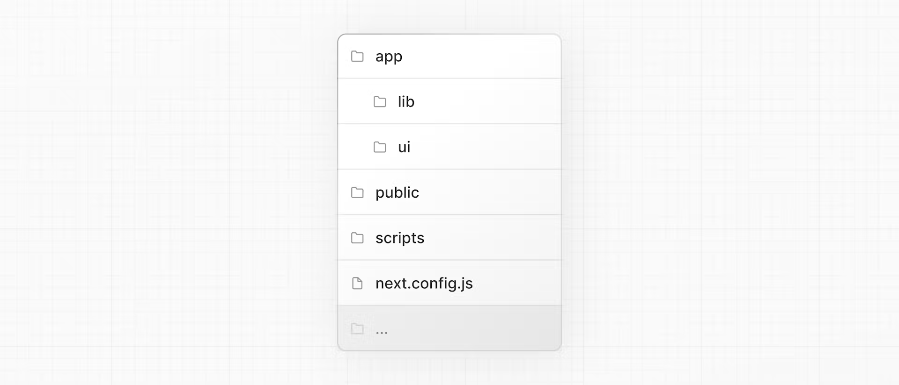

https://nextjs.org/learn/dashboard-app


## [Overview](https://nextjs.org/learn/dashboard-app#overview)

Here's an overview of features you'll learn about in this course:

- **Styling**: The different ways to style your application in Next.js.
- **Optimizations**: How to optimize images, links, and fonts.
- **Routing**: How to create nested layouts and pages using file-system routing.
- **Data Fetching**: How to set up a database on Vercel, and best practices for fetching and streaming.
- **Search and Pagination**: How to implement search and pagination using URL Search Params.
- **Mutating Data:** How to mutate data using React Server Actions, and revalidate the Next.js cache.
- **Error Handling:** How to handle general and `404` not found errors.
- **Form Validation and Accessibility:** How to do server-side form validation and tips for improving accessibility.
- **Authentication**: How to add authentication to your application using [`NextAuth.js`](https://next-auth.js.org/) and Middleware.
- **Metadata**: How to add metadata and prepare your application for social sharing.

## Getting Started

https://nextjs.org/learn/dashboard-app/getting-started

- create the project based on a template

```shell
npx create-next-app@latest nextjs-dashboard --example "https://github.com/vercel/next-learn/tree/main/dashboard/starter-example"
```

This command uses [`create-next-app`](https://nextjs.org/docs/app/api-reference/create-next-app), a Command Line Interface (CLI) tool that sets up a Next.js application for you.

### Exploring the project

folder structure



- **`/app`**: Contains all the routes, components, and logic for your application, this is where you'll be mostly working from.
- **`/app/lib`**: Contains functions used in your application, such as reusable utility functions and data fetching functions.
- **`/app/ui`**: Contains all the UI components for your application, such as cards, tables, and forms. To save time, we've pre-styled these components for you.
- **`/public`**: Contains all the static assets for your application, such as images.
- **`/scripts`**: Contains a seeding script that you'll use to populate your database in a later chapter.
- **Config Files**: You'll also notice config files such as `next.config.js` at the root of your application. Most of these files are created and pre-configured when you start a new project using `create-next-app`. You will not need to modify them in this course.

### Placeholder data

When you're building user interfaces, it helps to have some placeholder data. If a database or API is not yet available, you can:

- Use placeholder data in JSON format or as JavaScript objects.
- Use a 3rd party service like [mockAPI](https://mockapi.io/).

For this project, we've provided some placeholder data in `app/lib/placeholder-data.js`. Each JavaScript object in the file represents a table in your database. 

### TypeScript

You may also notice most files have a `.ts` or `.tsx` suffix. This is because the project is written in TypeScript. 

By using TypeScript, you can ensure you don't accidentally pass the wrong data format to your components or database, like passing a `string` instead of a `number` to invoice `amount`.

> We're manually declaring the data types, but for better type-safety, we recommend [Prisma](https://www.prisma.io/), which automatically generates types based on your database schema.

### Running the development server

install

```shell
pnpm i
```

start development server

```shell
pnpm dev
```

`pnpm dev` starts your Next.js development server on port `3000`. You can optionally use `npm` or your preferred package manager instead of `pnpm`.

## CSS Styling

