## [5) Navigating Between Pages](https://nextjs.org/learn/dashboard-app/navigating-between-pages)

1. How to use the `next/link` component.
2. How to show an active link with the `usePathname()` hook.
3. How navigation works in Next.js.

### Why optimize navigation?

avoid refresh by the `<a>` html link

> To link between pages, you'd traditionally use the `<a>` HTML element. At the moment, the sidebar links use `<a>` elements, but notice what happens when you navigate between the home, invoices, and customers pages on your browser.
>
> Did you see it?
>
> There's a full page refresh on each page navigation!

### The `<Link>` component

In Next.js, you can use the `<Link />` Component to link between pages in your application. `<Link>` allows you to do [client-side navigation](https://nextjs.org/docs/app/building-your-application/routing/linking-and-navigating#how-routing-and-navigation-works) with JavaScript.

```js
import {
  UserGroupIcon,
  HomeIcon,
  DocumentDuplicateIcon,
} from '@heroicons/react/24/outline';
import Link from 'next/link';
 
// ...
 
export default function NavLinks() {
  return (
    <>
      {links.map((link) => {
        const LinkIcon = link.icon;
        return (
          <Link
            key={link.name}
            href={link.href}
            className="flex h-[48px] grow items-center justify-center gap-2 rounded-md bg-gray-50 p-3 text-sm font-medium hover:bg-sky-100 hover:text-blue-600 md:flex-none md:justify-start md:p-2 md:px-3"
          >
            <LinkIcon className="w-6" />
            <p className="hidden md:block">{link.name}</p>
          </Link>
        );
      })}
    </>
  );
}
```

As you can see, the `Link` component is similar to using `<a>` tags, but instead of `<a href="…">`, you use `<Link href="…">`.

You should now be able to navigate between the pages without seeing a full refresh. Although parts of your application are rendered on the server, there's no full page refresh, making it feel like a web app. Why is that?

### Automatic code-splitting and prefetching

To improve the navigation experience, Next.js automatically code splits your application by route segments. 

Splitting code by routes means that pages become isolated. If a certain page throws an error, the rest of the application will still work.

By the time the user clicks the link, the code for the destination page will already be loaded in the background, and this is what makes the page transition near-instant!

### Pattern: Showing active tab on Nav

Next.js provides a hook called [`usePathname()`](https://nextjs.org/docs/app/api-reference/functions/use-pathname) that you can use to check the path and implement this pattern.

Since [`usePathname()`](https://nextjs.org/docs/app/api-reference/functions/use-pathname) is a hook, you'll need to turn `nav-links.tsx` into a Client Component. Add React's `"use client"` directive to the top of the file, then import `usePathname()` from `next/navigation`:

```js
'use client';
 
import {
  UserGroupIcon,
  HomeIcon,
  InboxIcon,
} from '@heroicons/react/24/outline';
import Link from 'next/link';
import { usePathname } from 'next/navigation';
 
// ...
```

Next, assign the path to a variable called `pathname` inside your `<NavLinks />` component:

```js
export default function NavLinks() {
  const pathname = usePathname();
  // ...
}
```

You can use the `clsx` library introduced in the chapter on [CSS styling](https://nextjs.org/learn/dashboard-app/css-styling) to conditionally apply class names when the link is active. When `link.href` matches the `pathname`, the link should be displayed with blue text and a light blue background.

```js
'use client'; // 客户端才能拿到 pathname
 
import {
  UserGroupIcon,
  HomeIcon,
  DocumentDuplicateIcon,
} from '@heroicons/react/24/outline';
import Link from 'next/link';
import { usePathname } from 'next/navigation';
import clsx from 'clsx';
 
// ...
 
export default function NavLinks() {
  const pathname = usePathname();
 
  return (
    <>
      {links.map((link) => {
        const LinkIcon = link.icon;
        return (
          <Link
            key={link.name}
            href={link.href}
            className={clsx(
              'flex h-[48px] grow items-center justify-center gap-2 rounded-md bg-gray-50 p-3 text-sm font-medium hover:bg-sky-100 hover:text-blue-600 md:flex-none md:justify-start md:p-2 md:px-3',
              {
                'bg-sky-100 text-blue-600': pathname === link.href,  // 用来高亮当前的页面的 url，所以 docusaurus 也是如此
              },
            )}
          >
            <LinkIcon className="w-6" />
            <p className="hidden md:block">{link.name}</p>
          </Link>
        );
      })}
    </>
  );
}
```

## [6) Setting Up Your Database](https://nextjs.org/learn/dashboard-app/setting-up-your-database)

- Create a Vercel account
- Connect and deploy your project
- Create a Postgres database

Navigate to your code editor and rename the `.env.example` file to **`.env`**. Paste in the copied contents from Vercel.

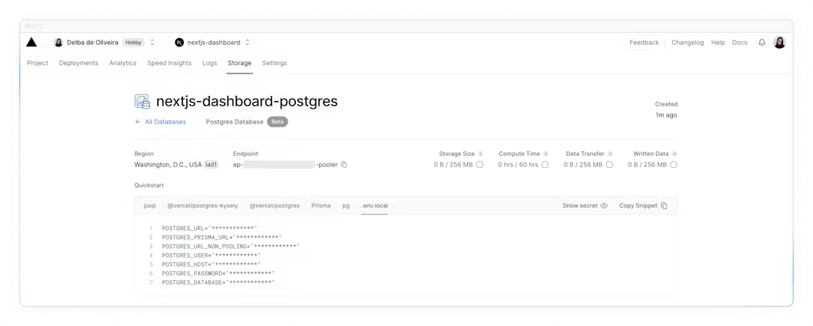

### Seed your database

In the `/scripts` folder of your project, there's a file called `seed.js`. This script contains the instructions for creating and seeding the `invoices`, `customers`, `user`, `revenue` tables.

Don't worry if you don't understand everything the code is doing, but to give you an overview, the script uses **SQL** to create the tables, and the data from `placeholder-data.js` file to populate them after they've been created.

Next, in your `package.json` file, add the following line to your scripts:

```json
"scripts": {
  "build": "next build",
  "dev": "next dev",
  "start": "next start",
  "seed": "node -r dotenv/config ./scripts/seed.js"
},
```

Now, run `pnpm seed`. You should see some `console.log` messages in your terminal to let you know the script is running.

### Exploring your database

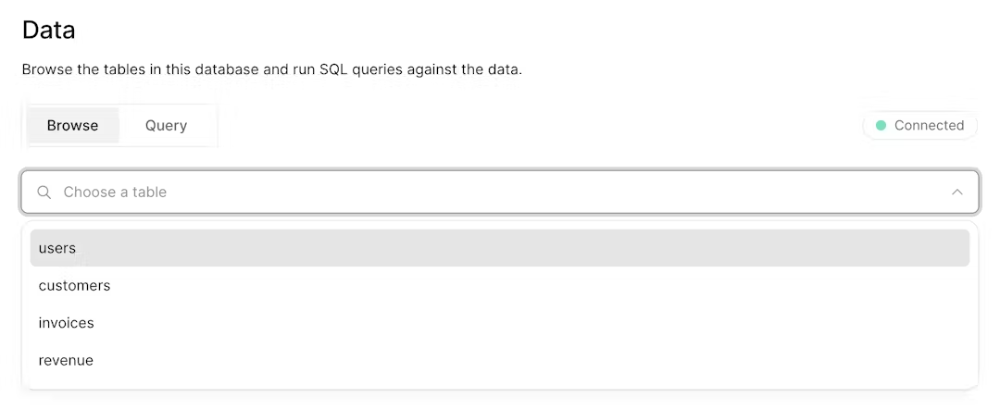

### Executing queries

You can switch to the "query" tab to interact with your database. This section supports standard SQL commands. For instance, inputting `DROP TABLE customers` will delete "customers" table along with all its data - ***so be careful\***!

Let's run your first database query. Paste and run the following SQL code into the Vercel interface:

```
SELECT invoices.amount, customers.nameFROM invoicesJOIN customers ON invoices.customer_id = customers.idWHERE invoices.amount = 666;
```

## [7) Fetching Data](https://nextjs.org/learn/dashboard-app/fetching-data)

- Learn about some approaches to fetching data: APIs, ORMs, SQL, etc.
- How Server Components can help you access back-end resources more securely.
- What network waterfalls are.
- How to implement parallel data fetching using a JavaScript Pattern.

### ⭐️  API layer: Route Handlers

APIs are an intermediary layer between your application code and database. There are a few cases where you might use an API:

- If you're using 3rd party services that provide an API.
- If you're fetching data from the client, you want to have an API layer that runs on the server to avoid exposing your database secrets to the client.

In Next.js, you can create API endpoints using [Route Handlers](https://nextjs.org/docs/app/building-your-application/routing/route-handlers).

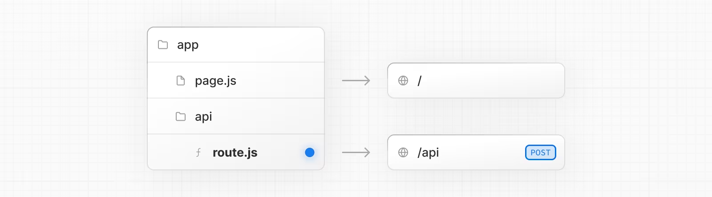

Route Handlers are defined in a [`route.js|ts` file](https://nextjs.org/docs/app/api-reference/file-conventions/route) inside the `app` directory:

```react
export const dynamic = 'force-dynamic' // defaults to auto
export async function GET(request: Request) {}
```

### Database queries

When you're creating a full-stack application, you'll also need to write logic to interact with your database. For [relational databases](https://aws.amazon.com/relational-database/) like Postgres, you can do this with SQL, or an [ORM](https://vercel.com/docs/storage/vercel-postgres/using-an-orm#) like [Prisma](https://www.prisma.io/).

There are a few cases where you have to write database queries:

- When creating your API endpoints, you need to write logic to interact with your database.
- If you are using React Server Components (fetching data on the server), you can skip the API layer, and query your database directly without risking exposing your database secrets to the client.

### ⭐️  Using Server Components to fetch data

By default, Next.js applications use **React Server Components**. Fetching data with Server Components is a relatively new approach and there are a few benefits of using them:

- Server Components support promises, providing a simpler solution for asynchronous tasks like data fetching. You can use `async/await` syntax without reaching out for `useEffect`, `useState` or data fetching libraries.
- Server Components execute on the server, so you can keep expensive data fetches and logic on the server and only send the result to the client.
- As mentioned before, since Server Components execute on the server, you can query the database directly without an additional API layer.

> Server Components support promises, providing a simpler solution for asynchronous tasks like data fetching. You can use `async/await` syntax without reaching out for `useEffect`, `useState` or data fetching libraries. 
>
> 这段话的意思是说，**Server Components**（服务器组件）支持使用**Promises**，这为处理异步任务（如数据获取）提供了一个更简单的解决方案。你可以使用**async/await**语法来编写异步代码，而不需要使用**useEffect**、**useState**或其他数据获取库。
>
> 具体来说：
> - **Server Components**：这是指在服务器端执行的React组件。
> - **Promises**：JavaScript中的一种处理异步操作的机制。
> - **async/await**：JavaScript中的语法糖，用于简化处理异步操作的代码。
> - **useEffect**和**useState**：React中的两个Hook，通常用于在客户端组件中处理副作用和状态管理。
> - **数据获取库**：例如axios、fetch等，用于在客户端或服务器端获取数据的库。
>
> 使用服务器组件时，你可以直接在组件中使用async/await来进行异步操作，而不需要依赖客户端的钩子函数或外部库，从而简化了代码和逻辑。
>
> ### 示例
> 假设你需要从API获取数据并在组件中显示，以前在客户端组件中你可能会这样做：
>
> ```javascript
> import { useState, useEffect } from 'react';
> 
> function MyComponent() {
>   const [data, setData] = useState(null);
> 
>   useEffect(() => {
>     async function fetchData() {
>       const response = await fetch('https://api.example.com/data');
>       const result = await response.json();
>       setData(result);
>     }
>     fetchData();
>   }, []);
> 
>   return <div>{data ? data : 'Loading...'}</div>;
> }
> ```
>
> 而现在在服务器组件中，你可以这样做：
>
> ```javascript
> async function MyComponent() {
>   const response = await fetch('https://api.example.com/data');
>   const data = await response.json();
> 
>   return <div>{data}</div>;
> }
> ```
>
> 这样，你可以避免在客户端处理异步逻辑，从而简化了代码。

### ⭐️  Using SQL

For your dashboard project, you'll write database queries using the [Vercel Postgres SDK](https://vercel.com/docs/storage/vercel-postgres/sdk) and SQL. There are a few reasons why we'll be using SQL:

- SQL is the industry standard for querying relational databases (e.g. ORMs generate SQL under the hood).
- Having a basic understanding of SQL can help you understand the fundamentals of relational databases, allowing you to apply your knowledge to other tools.
- SQL is versatile, allowing you to fetch and manipulate specific data.
- The Vercel Postgres SDK provides protection against [SQL injections](https://vercel.com/docs/storage/vercel-postgres/sdk#preventing-sql-injections).

Go to `/app/lib/data.ts`, here you'll see that we're importing the [`sql`](https://vercel.com/docs/storage/vercel-postgres/sdk#sql) function from `@vercel/postgres`. This function allows you to query your database:

```js
import { sql } from '@vercel/postgres';
 
// ...
```

You can call `sql` inside any Server Component. But to allow you to navigate the components more easily, we've kept all the data queries in the `data.ts` file, and you can import them into the components.

### Fetching data for the dashboard overview page

Now that you understand different ways of fetching data, let's fetch data for the dashboard overview page. Navigate to `/app/dashboard/page.tsx`, paste the following code, and spend some time exploring it:

```react
import { Card } from '@/app/ui/dashboard/cards';
import RevenueChart from '@/app/ui/dashboard/revenue-chart';
import LatestInvoices from '@/app/ui/dashboard/latest-invoices';
import { lusitana } from '@/app/ui/fonts';
 
export default async function Page() {
  return (
    <main>
      <h1 className={`${lusitana.className} mb-4 text-xl md:text-2xl`}>
        Dashboard
      </h1>
      <div className="grid gap-6 sm:grid-cols-2 lg:grid-cols-4">
        {/* <Card title="Collected" value={totalPaidInvoices} type="collected" /> */}
        {/* <Card title="Pending" value={totalPendingInvoices} type="pending" /> */}
        {/* <Card title="Total Invoices" value={numberOfInvoices} type="invoices" /> */}
        {/* <Card
          title="Total Customers"
          value={numberOfCustomers}
          type="customers"
        /> */}
      </div>
      <div className="mt-6 grid grid-cols-1 gap-6 md:grid-cols-4 lg:grid-cols-8">
        {/* <RevenueChart revenue={revenue}  /> */}
        {/* <LatestInvoices latestInvoices={latestInvoices} /> */}
      </div>
    </main>
  );
}
```

In the code above:

- Page is an **async** component. This allows you to use `await` to fetch data.
- There are also 3 components which receive data: `<Card>`, `<RevenueChart>`, and `<LatestInvoices>`. They are currently commented out to prevent the application from erroring.

### Fetching data for `<RevenueCart>`

To fetch data for the `<RevenueChart/>` component, import the `fetchRevenue` function from `data.ts` and call it inside your component:

```react
import { Card } from '@/app/ui/dashboard/cards';
import RevenueChart from '@/app/ui/dashboard/revenue-chart';
import LatestInvoices from '@/app/ui/dashboard/latest-invoices';
import { lusitana } from '@/app/ui/fonts';
import { fetchRevenue } from '@/app/lib/data';
 
export default async function Page() {
  const revenue = await fetchRevenue();
  // ...
}
```

Then, uncomment the `<RevenueChart/>` component, navigate to the component file (`/app/ui/dashboard/revenue-chart.tsx`) and uncomment the code inside it. Check your localhost, you should be able to see a chart that uses `revenue` data.

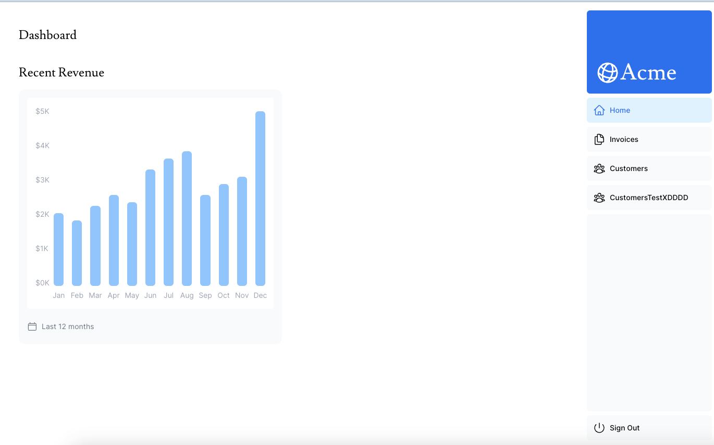

### Fetching data for `<LatestInvoices/>`

For the `<LatestInvoices />` component, we need to get the latest 5 invoices, sorted by date. Instead of sorting through the latest invoices in-memory, you can use an SQL query to fetch only the last 5 invoices. For example, this is the SQL query from your `data.ts` file:

```sql
// Fetch the last 5 invoices, sorted by date
const data = await sql<LatestInvoiceRaw>`
  SELECT invoices.amount, customers.name, customers.image_url, customers.email
  FROM invoices
  JOIN customers ON invoices.customer_id = customers.id
  ORDER BY invoices.date DESC
  LIMIT 5`;
```

In your page, import the `fetchLatestInvoices` function:

Then, uncomment the `<LatestInvoices />` component. You will also need to uncomment the relevant code in the `<LatestInvoices />` component itself, located at `/app/ui/dashboard/latest-invoices`.

If you visit your localhost, you should see that only the last 5 invoices are returned from the database. Hopefully, you're beginning to see the advantages of querying your database directly!

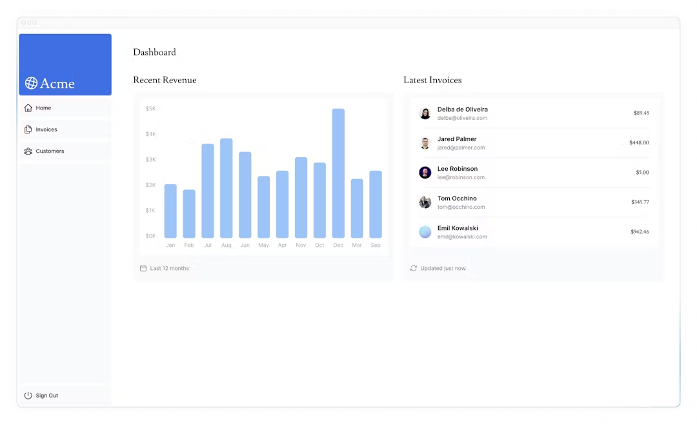

### Practice: Fetch data for the `<Card>` components

Now it's your turn to fetch data for the `<Card>` components. The cards will display the following data:

- Total amount of invoices collected.
- Total amount of invoices pending.
- Total number of invoices.
- Total number of customers.

Again, you might be tempted to fetch all the invoices and customers, and use JavaScript to manipulate the data. For example, you could use `Array.length` to get the total number of invoices and customers:

```
const totalInvoices = allInvoices.length;
const totalCustomers = allCustomers.length;
```

But with SQL, you can fetch only the data you need. It's a little longer than using `Array.length`, but it means less data needs to be transferred during the request. This is the SQL alternative:

```react
const invoiceCountPromise = sql`SELECT COUNT(*) FROM invoices`;
const customerCountPromise = sql`SELECT COUNT(*) FROM customers`;
```

card 的 export function 

```react
export async function fetchCardData() {
  try {
    // You can probably combine these into a single SQL query
    // However, we are intentionally splitting them to demonstrate
    // how to initialize multiple queries in parallel with JS.
    const invoiceCountPromise = sql`SELECT COUNT(*) FROM invoices`;
    const customerCountPromise = sql`SELECT COUNT(*) FROM customers`;
    const invoiceStatusPromise = sql`SELECT
         SUM(CASE WHEN status = 'paid' THEN amount ELSE 0 END) AS "paid",
         SUM(CASE WHEN status = 'pending' THEN amount ELSE 0 END) AS "pending"
         FROM invoices`;

    const data = await Promise.all([
      invoiceCountPromise,
      customerCountPromise,
      invoiceStatusPromise,
    ]);

    const numberOfInvoices = Number(data[0].rows[0].count ?? '0');
    const numberOfCustomers = Number(data[1].rows[0].count ?? '0');
    const totalPaidInvoices = formatCurrency(data[2].rows[0].paid ?? '0');
    const totalPendingInvoices = formatCurrency(data[2].rows[0].pending ?? '0');

    return {
      numberOfCustomers,
      numberOfInvoices,
      totalPaidInvoices,
      totalPendingInvoices,
    };
  } catch (error) {
    console.error('Database Error:', error);
    throw new Error('Failed to fetch card data.');
  }
}
```

解释: `const totalPaidInvoices = formatCurrency(data[2].rows[0].paid ?? '0');`

> 1. **data[2]**: 这里的`data`是一个数组，`data[2]`表示获取数组中的第三个元素。
> 2. **rows[0]**: `data[2]`的值是一个对象，这个对象包含一个`rows`属性，`rows`是一个数组。`rows[0]`表示获取这个数组中的第一个元素。
> 3. **paid**: `rows[0]`是一个对象，这个对象包含一个`paid`属性。`paid`表示已支付的金额。
> 4. **?? '0': 这个符号是JavaScript中的空值合并操作符（Nullish Coalescing Operator）。如果`rows[0].paid`的值为`null`或`undefined`，那么会使用`'0'`作为默认值。换句话说，如果`paid`没有值，则会使用`'0'`。**
> 5. **formatCurrency**: 这是一个函数，用于将金额格式化为货币形式。这个函数会将传入的金额格式化为特定的货币格式，比如添加货币符号、千位分隔符等。
> 6. **totalPaidInvoices**: 这是一个常量，存储格式化后的已支付发票总金额。
>
> 综上所述，这段代码的整体作用是：从数据中提取已支付的发票金额，如果没有已支付金额则使用`'0'`，然后将该金额格式化为货币形式，并将结果存储在`totalPaidInvoices`中。

However... there are two things you need to be aware of:

1. The data requests are unintentionally blocking each other, creating a **request waterfall**.
2. By default, Next.js **prerenders** routes to improve performance, this is called **Static Rendering**. So if your data changes, it won't be reflected in your dashboard.

Let's discuss number 1 in this chapter, then look into detail at number 2 in the next chapter.

### What are request waterfalls?

A "waterfall" refers to a sequence of network requests that depend on the completion of previous requests. In the case of data fetching, each request can only begin once the previous request has returned data.

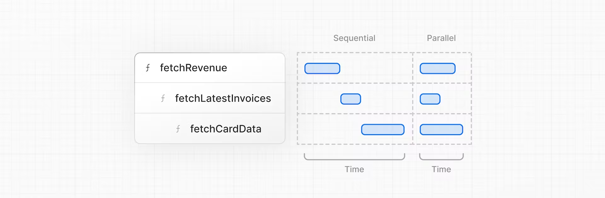

For example, we need to wait for `fetchRevenue()` to execute before `fetchLatestInvoices()` can start running, and so on.

```react
const revenue = await fetchRevenue();
const latestInvoices = await fetchLatestInvoices(); // wait for fetchRevenue() to finish
const {
  numberOfInvoices,
  numberOfCustomers,
  totalPaidInvoices,
  totalPendingInvoices,
} = await fetchCardData(); // wait for fetchLatestInvoices() to finish
```

However, this behavior can also be unintentional and impact performance.

### ⭐️ Parallel data fetching

A common way to avoid waterfalls is to initiate all data requests at the same time - in parallel.

In JavaScript, you can use the [`Promise.all()`](https://developer.mozilla.org/en-US/docs/Web/JavaScript/Reference/Global_Objects/Promise/all) or [`Promise.allSettled()`](https://developer.mozilla.org/en-US/docs/Web/JavaScript/Reference/Global_Objects/Promise/allSettled) functions to initiate all promises at the same time. For example, in `data.ts`, we're using `Promise.all()` in the `fetchCardData()` function:

```react
export async function fetchCardData() {
  try {
    //...
 
    const data = await Promise.all([
      invoiceCountPromise,
      customerCountPromise,
      invoiceStatusPromise,
    ]);
    // ...
  }
}
```

By using this pattern, you can:

- Start executing all data fetches at the same time, which can lead to performance gains.
- Use a native JavaScript pattern that can be applied to any library or framework.

However, there is one **disadvantage** of relying only on this JavaScript pattern: what happens if one data request is slower than all the others?

## [8) Static and Dynamic Rendering](https://nextjs.org/learn/dashboard-app/static-and-dynamic-rendering)

In the previous chapter, you fetched data for the Dashboard Overview page. However, we briefly discussed two limitations of the current setup:

1. The data requests are creating an unintentional waterfall.
2. The dashboard is static, so any data updates will not be reflected on your application.

What we will learn:

- What static rendering is and how it can improve your application's performance.
- What dynamic rendering is and when to use it.
- Different approaches to make your dashboard dynamic.
- Simulate a slow data fetch to see what happens.

### What is Static Rendering?

With static rendering, data fetching and rendering happens on the server at build time (when you deploy) or during [revalidation](https://nextjs.org/docs/app/building-your-application/data-fetching/fetching-caching-and-revalidating#revalidating-data). The result can then be distributed and cached in a [Content Delivery Network (CDN)](https://developer.mozilla.org/en-US/docs/Glossary/CDN).

Whenever a user visits your application, the cached result is served. There are a couple of benefits of static rendering:

- **Faster Websites** - Prerendered content can be cached and globally distributed. This ensures that users around the world can access your website's content more quickly and reliably.
- **Reduced Server Load** - Because the content is cached, your server does not have to dynamically generate content for each user request.
- **SEO** - Prerendered content is easier for search engine crawlers to index, as the content is already available when the page loads. This can lead to improved search engine rankings.

Static rendering is useful for UI with **no data** or **data that is shared across users**, such as a static blog post or a product page. It might not be a good fit for a dashboard that has personalized data which is regularly updated.

### What is Dynamic Rendering?

With dynamic rendering, content is rendered on the server for each user at **request time** (when the user visits the page). There are a couple of benefits of dynamic rendering:

- **Real-Time Data** - Dynamic rendering allows your application to display real-time or frequently updated data. This is ideal for applications where data changes often.
- **User-Specific Content** - It's easier to serve personalized content, such as dashboards or user profiles, and update the data based on user interaction.
- **Request Time Information** - Dynamic rendering allows you to access information that can only be known at request time, such as cookies or the URL search parameters.

### ⭐️  Making the dashboard dynamic: disable cache

You can use a Next.js API called `unstable_noStore` inside your Server Components or data fetching functions to opt out of static rendering. Let's add this.

In your `data.ts`, import `unstable_noStore` from `next/cache`, and call it the top of your data fetching functions:

```react
import { unstable_noStore as noStore } from 'next/cache';

export async function fetchRevenue() {
  // Add noStore() here to prevent the response from being cached.
  // This is equivalent to in fetch(..., {cache: 'no-store'}).
  noStore();
 
  // ...
}

//etc
```

### Simulating a Slow Data Fetch(add latency)

What happens if one data request is slower than all the others?

Let's simulate a slow data fetch. In your `data.ts` file, uncomment the `console.log` and `setTimeout` inside `fetchRevenue()`:

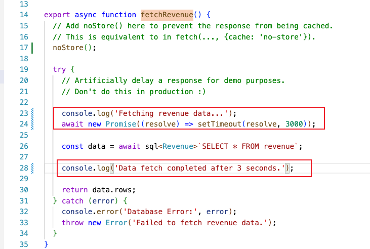

```react
export async function fetchRevenue() {
  // Add noStore() here to prevent the response from being cached.
  // This is equivalent to in fetch(..., {cache: 'no-store'}).
  noStore();

  try {
    // Artificially delay a response for demo purposes.
    // Don't do this in production :)

    console.log('Fetching revenue data...');
    await new Promise((resolve) => setTimeout(resolve, 3000));

    const data = await sql<Revenue>`SELECT * FROM revenue`;

    console.log('Data fetch completed after 3 seconds.');

    return data.rows;
  } catch (error) {
    console.error('Database Error:', error);
    throw new Error('Failed to fetch revenue data.');
  }
}
```

Here, you've added an artificial 3-second delay to simulate a slow data fetch. The result is that now your whole page is blocked while the data is being fetched. Which brings us to a common challenge developers have to solve:

- With dynamic rendering, **your application is only as fast as your slowest data fetch.**

## [9) Streaming](https://nextjs.org/learn/dashboard-app/streaming)

We also discussed how slow data fetches can impact the performance of your application. Let's look at how you can improve the user experience when there are slow data requests.

### What is streaming?

Streaming is a data transfer technique that allows you to break down a route into smaller "chunks" and progressively stream them from the server to the client as they become ready.

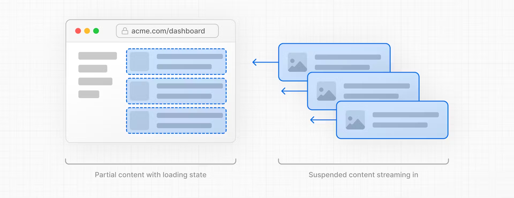

By streaming, you can prevent slow data requests from blocking your whole page. 

- This allows the user to see and interact with parts of the page without waiting for all the data to load before any UI can be shown to the user.

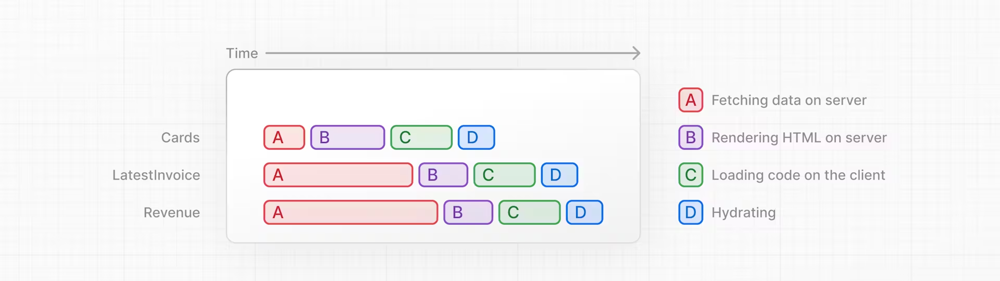

There are two ways you implement streaming in Next.js:

1. At the page level, with the `loading.tsx` file.
2. For specific components, with `<Suspense>`.

### 1) `Streaming a whole page` with loading.tsx

In the `/app/dashboard` folder, create a new file called `loading.tsx`:

```js
export default function Loading() {
  return <div>Loading...</div>;
}
```

Refresh http://localhost:3000/dashboard, and you should now see:

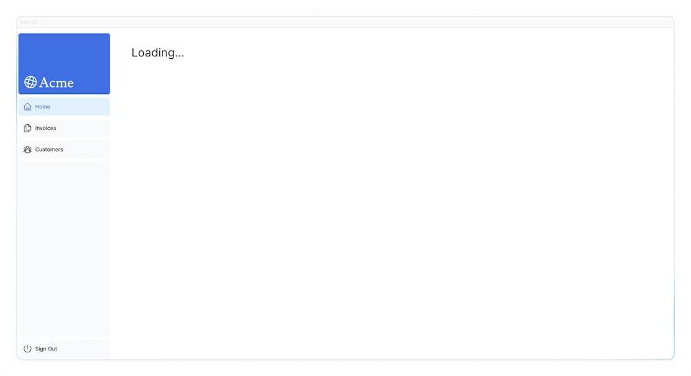

A few things are happening here:

1. `loading.tsx` is a special Next.js file built on top of Suspense, it allows you to create fallback UI to **show as a replacement while page content loads.**
2. Since `<SideNav>` is static, it's shown immediately. **The user can interact with `<SideNav>` while the dynamic content is loading.**
3. The user doesn't have to wait for the page to finish loading before navigating away (this is called interruptable navigation).

Congratulations! You've just implemented streaming. But we can do more to improve the user experience. Let's show a loading skeleton instead of the `Loading…` text.

### Adding loading skeletons

Inside your `loading.tsx` file, import a new component called `<DashboardSkeleton>`:

```js
import DashboardSkeleton from '@/app/ui/skeletons';
 
export default function Loading() {
  return <DashboardSkeleton />;
}
```

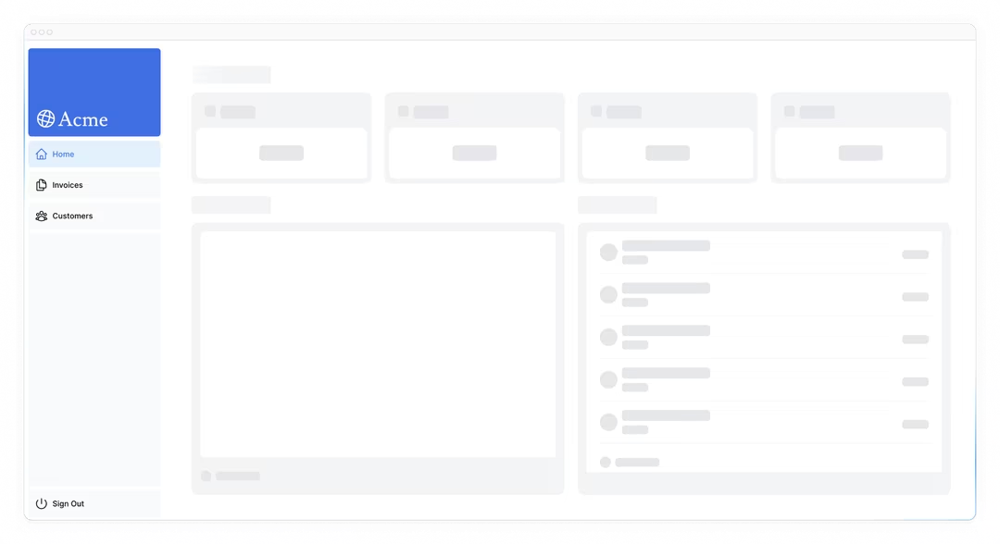

### Route groups: Fixing the loading skeleton bug with route groups

Right now, your loading skeleton will apply to the invoices and customers pages as well.

Since `loading.tsx` is a level higher than `/invoices/page.tsx` and `/customers/page.tsx` in the file system, it's also applied to those pages.

We can change this with [Route Groups](https://nextjs.org/docs/app/building-your-application/routing/route-groups). Create a new folder called `/(overview)` inside the dashboard folder. Then, move your `loading.tsx` and `page.tsx` files inside the folder:


Now, the `loading.tsx` file will only apply to your dashboard overview page.

Route groups allow you to organize files into logical groups without affecting the URL path structure. When you create a new folder using parentheses `()`, the name won't be included in the URL path. So `/dashboard/(overview)/page.tsx` becomes `/dashboard`.

### ⭐️  2) `Streaming a component`: component level streaming

So far, you're streaming a whole page. But you can also be more granular and stream specific components using React Suspense.

Suspense allows you to defer rendering parts of your application until some condition is met (e.g. data is loaded).

If you remember the slow data request, `fetchRevenue()`, this is the request that is slowing down the whole page. Instead of blocking your whole page, you can use Suspense to stream only this component and immediately show the rest of the page's UI.

- Delete all instances of `fetchRevenue()` and its data from `/dashboard/(overview)/page.tsx`:
- Then, import `<Suspense>` from React, and wrap it around `<RevenueChart />`. You can pass it a fallback component called `<RevenueChartSkeleton>`.

```react
import { Suspense } from 'react';
import { RevenueChartSkeleton } from '@/app/ui/skeletons';
 
        <Suspense fallback={<RevenueChartSkeleton />}>
          <RevenueChart />
        </Suspense>

```

Finally, update the `<RevenueChart>` component to fetch its own data and remove the prop passed to it:

```react
import { fetchRevenue } from '@/app/lib/data';

 
export default async function RevenueChart() { // Make component async, remove the props
  const revenue = await fetchRevenue(); // Fetch data inside the component
```

Now refresh the page, you should see the dashboard information almost immediately, while a fallback skeleton is shown for `<RevenueChart>`:

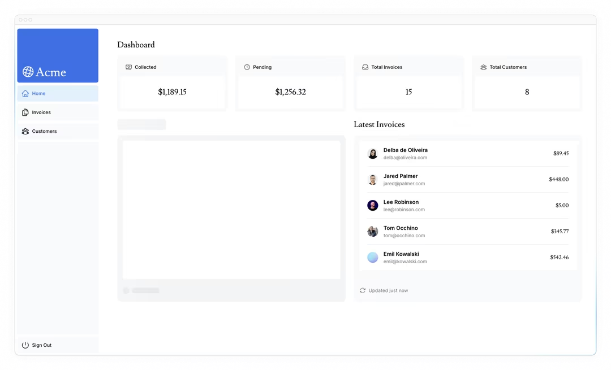

### Practice: Streaming `<LatestInvoices>`

Now it's your turn! Practice what you've just learned by streaming the `<LatestInvoices>` component.

Move `fetchLatestInvoices()` down from the page to the `<LatestInvoices>` component. Wrap the component in a `<Suspense>` boundary with a fallback called `<LatestInvoicesSkeleton>`.

### ⭐️  3) `Grouping components1`: Make multiple small components load at the same time

Great! You're almost there, now you need to wrap the `<Card>` components in Suspense. You can fetch data for each individual card, but this could lead to a *popping* effect as the cards load in, this can be visually jarring for the user.

To create more of a *staggered* effect, you can group the cards using a wrapper component. This means the static `<SideNav/>` will be shown first, followed by the cards, etc.

In your `page.tsx` file:

1. Delete your `<Card>` components.
2. Delete the `fetchCardData()` function.
3. Import a new **wrapper** component called `<CardWrapper />`.
4. Import a new **skeleton** component called `<CardsSkeleton />`.
5. Wrap `<CardWrapper />` in Suspense.

> await function must be used in async function

Refresh the page, and you should see all the cards load in at the same time. You can use this pattern when you want multiple components to load in at the same time.

### Deciding where to place your Suspense boundaries

- You could stream the **whole page** like we did with `loading.tsx`... but that may lead to a longer loading time if one of the components has a slow data fetch.
- You could stream **every component** individually... but that may lead to UI *popping* into the screen as it becomes ready.
- You could also create a *staggered* effect by streaming **page sections**. But you'll need to create wrapper components.

Where you place your suspense boundaries will vary depending on your application. In general, it's good practice to move your data fetches down to the components that need it, and then wrap those components in Suspense.

### Looking ahead

Streaming and Server Components give us new ways to handle data fetching and loading states, ultimately with the goal of improving the end user experience.

In the next chapter, you'll learn about Partial Prerendering, a new Next.js rendering model built with streaming in mind.