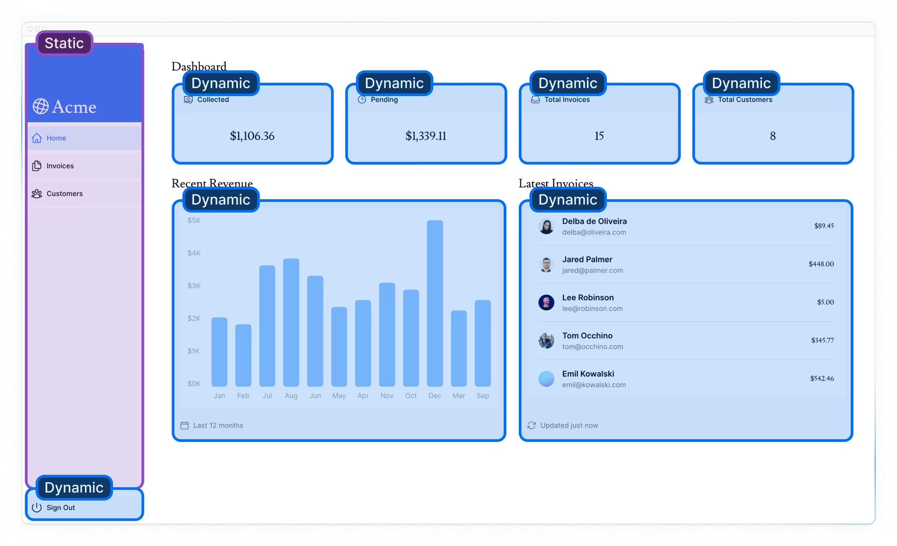
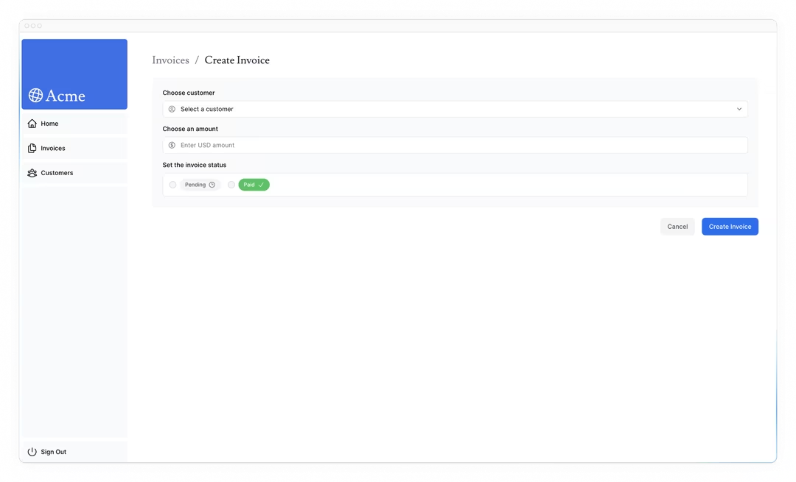
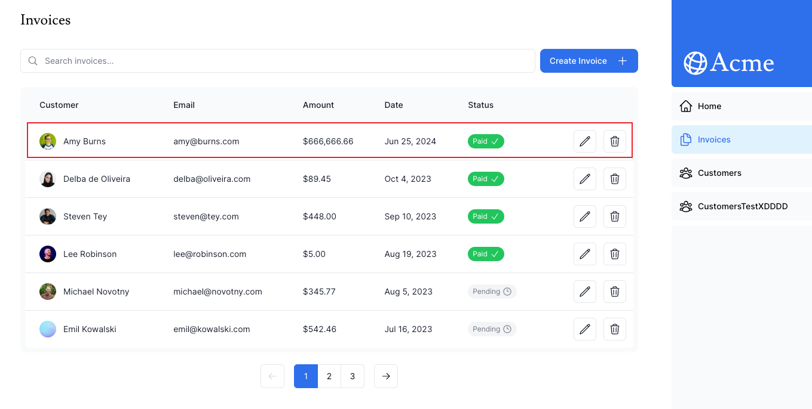
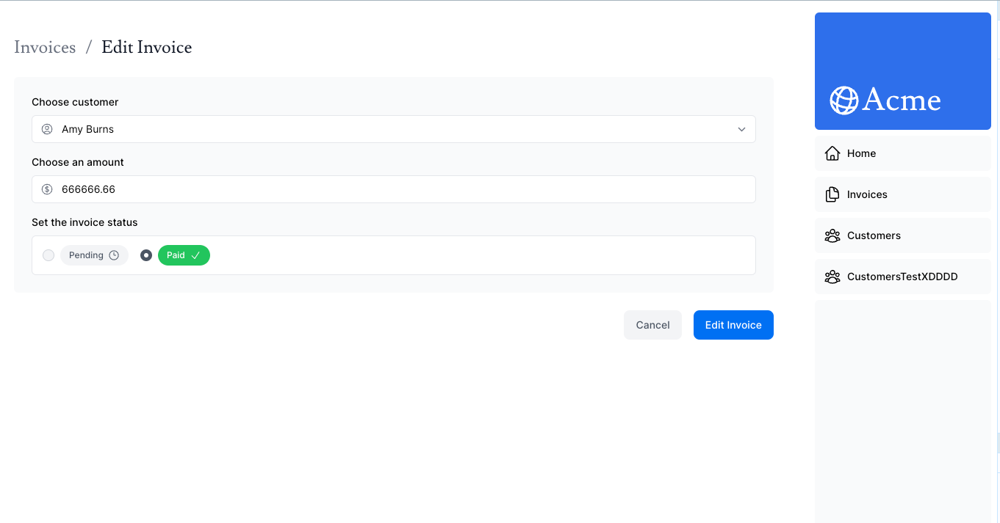
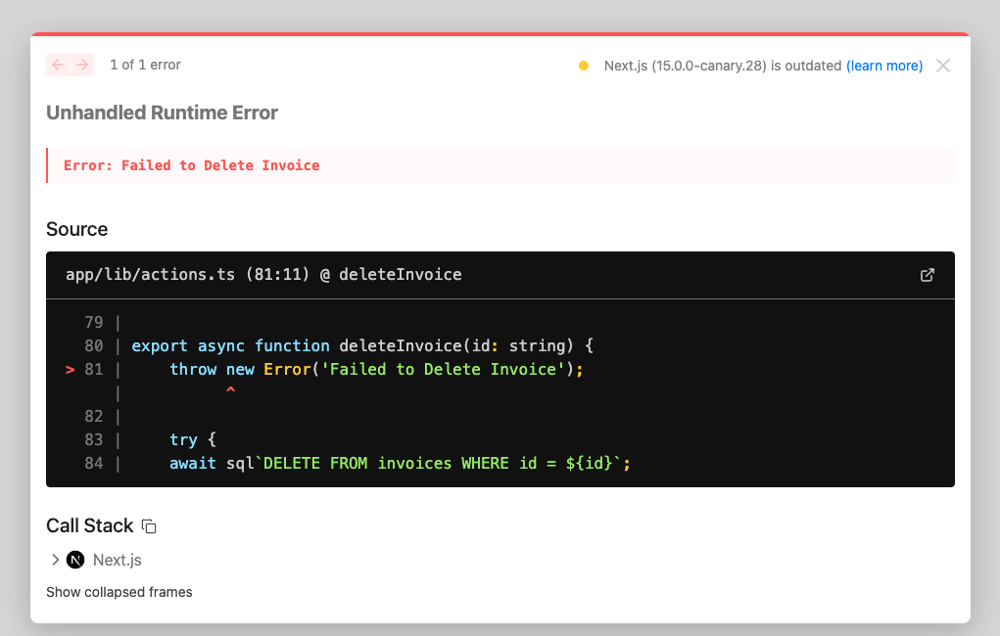
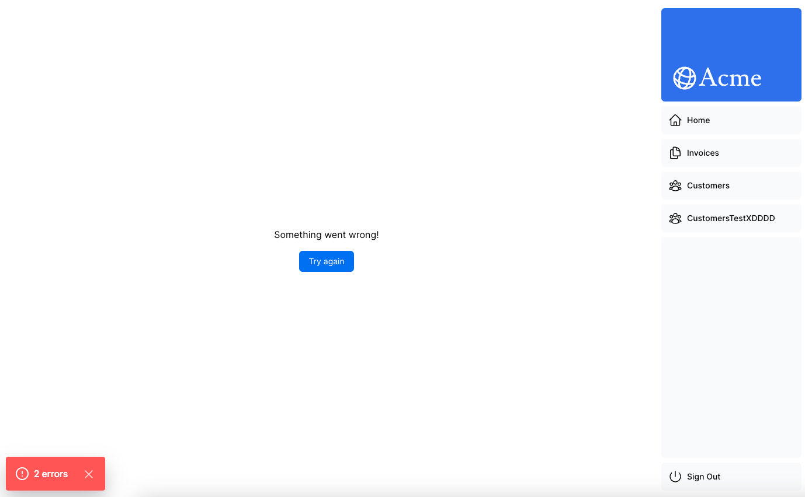
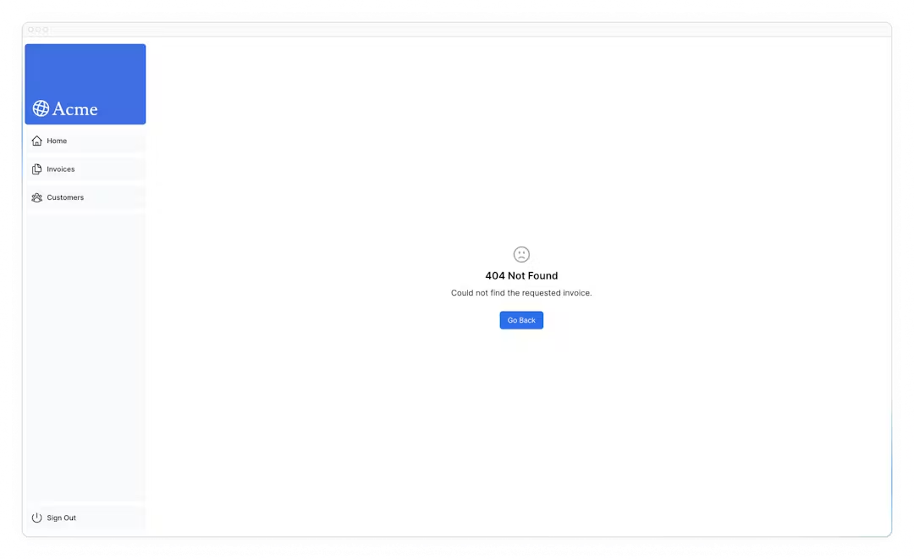
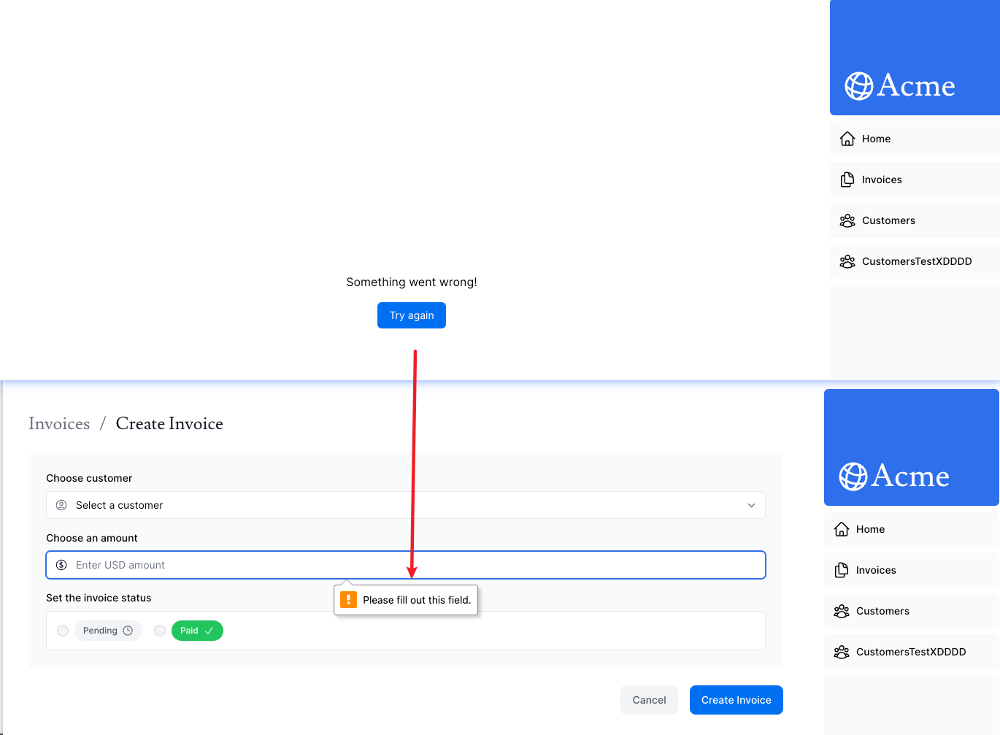

## [10) Partial Prerendering](https://nextjs.org/learn/dashboard-app/partial-prerendering)

In this chapter, let's learn how to combine static rendering, dynamic rendering, and streaming in the same route with **Partial Prerendering (PPR)**.

> Partial Prerendering is an experimental feature introduced in Next.js 14. The content of this page may be updated as the feature progresses in stability.

### Static vs. Dynamic Routes

For most web apps built today, you either choose between static and dynamic rendering for your **entire application**, or for a **specific route**. And in Next.js, if you call a [dynamic function](https://nextjs.org/docs/app/building-your-application/routing/route-handlers#dynamic-functions) in a route (like querying your database), the *entire* route becomes dynamic.



### What is Partial Prerendering?

Next.js 14 introduced an experimental version of **Partial Prerendering** – a new rendering model that allows you to combine the benefits of static and dynamic rendering in the same route. For example:

When a user visits a route:

- A static route shell that includes the navbar and product information is served, ensuring a fast initial load.
- The shell leaves holes where dynamic content like the cart and recommended products will load in asynchronously.
- The async holes are streamed in parallel, reducing the overall load time of the page.

### How does Partial Prerendering work?

意思就是还是和之前一样用 suspense，但是使用了 ppr 后，nextjs 框架会自动在编译期创建静态 shell。动态内容只有在用户请求时才生成。

把一个内容包在 suspense 里并不会使内容变为动态的，suspense 只是被用作代码中静态和动态的边界。

Partial Prerendering uses React's [Suspense](https://react.dev/reference/react/Suspense) (which you learned about in the previous chapter) 

The Suspense fallback is embedded into the initial HTML file along with the static content. At build time (or during revalidation), the static content is **prerendered** to create a static shell. The rendering of dynamic content is **postponed** until the user requests the route.

Wrapping a component in Suspense doesn't make the component itself dynamic, but rather Suspense is used as a boundary between your static and dynamic code.

### Implementing Partial Prerendering

Enable PPR for your Next.js app by adding the [`ppr`](https://rc.nextjs.org/docs/app/api-reference/next-config-js/ppr) option to your `next.config.mjs` file:

```react
/** @type {import('next').NextConfig} */
 
const nextConfig = {
  experimental: {
    ppr: 'incremental',
  },
};
 
module.exports = nextConfig;
```

The `'incremental'` value allows you to adopt PPR for specific routes.

Next, add the `experimental_ppr` segment config option to your dashboard layout:

```react
import SideNav from '@/app/ui/dashboard/sidenav';
 
export const experimental_ppr = true;
 
// ...
```

That's it. You may not see a difference in your application in development, but you should notice a performance improvement in production. Next.js will prerender the static parts of your route and defer the dynamic parts until the user requests them.

The great thing about Partial Prerendering is that you don't need to change your code to use it. As long as you're using Suspense to wrap the dynamic parts of your route, Next.js will know which parts of your route are static and which are dynamic.

We believe PPR has the potential to [become the default rendering model for web applications](https://vercel.com/blog/partial-prerendering-with-next-js-creating-a-new-default-rendering-model), bringing together the best of static site and dynamic rendering. 

### Summary

To recap, you've done a few things to optimize data fetching in your application:

1. Created a database
2. Fetched data on the server with React Server Components. 
3. Used SQL to only fetch the data you needed
4. Parallelize data fetching with JavaScript
   1. promiseAll
5. Implemented Streaming to prevent slow data requests from blocking your whole page, and to allow the user to start interacting with the UI without waiting for everything to load.
6. Move data fetching down to the components that need it, thus isolating which parts of your routes should be dynamic.

## [11) Adding Search and Pagination](https://nextjs.org/learn/dashboard-app/adding-search-and-pagination)

Now let's move on to the `/invoices` page, and learn how to add search and pagination!

- Learn how to use the Next.js APIs: `useSearchParams`, `usePathname`, and `useRouter`.

- Implement search and pagination using URL search params.

### Starting code

Inside your `/dashboard/invoices/page.tsx` file, paste the following code:

```react
import Pagination from '@/app/ui/invoices/pagination';
import Search from '@/app/ui/search';
import Table from '@/app/ui/invoices/table';
import { CreateInvoice } from '@/app/ui/invoices/buttons';
import { lusitana } from '@/app/ui/fonts';
import { InvoicesTableSkeleton } from '@/app/ui/skeletons';
import { Suspense } from 'react';
 
export default async function Page() {
  return (
    <div className="w-full">
      <div className="flex w-full items-center justify-between">
        <h1 className={`${lusitana.className} text-2xl`}>Invoices</h1>
      </div>
      <div className="mt-4 flex items-center justify-between gap-2 md:mt-8">
        <Search placeholder="Search invoices..." />
        <CreateInvoice />
      </div>
      {/*  <Suspense key={query + currentPage} fallback={<InvoicesTableSkeleton />}>
        <Table query={query} currentPage={currentPage} />
      </Suspense> */}
      <div className="mt-5 flex w-full justify-center">
        {/* <Pagination totalPages={totalPages} /> */}
      </div>
    </div>
  );
}
```

Spend some time familiarizing yourself with the page and the components you'll be working with:

1. `<Search/>` allows users to search for specific invoices.
2. `<Pagination/>` allows users to navigate between pages of invoices.
3. `<Table/>` displays the invoices.

Your search functionality will span the client and the server. When a user searches for an invoice on the client, the URL params will be updated, data will be fetched on the server, and the table will re-render on the server with the new data.

### Why use URL search params?

As mentioned above, you'll be using URL search params to manage the search state. This pattern may be new if you're used to doing it with client side state.

### Adding the search functionality

These are the Next.js client hooks that you'll use to implement the search functionality:

- **`useSearchParams`**- Allows you to access the parameters of the current URL. For example, the search params for this URL `/dashboard/invoices?page=1&query=pending` would look like this: `{page: '1', query: 'pending'}`.
- **`usePathname`** - Lets you read the current URL's pathname. For example, for the route `/dashboard/invoices`, `usePathname` would return `'/dashboard/invoices'`.
- **`useRouter`** - Enables navigation between routes within client components programmatically. There are [multiple methods](https://nextjs.org/docs/app/api-reference/functions/use-router#userouter) you can use.

Here's a quick overview of the implementation steps:

1. Capture the user's input.
2. Update the URL with the search params.
3. Keep the URL in sync with the input field.
4. Update the table to reflect the search query.

### 1. Capture the user's input

Create a new `handleSearch` function, and add an `onChange` listener to the `<input>` element. `onChange` will invoke `handleSearch` whenever the input value changes.

```react
'use client';
 
import { MagnifyingGlassIcon } from '@heroicons/react/24/outline';
 
export default function Search({ placeholder }: { placeholder: string }) {
  function handleSearch(term: string) {
    console.log(term);
  }
 
  return (
    <div className="relative flex flex-1 flex-shrink-0">
      <label htmlFor="search" className="sr-only">
        Search
      </label>
      <input
        className="peer block w-full rounded-md border border-gray-200 py-[9px] pl-10 text-sm outline-2 placeholder:text-gray-500"
        placeholder={placeholder}
        onChange={(e) => {
          handleSearch(e.target.value);
        }}
      />
      <MagnifyingGlassIcon className="absolute left-3 top-1/2 h-[18px] w-[18px] -translate-y-1/2 text-gray-500 peer-focus:text-gray-900" />
    </div>
  );
}
```

Test that it's working correctly by opening the console in your Developer Tools, then type into the search field. You should see the search term logged to the console.

### 2. Update the URL with the search params

Import the `useSearchParams` hook from `'next/navigation'`, and assign it to a variable:

```react
'use client';
 
import { MagnifyingGlassIcon } from '@heroicons/react/24/outline';
import { useSearchParams } from 'next/navigation';
 
export default function Search() {
  const searchParams = useSearchParams();
 
  function handleSearch(term: string) {
    console.log(term);
  }
  // ...
}
```

Inside `handleSearch,` create a new [`URLSearchParams`](https://developer.mozilla.org/en-US/docs/Web/API/URLSearchParams) instance using your new `searchParams` variable.

```react
'use client';
 
import { MagnifyingGlassIcon } from '@heroicons/react/24/outline';
import { useSearchParams } from 'next/navigation';
 
export default function Search() {
  const searchParams = useSearchParams();
 
  function handleSearch(term: string) {
    const params = new URLSearchParams(searchParams);
    if (term) {
      params.set('query', term);
    } else {
      params.delete('query');
    }
  }
  // ...
}
```

`URLSearchParams` is a Web API that provides utility methods for manipulating the URL query parameters. Instead of creating a complex string literal, you can use it to get the params string like `?page=1&query=a`.

Now that you have the query string. You can use Next.js's `useRouter` and `usePathname` hooks to update the URL.

Import `useRouter` and `usePathname` from `'next/navigation'`, and use the `replace` method from `useRouter()` inside `handleSearch`:

```react
'use client';

import { useSearchParams, usePathname, useRouter } from 'next/navigation';
 
export default function Search() {
	//...
  const pathname = usePathname();
  const { replace } = useRouter();
 
  function handleSearch(term: string) {
		//...
    replace(`${pathname}?${params.toString()}`);
  }
}
```

### 3. Keeping the URL and input in sync

To ensure the input field is in sync with the URL and will be populated when sharing, you can pass a `defaultValue` to input by reading from `searchParams`:

```react
<input
  className="peer block w-full rounded-md border border-gray-200 py-[9px] pl-10 text-sm outline-2 placeholder:text-gray-500"
  placeholder={placeholder}
  onChange={(e) => {
    handleSearch(e.target.value);
  }}
  defaultValue={searchParams.get('query')?.toString()}
/>
```

> **`defaultValue` vs. `value` / Controlled vs. Uncontrolled**
>
> If you're using state to manage the value of an input, you'd use the `value` attribute to make it a controlled component. This means React would manage the input's state.
>
> However, since you're not using state, you can use `defaultValue`. This means the native input will manage its own state. This is okay since you're saving the search query to the URL instead of state.

### 4. Updating the table

Finally, you need to update the table component to reflect the search query.

Navigate back to the invoices page.

Page components [accept a prop called `searchParams`](https://nextjs.org/docs/app/api-reference/file-conventions/page), so you can pass the current URL params to the `<Table>` component.

With these changes in place, go ahead and test it out. If you search for a term, you'll update the URL, which will send a new request to the server, data will be fetched on the server, and only the invoices that match your query will be returned.

> **When to use the `useSearchParams()` hook vs. the `searchParams` prop?**
>
> You might have noticed you used two different ways to extract search params. Whether you use one or the other depends on whether you're working on the client or the server.
>
> - `<Search>` is a Client Component, so you used the `useSearchParams()` hook to access the params from the client.
> - `<Table>` is a Server Component that fetches its own data, so you can pass the `searchParams` prop from the page to the component.
>
> As a general rule, if you want to read the params from the client, use the `useSearchParams()` hook as this avoids having to go back to the server.

### Best practice: Debouncing

为什么不用 search button 呢？不过 debouncing 的好处就是比较动态了吧

You're updating the URL on every keystroke, and therefore querying your database on every keystroke! 

**Debouncing** is a programming practice that limits the rate at which a function can fire. In our case, you only want to query the database when the user has stopped typing.

> **How Debouncing Works:**
>
> 1. **Trigger Event**: When an event that should be debounced (like a keystroke in the search box) occurs, a timer starts.
> 2. **Wait**: If a new event occurs before the timer expires, the timer is reset.
> 3. **Execution**: If the timer reaches the end of its countdown, the debounced function is executed.

You can implement debouncing in a few ways, including manually creating your own debounce function. To keep things simple, we'll use a library called use-debounce.

Install `use-debounce`:

```shell
pnpm i use-debounce
```

In your `<Search>` Component, import a function called `useDebouncedCallback`:

```react
// ...
import { useDebouncedCallback } from 'use-debounce';
 
// Inside the Search Component...
const handleSearch = useDebouncedCallback((term) => {
  console.log(`Searching... ${term}`);
 
  const params = new URLSearchParams(searchParams);
  if (term) {
    params.set('query', term);
  } else {
    params.delete('query');
  }
  replace(`${pathname}?${params.toString()}`);
}, 300);
```

This function will wrap the contents of `handleSearch`, and only run the code after a specific time once the user has stopped typing (300ms).

By debouncing, you can reduce the number of requests sent to your database, thus saving resources.

### Adding pagination

After introducing the search feature, you'll notice the table displays only 6 invoices at a time. This is because the `fetchFilteredInvoices()` function in `data.ts` returns a maximum of 6 invoices per page.

Navigate to the `<Pagination/>` component and you'll notice that it's a Client Component. You don't want to fetch data on the client as this would expose your database secrets (remember, you're not using an API layer)

In `/dashboard/invoices/page.tsx`, import a new function called `fetchInvoicesPages` and pass the `query` from `searchParams` as an argument:

```react
import { fetchInvoicesPages } from '@/app/lib/data';

  const totalPages = await fetchInvoicesPages(query);

```

### Summary

Congratulations! You've just implemented search and pagination using URL Params and Next.js APIs.

To summarize, in this chapter:

- You've handled search and pagination with URL search parameters instead of client state.
- You've fetched data on the server.
- You're using the `useRouter` router hook for smoother, client-side transitions.

These patterns are different from what you may be used to when working with client-side React, but hopefully, you now better understand the benefits of using URL search params and lifting this state to the server.

## [12) Mutating Data, CRUD](https://nextjs.org/learn/dashboard-app/mutating-data)

Let's continue working on the Invoices page by adding the ability to create, update, and delete invoices!

### What are Server Actions?

React Server Actions allow you to run asynchronous code directly on the server. They eliminate the need to create API endpoints to mutate your data. Instead, you write asynchronous functions that execute on the server and can be invoked from your Client or Server Components.

Security is a top priority for web applications, as they can be vulnerable to various threats. This is where Server Actions come in.Server Actions achieve this through techniques like POST requests, encrypted closures, strict input checks, error message hashing, and host restrictions, all working together to significantly enhance your app's safety.

### Using forms with Server Actions

In React, you can use the `action` attribute in the `<form>` element to invoke actions. The action will automatically receive the native [FormData](https://developer.mozilla.org/en-US/docs/Web/API/FormData) object, containing the captured data.

```react
// Server Component
export default function Page() {
  // Action
  async function create(formData: FormData) {
    'use server';
 
    // Logic to mutate data...
  }
 
  // Invoke the action using the "action" attribute
  return <form action={create}>...</form>;  // <=== here
}
```

An advantage of invoking a Server Action within a Server Component is progressive enhancement - forms work even if JavaScript is disabled on the client.

### Next.js with Server Actions

Server Actions are also deeply integrated with Next.js [caching](https://nextjs.org/docs/app/building-your-application/caching). When a form is submitted through a Server Action, not only can you use the action to mutate data, but you can also revalidate the associated cache using APIs like `revalidatePath` and `revalidateTag`.

### Creating an invoice

1. Create a form to capture the user's input.
2. Create a Server Action and invoke it from the form.
3. Inside your Server Action, extract the data from the `formData` object.
4. Validate and prepare the data to be inserted into your database.
5. Insert the data and handle any errors.
6. Revalidate the cache and redirect the user back to invoices page.

#### 1) Create a form to capture the user's input.

Navigate to the `<Form>` component, and you'll see that the form:

- Has one `<select>` (dropdown) element with a list of **customers**.
- Has one `<input>` element for the **amount** with `type="number"`.
- Has two `<input>` elements for the status with `type="radio"`.
- Has one button with `type="submit"`.

On http://localhost:3000/dashboard/invoices/create, you should see the following UI:



#### 2) Create a Server Action

In your `actions.ts` file, create a new async function that accepts `formData`:

```react
'use server';
 
export async function createInvoice(formData: FormData) {}
```

Then, in your `<Form>` component, import the `createInvoice` from your `actions.ts` file. Add a `action` attribute to the `<form>` element, and call the `createInvoice` action.

```react
import { customerField } from '@/app/lib/definitions';
import Link from 'next/link';
import {
  CheckIcon,
  ClockIcon,
  CurrencyDollarIcon,
  UserCircleIcon,
} from '@heroicons/react/24/outline';
import { Button } from '@/app/ui/button';
import { createInvoice } from '@/app/lib/actions';
 
export default function Form({
  customers,
}: {
  customers: customerField[];
}) {
  return (
    <form action={createInvoice}>
      // ...
  )
}
```

> Behind the scenes, Server Actions create a `POST` API endpoint. This is why you don't need to create API endpoints manually when using Server Actions.

#### 3) Extract the data from formData

Back in your `actions.ts` file, you'll need to extract the values of `formData`, there are a [couple of methods](https://developer.mozilla.org/en-US/docs/Web/API/FormData/append) you can use. For this example, let's use the [`.get(name)`](https://developer.mozilla.org/en-US/docs/Web/API/FormData/get) method.

#### 4) Validate and prepare the data

Before sending the form data to your database, you want to ensure it's in the correct format and with the correct types. If you remember from earlier in the course, your invoices table expects data in the following format:

> For your example, we'll use Zod, a TypeScript-first validation library that can simplify this task for you.
>
> 在这段话中，"TypeScript-first" 指的是 Zod 这个库在设计和实现时优先考虑 TypeScript 的特点和需求。这意味着它在以下几个方面表现出对 TypeScript 的强烈支持：
>
> 1. **类型安全**：Zod 充分利用 TypeScript 的类型系统，确保在编写代码时能提供更好的类型检查和自动补全，从而减少运行时错误。
> 2. **类型推导**：Zod 可以根据验证规则自动推导出 TypeScript 类型，使开发者不需要手动编写冗长的类型定义。
> 3. **类型互操作性**：Zod 和 TypeScript 的类型系统紧密集成，允许在验证数据的同时确保数据符合预期的类型。
>
> 通过这些特性，Zod 可以让使用 TypeScript 的开发者更加轻松地进行数据验证，同时充分利用 TypeScript 提供的类型优势。
>
> 简单来说，"TypeScript-first" 意味着 Zod 是专门为 TypeScript 生态系统设计的，并在这个过程中优先考虑了 TypeScript 用户的需求和开发体验。

In your `actions.ts` file, import Zod and define a schema that matches the shape of your form object. This schema will validate the `formData` before saving it to a database.

```react
'use server';
 
import { z } from 'zod';
 
const FormSchema = z.object({
  id: z.string(),
  customerId: z.string(),
  amount: z.coerce.number(),
  status: z.enum(['pending', 'paid']),
  date: z.string(),
});
 
const CreateInvoice = FormSchema.omit({ id: true, date: true });
 
export async function createInvoice(formData: FormData) {
  const { customerId, amount, status } = CreateInvoice.parse({
    customerId: formData.get('customerId'),
    amount: formData.get('amount'),
    status: formData.get('status'),
  });
  const amountInCents = amount * 100;
  const date = new Date().toISOString().split('T')[0];
  // ...
}
```

#### 5) Inserting the data into your database

Now that you have all the values you need for your database, you can create an SQL query to insert the new invoice into your database and pass in the variables:

```react

  await sql`
    INSERT INTO invoices (customer_id, amount, status, date)
    VALUES (${customerId}, ${amountInCents}, ${status}, ${date})
  `;
```

#### 6) Revalidate cache and redirect

Next.js has a [Client-side Router Cache](https://nextjs.org/docs/app/building-your-application/caching#router-cache) that stores the route segments in the user's browser for a time. Along with [prefetching](https://nextjs.org/docs/app/building-your-application/routing/linking-and-navigating#1-prefetching), this cache ensures that users can quickly navigate between routes while reducing the number of requests made to the server.

Since you're updating the data displayed in the invoices route, you want to clear this cache and trigger a new request to the server. You can do this with the [`revalidatePath`](https://nextjs.org/docs/app/api-reference/functions/revalidatePath) function from Next.js:

```react
import { revalidatePath } from 'next/cache';
 
export async function createInvoice(formData: FormData) {
 //...
 
  revalidatePath('/dashboard/invoices');
}
```

At this point, you also want to redirect the user back to the `/dashboard/invoices` page. You can do this with the [`redirect`](https://nextjs.org/docs/app/api-reference/functions/redirect) function from Next.js:

```react
import { redirect } from 'next/navigation';

export async function createInvoice(formData: FormData) {
  // ...
 
  revalidatePath('/dashboard/invoices');
  redirect('/dashboard/invoices');
}
```



### Updating an invoice

The updating invoice form is similar to the create an invoice form, except you'll need to pass the invoice `id` to update the record in your database. Let's see how you can get and pass the invoice `id`.

These are the steps you'll take to update an invoice:

1. Create a new dynamic route segment with the invoice `id`.
2. Read the invoice `id` from the page params.
3. Fetch the specific invoice from your database.
4. Pre-populate the form with the invoice data.
5. Update the invoice data in your database.

#### 1) Create a Dynamic Route Segment with the invoice `id`

Next.js allows you to create [Dynamic Route Segments](https://nextjs.org/docs/app/building-your-application/routing/dynamic-routes) when you don't know the exact segment name and want to create routes based on data. You can create dynamic route segments by wrapping a folder's name in square brackets. For example, `[id]`, `[post]` or `[slug]`.

In your `/invoices` folder, create a new dynamic route called `[id]`, then a new route called `edit` with a `page.tsx` file. Your file structure should look like this:


In your `<Table>` component, notice there's a `<UpdateInvoice />` button that receives the invoice's `id` from the table records.

```react
export default async function InvoicesTable({
  query,
  currentPage,
}: {
  query: string;
  currentPage: number;
}) {
  return (
    // ...
    <td className="flex justify-end gap-2 whitespace-nowrap px-6 py-4 text-sm">
      <UpdateInvoice id={invoice.id} />  // <=== here
      <DeleteInvoice id={invoice.id} />
    </td>
    // ...
  );
}
```

#### 2) Read the invoice id from page params

In addition to `searchParams`, page components also accept a prop called `params` which you can use to access the `id`. Update your `<Page>` component to receive the prop:

```react
import Form from '@/app/ui/invoices/edit-form';
import Breadcrumbs from '@/app/ui/invoices/breadcrumbs';
import { fetchCustomers } from '@/app/lib/data';
 
export default async function Page({ params }: { params: { id: string } }) {
  const id = params.id;
  // ...
}
```

#### 3) Fetch the specific invoice

Then:

- Import a new function called `fetchInvoiceById` and pass the `id` as an argument.
- Import `fetchCustomers` to fetch the customer names for the dropdown.

You can use `Promise.all` to fetch both the invoice and customers in parallel:

```react
import Form from '@/app/ui/invoices/edit-form';
import Breadcrumbs from '@/app/ui/invoices/breadcrumbs';
import { fetchInvoiceById, fetchCustomers } from '@/app/lib/data';
 
export default async function Page({ params }: { params: { id: string } }) {
  const id = params.id;
  const [invoice, customers] = await Promise.all([
    fetchInvoiceById(id),
    fetchCustomers(),
  ]);
  // ...
}
```



The URL should also be updated with an `id` as follows: `http://localhost:3000/dashboard/invoice/uuid/edit`

> http://localhost:3000/dashboard/invoices/22842d1a-1bea-4a12-b921-ac20105d1847/edit

> **UUIDs vs. Auto-incrementing Keys**
>
> We use UUIDs instead of incrementing keys (e.g., 1, 2, 3, etc.). This makes the URL longer; however, UUIDs eliminate the risk of ID collision, are globally unique, and reduce the risk of enumeration attacks - making them ideal for large databases.
>
> However, if you prefer cleaner URLs, you might prefer to use auto-incrementing keys.

#### 4) Pass the id to the Server Action

You **cannot** pass the `id` as an argument like so:

```react
// Passing an id as argument won't work
<form action={updateInvoice(id)}>
```

Instead, you can pass `id` to the Server Action using JS `bind`. This will ensure that any values passed to the Server Action are encoded.

```react
// ...
import { updateInvoice } from '@/app/lib/actions';
 
export default function EditInvoiceForm({
  invoice,
  customers,
}: {
  invoice: InvoiceForm;
  customers: CustomerField[];
}) {
  const updateInvoiceWithId = updateInvoice.bind(null, invoice.id);
 
  return (
    <form action={updateInvoiceWithId}>
      <input type="hidden" name="id" value={invoice.id} />
    </form>
  );
}
```

Similarly to the `createInvoice` action, here you are:

1. Extracting the data from `formData`.
2. Validating the types with Zod.
3. Converting the amount to cents.
4. Passing the variables to your SQL query.
5. Calling `revalidatePath` to clear the client cache and make a new server request.
6. Calling `redirect` to redirect the user to the invoice's page.

Test it out by editing an invoice. After submitting the form, you should be redirected to the invoices page, and the invoice should be updated.

### Deleting an invoice

To delete an invoice using a Server Action, wrap the delete button in a `<form>` element and pass the `id` to the Server Action using `bind`:

```react
import { deleteInvoice } from '@/app/lib/actions';
 
// ...
 
export function DeleteInvoice({ id }: { id: string }) {
  const deleteInvoiceWithId = deleteInvoice.bind(null, id);
 
  return (
    <form action={deleteInvoiceWithId}>
      <button type="submit" className="rounded-md border p-2 hover:bg-gray-100">
        <span className="sr-only">Delete</span>
        <TrashIcon className="w-4" />
      </button>
    </form>
  );
}
```

Inside your `actions.ts` file, create a new action called `deleteInvoice`.

```react
export async function deleteInvoice(id: string) {
  await sql`DELETE FROM invoices WHERE id = ${id}`;
  revalidatePath('/dashboard/invoices');
}
```

Since this action is being called in the `/dashboard/invoices` path, you don't need to call `redirect`. Calling `revalidatePath` will trigger a new server request and re-render the table.

## [13) Handling Errors](https://nextjs.org/learn/dashboard-app/error-handling)

Let's see how you can handle errors *gracefully* using JavaScript's `try/catch` statements and Next.js APIs.

- How to use the special `error.tsx` file to catch errors in your route segments, and show a fallback UI to the user.
- How to use the `notFound` function and `not-found` file to handle 404 errors (for resources that don’t exist).

### Adding try/catch to Server Actions

First, let's add JavaScript's `try/catch` statements to your Server Actions to allow you to handle errors gracefully.

If you know how to do this, spend a few minutes updating your Server Actions, or you can copy the code below:

```react
  try {
    await sql`
      INSERT INTO invoices (customer_id, amount, status, date)
      VALUES (${customerId}, ${amountInCents}, ${status}, ${date})
    `;
  } catch (error) {
    return {
      message: 'Database Error: Failed to Create Invoice.',
    };
  }
    
```

> Note how `redirect` is being called outside of the `try/catch` block. **This is because `redirect` works by throwing an error, which would be caught by the `catch` block.** To avoid this, you can call `redirect` **after** `try/catch`. `redirect` would only be reachable if `try` is successful.

what happens when an error is thrown in your Server Action



### Handling all errors with `error.tsx`

You also want to show errors to the user to avoid an abrupt failure and allow your application to continue running. This is where Next.js [`error.tsx`](https://nextjs.org/docs/app/api-reference/file-conventions/error) file comes in.

The `error.tsx` file can be used to define a UI boundary for a route segment. It serves as a **catch-all** for unexpected errors and allows you to display a fallback UI to your users.

Inside your `/dashboard/invoices` folder, create a new file called `error.tsx` and paste the following code:

```react
'use client';
 
import { useEffect } from 'react';
 
export default function Error({
  error,
  reset,
}: {
  error: Error & { digest?: string };
  reset: () => void;
}) {
  useEffect(() => {
    // Optionally log the error to an error reporting service
    console.error(error);
  }, [error]);
 
  return (
    <main className="flex h-full flex-col items-center justify-center">
      <h2 className="text-center">Something went wrong!</h2>
      <button
        className="mt-4 rounded-md bg-blue-500 px-4 py-2 text-sm text-white transition-colors hover:bg-blue-400"
        onClick={
          // Attempt to recover by trying to re-render the invoices route
          () => reset()
        }
      >
        Try again
      </button>
    </main>
  );
}
```

There are a few things you'll notice about the code above:

- **"use client"** - `error.tsx` needs to be a Client Component.
- It accepts two props:
  - `error`: This object is an instance of JavaScript's native [`Error`](https://developer.mozilla.org/en-US/docs/Web/JavaScript/Reference/Global_Objects/Error) object.
  - `reset`: This is a function to reset the error boundary. When executed, the function will try to re-render the route segment.

When you try to delete an invoice again, you should see the following UI:



### Handling 404 errors with the `notFound` func and `not-found.tsx`

```react
import { fetchInvoiceById, fetchCustomers } from '@/app/lib/data';
import { updateInvoice } from '@/app/lib/actions';
import { notFound } from 'next/navigation'; // return 404 specifically
 
export default async function Page({ params }: { params: { id: string } }) {
  const id = params.id;
  const [invoice, customers] = await Promise.all([
    fetchInvoiceById(id),
    fetchCustomers(),
  ]);
 
  if (!invoice) {
    notFound();
  }
 
  // ...
}
```

Perfect! `<Page>` will now throw an error if a specific invoice is not found. To show an error UI to the user. Create a `not-found.tsx` file inside the `/edit` folder.


Then, inside the `not-found.tsx` file, paste the following the code:

```react
import Link from 'next/link';
import { FaceFrownIcon } from '@heroicons/react/24/outline';
 
export default function NotFound() {
  return (
    <main className="flex h-full flex-col items-center justify-center gap-2">
      <FaceFrownIcon className="w-10 text-gray-400" />
      <h2 className="text-xl font-semibold">404 Not Found</h2>
      <p>Could not find the requested invoice.</p>
      <Link
        href="/dashboard/invoices"
        className="mt-4 rounded-md bg-blue-500 px-4 py-2 text-sm text-white transition-colors hover:bg-blue-400"
      >
        Go Back
      </Link>
    </main>
  );
}
```

That's something to keep in mind, `notFound` will take precedence over `error.tsx`, so you can reach out for it when you want to handle more specific errors!


visit this: http://localhost:3000/dashboard/invoices/2e94d1ed-d220-449f-9f11-f0bbceed9645/edit

will see 404 not found page



To learn more about error handling in Next.js, check out the following documentation:

- [Error Handling](https://nextjs.org/docs/app/building-your-application/routing/error-handling)
- [`error.js` API Reference](https://nextjs.org/docs/app/api-reference/file-conventions/error)
- [`notFound()` API Reference](https://nextjs.org/docs/app/api-reference/functions/not-found)
- [`not-found.js` API Reference](https://nextjs.org/docs/app/api-reference/file-conventions/not-found)

## [14) Improving Accessibility](https://nextjs.org/learn/dashboard-app/improving-accessibility)

- How to use `eslint-plugin-jsx-a11y` with Next.js to implement accessibility best practices.
- How to implement server-side form validation.
- How to use the React `useActionState` hook to handle form errors, and display them to the user.

### Using the ESLint accessibility plugin in Next.js

Next.js includes the [`eslint-plugin-jsx-a11y`](https://www.npmjs.com/package/eslint-plugin-jsx-a11y) plugin in its ESLint config to help catch accessibility issues early. 

Optionally, if you would like to try this out, add `next lint` as a script in your `package.json` file:

```react
"scripts": {
    "build": "next build",
    "dev": "next dev",
    "start": "next start",
    "lint": "next lint"
},
```

Then run `pnpm lint` in your terminal:

```shell
╰─$ pnpm lint


> @ lint /Users/fenglyulin/guzheng/github/project/nextjs-dashboard
> next lint

✔ No ESLint warnings or errors
```

### Improving form accessibility

There are three things we're already doing to improve accessibility in our forms:

- **Semantic HTML**: Using semantic elements (`<input>`, `<option>`, etc) instead of `<div>`. This allows assistive technologies (AT) to focus on the input elements
- **Labelling**: Including `<label>` and the `htmlFor` attribute ensures that each form field has a descriptive text label. 
- **Focus Outline**: The fields are properly styled to show an outline when they are in focus. .You can verify this by pressing `tab`.

### Form validation

Go to http://localhost:3000/dashboard/invoices/create, and submit an empty form. What happens?

### Client-Side validation

There are a couple of ways you can validate forms on the client. The simplest would be to rely on the form validation provided by the browser by adding the `required` attribute to the `<input>` and `<select>` elements in your forms. For example:

```react
<input
  id="amount"
  name="amount"
  type="number"
  placeholder="Enter USD amount"
  className="peer block w-full rounded-md border border-gray-200 py-2 pl-10 text-sm outline-2 placeholder:text-gray-500"
  required
/>
```



### Server-Side validation [TODO]


## [15) Adding Authentication](https://nextjs.org/learn/dashboard-app/adding-authentication)

### What is authentication?

Authentication is a key part of many web applications today. It's how a system checks if the user is who they say they are.

A secure website often uses multiple ways to check a user's identity. For instance, after entering your username and password, the site may send a verification code to your device or use an external app like Google Authenticator. This 2-factor authentication (2FA) helps increase security

### Authentication vs. Authorization

In web development, authentication and authorization serve different roles:

- **Authentication** is about making sure the user is who they say they are. You're proving your identity with something you have like a username and password.
- **Authorization** is the next step. Once a user's identity is confirmed, authorization decides what parts of the application they are allowed to use.

### Creating the login route

Start by creating a new route in your application called `/login` and paste the following code:

```react
import AcmeLogo from '@/app/ui/acme-logo';
import LoginForm from '@/app/ui/login-form';
 
export default function LoginPage() {
  return (
    <main className="flex items-center justify-center md:h-screen">
      <div className="relative mx-auto flex w-full max-w-[400px] flex-col space-y-2.5 p-4 md:-mt-32">
        <div className="flex h-20 w-full items-end rounded-lg bg-blue-500 p-3 md:h-36">
          <div className="w-32 text-white md:w-36">
            <AcmeLogo />
          </div>
        </div>
        <LoginForm />
      </div>
    </main>
  );
}
```

### NextAuth.js

We will be using [NextAuth.js](https://nextjs.authjs.dev/) to add authentication to your application. NextAuth.js abstracts away much of the complexity involved in managing sessions, sign-in and sign-out, and other aspects of authentication. While you can manually implement these features, the process can be time-consuming and error-prone. NextAuth.js simplifies the process, providing a unified solution for auth in Next.js applications.

Install NextAuth.js by running the following command in your terminal:

```shell
pnpm i next-auth@beta
```

Here, you're installing the `beta` version of NextAuth.js, which is compatible with Next.js 14.

Next, generate a secret key for your application. This key is used to encrypt cookies, ensuring the security of user sessions. You can do this by running the following command in your terminal:

```shell
openssl rand -base64 32
```

Then, in your `.env` file, add your generated key to the `AUTH_SECRET` variable:

```shell
AUTH_SECRET=your-secret-key
```

For auth to work in production, you'll need to update your environment variables in your Vercel project too. Check out this [guide](https://vercel.com/docs/projects/environment-variables) on how to add environment variables on Vercel.

Adding the pages option

### Adding the Credentials provider

`providers` is an array where you list different login options such as Google or GitHub. For this course, we will focus on using the [Credentials provider](https://authjs.dev/getting-started/providers/credentials-tutorial) only.

The Credentials provider allows users to log in with a username and a password.

```react
import NextAuth from 'next-auth';
import { authConfig } from './auth.config';
import Credentials from 'next-auth/providers/credentials';
 
export const { auth, signIn, signOut } = NextAuth({
  ...authConfig,
  providers: [Credentials({})],
});
```

> **Good to know:**
>
> Although we're using the Credentials provider, it's generally recommended to use alternative providers such as [OAuth](https://authjs.dev/getting-started/providers/oauth-tutorial) or [email](https://authjs.dev/getting-started/providers/email-tutorial) providers. See the [NextAuth.js docs](https://authjs.dev/getting-started/providers) for a full list of options.

### Adding the sign in functionality

## [16) Adding Metadata](https://nextjs.org/learn/dashboard-app/adding-metadata)

Metadata is crucial for SEO and shareability. In this chapter, we'll discuss how you can add metadata to your Next.js application.

Metadata is not visible to the users visiting the page. 

 it works behind the scenes, embedded within the page's HTML, usually within the `<head>` element. This hidden information is crucial for search engines and other systems that need to understand your webpage's content better.

### Why is metadata important?

Metadata plays a significant role in enhancing a webpage's SEO, 

- making it more accessible and understandable for search engines and social media platforms. 
- Proper metadata helps search engines effectively index webpages, improving their ranking in search results. 
- Additionally, metadata like Open Graph improves the appearance of shared links on social media, making the content more appealing and informative for users.

## [Next Steps](https://nextjs.org/learn/dashboard-app/next-steps)

Congratulations! You've completed the Next.js dashboard course where you learned about the main features of Next.js and best practices for building web applications.

But this is just the beginning—Next.js has many other features. It's designed to help you build small side projects, your next startup idea, or even large-scale applications with your team.

Here are some resources to continue exploring Next.js:

- [Next.js Documentation](https://nextjs.org/docs)
- Next.js Templates
  - [Admin Dashboard Template](https://vercel.com/templates/next.js/admin-dashboard-tailwind-postgres-react-nextjs)
  - [Next.js Commerce](https://vercel.com/templates/next.js/nextjs-commerce)
  - [Blog Starter Kit](https://vercel.com/templates/next.js/blog-starter-kit)
  - [AI Chatbot](https://vercel.com/templates/next.js/nextjs-ai-chatbot)
  - [Image Gallery Starter](https://vercel.com/templates/next.js/image-gallery-starter)
- [Next.js Repository](https://github.com/vercel/next.js)
- [Vercel YouTube](https://www.youtube.com/@VercelHQ/videos)