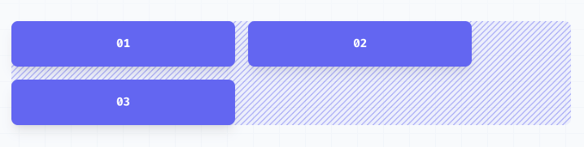
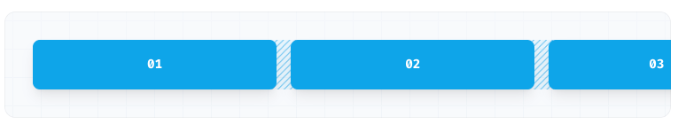
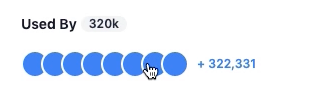

## Layout

### flex

- flex

- flex-row

  - 水平排列

- flex-col

  - 垂直排列

- flex-wrap

  - 允许换行

    

- flex-unrwap

  - 不允许换行，会超出

    

- inline-flex

  - 用于需要元素叠加的时候

    

- grow

  - 允许元素变大填满空余空间
  - grow-0 避免一个 flex 元素变大

- shrink

  - 允许缩小
  - shrink-0 避免一个 flex 元素变小
  
- 在 Tailwind CSS 中，`flex-1` 是一个用于设置 Flexbox 子元素的类。它的作用是让该子元素尽可能多地占据剩余的可用空间。这是通过设置 `flex-grow`, `flex-shrink` 和 `flex-basis` 属性来实现的。

  - `flex-grow: 1;`：子元素可以增长，占据剩余的可用空间。
  - `flex-shrink: 1;`：子元素可以收缩，以适应父容器的空间。
  - `flex-basis: 0%;`：子元素的基础大小为 0，实际大小由 `flex-grow` 和 `flex-shrink` 属性决定。


### grid

- grid-cols-3

### size

- w-6
- 比例 weight
  - w-8/12
  - w-3/12
  - w-1/12
- h-6
  - h-full

### container

- container 可以和 flex 一起用
- 指定元素宽度
  - w-3/4  四分之三的宽度

### **space**

子元素的距离

- space-x-2

### **padding**

内边距 

**定义**：`padding` 是元素内容和元素边框之间的空间。

**作用**：增加元素的内部空间，使内容与边框之间有一定的间隔。

- px
- py 
- pt, pl, pr, pb
- https://tailwindcss.com/docs/padding

### **margin**

外边距

**定义**：`margin` 是元素边框与相邻元素（或容器边框）之间的空间。

**作用**：增加元素的外部空间，使元素与其他元素或容器之间有一定的间隔。

- mr-2
- ml-2
  - margin-left-2
- mx-1
- mx-auto 水平居中

### gap

- `grid grid-cols-1 gap-x-8 gap-y-16 `
- 在 CSS Grid 布局中，`gap` 属性用于设置网格单元之间的间距。
- Tailwind CSS 从版本 2.2 开始支持在 Flexbox 布局中使用 `gap` 属性。

### **Top/Right/Bottom/Left**

- top-0

  - top-[3px]

- right-0

- left-0

- inset-x-0

  ```
  left: 0px;
  right: 0px;
  ```

### **visibility**

- visible
- invisible
  - visibility: hidden;
- collapse
  - visibility: collapse;

### **align**

- Items-center
  - items-start，从左上角开始对齐
  - Items-end，右下角开始对齐
  - `items-center` 使子元素在垂直方向上居中。
- justify
  - justify-between, 两边对齐
    - Use `justify-between` to justify items along the container’s main axis such that there is an equal amount of space between each item:
  - `justify-center` 使子元素在水平方向上居中。

### **rounded**

- rounded
- rounded-lg
- rounded-xl 
- rounded-md
- rounded-r-none  右边不为弧形
- rounded-full 圆

### **border**

- border
  - border-gray-600
- 位置
  - border-b
  - border-l
  - ...
- 位置和颜色要一起写
  - `border-l border-gray-600`

### [position](https://tailwindcss.com/docs/position)

- static

  - 这是元素的默认定位方式。使用 `position: static;` 时，元素按照文档的正常流进行定位。

  - **特点**：元素的位置由文档的流决定。

    不受 `top`、`right`、`bottom`、`left` 等定位属性影响。 Any [offsets](https://tailwindcss.com/docs/top-right-bottom-left) will be ignored and the element will not act as a position reference for absolutely positioned children.

  - 例子：和 relative 的区别就是子元素的定位属性会被忽略

- relative

  - 元素相对于其正常位置进行定位。即元素在文档流中的位置不会改变，但可以通过 `top`、`right`、`bottom`、`left` 属性对其进行偏移。

  - **特点**：元素仍然占据正常的文档流空间。

    可以使用 `top`、`right`、`bottom`、`left` 属性来对其进行偏移。

- absolute

  - 元素相对于最近的已定位（非 static）的祖先元素进行定位。如果没有已定位的祖先元素，则相对于初始包含块（通常是文档的根元素）进行定位。

  - **特点**：元素从正常文档流中移除，不占据空间。

    可以使用 `top`、`right`、`bottom`、`left` 属性来指定元素的位置。

  - 例子：想跳出 static 父元素影响

    - 在 Tailwind CSS 中，`-translate-y-1/2` 是一个用于应用变换（transformation）的类，它会将元素在垂直方向上移动其自身高度的一半，且方向为负（即向上移动）。

      具体解释如下：

      - `translate-y` 表示在垂直方向上的平移（translate）。
      - `-1/2` 表示向上移动元素高度的 50%。

      ```
      <div class="relative h-32">
        <div class="absolute top-1/2 -translate-y-1/2">
          这个元素垂直居中
        </div>
      </div>
      ```

      - 也可以通过在父元素加上 flex item-center 实现

- fixed

  - 元素相对于浏览器窗口进行定位。即使页面滚动，元素也会固定在指定的位置。

  - **特点**：元素从正常文档流中移除，不占据空间。

    可以使用 `top`、`right`、`bottom`、`left` 属性来指定元素在窗口中的位置。

  - 例子：网页的 header，往下滚动也会钉在窗口上面

  sticky

  - 元素在正常文档流中滚动时是相对定位的，但在滚动到特定位置时变为固定定位。

  - **特点**：元素根据滚动位置切换在相对定位和固定定位之间。

    可以使用 `top`、`right`、`bottom`、`left` 属性来指定元素变为固定定位的位置。

  - 例子：表格的 header，当滚动超过列表 header 时，往下滚动也会钉在窗口上面

## font

**size**

- font-medium
- text-xl
- text-sm
  - text-xs
  - text-xl
- text-base
  - 在 Tailwind CSS 中，`text-base` 是一个用于设置文本大小的实用工具类。具体来说，它将文本的字体大小设置为基础大小，通常定义为 1rem
  

**bold**

font-semibold

**text color**

- text-black

**position**

- text-right

**leading**

- leading-7

  - 在 Tailwind CSS 的默认配置中，`leading-7` 对应的行高是 1.75。这意味着行高是当前字体大小的 1.75 倍。例如，如果当前字体大小是 16px，那么 `leading-7` 会将行高设置为 16px * 1.75 = 28px。

  - ```
    <p class="text-base leading-7">
      这是一个示例段落，使用基础字体大小和行高为 1.75 倍的设置。
    </p>
    ```

**truncate**

- truncate  截断，不换行

**letter-spacing**

- tracking-tight 
  - 在 Tailwind CSS 的默认配置中，`tracking-tight` 对应的字母间距是 `-0.05em`，即字符之间的距离比正常的间距要紧密一些。

## display

- color
  - bg-gray-400
- shadow
  - shadow-sm
- divide 分割线
  - divide-y y轴上的分隔线
  - divide-gray-300 分割线的颜色

## tbale

无序列表

- ul
  - li

**layout**

- table-atuo
- table-fixed

**caption**

- 也就是居中的标题，要么在上面，要么在下面

## hover, group...

[Responsive breakpoints](https://tailwindcss.com/docs/hover-focus-and-other-states#responsive-breakpoints)

- `hover:` with everything
  - hover:text-gray-400
  - hover:underline
- group
  - group 如果子元素有 group-hover，整个元素会一起被hover的行为改变
  - group-hover
    - group-hover:text-blue-600

## SVG

- color
  - fill-current https://tailwindcss.com/docs/fill
    - 填充当前元素字体颜色、或父元素字体颜色

## 自适应小屏幕的写法

## 自定义标签

- Repo-stats (标识 div 块，没有任何样式)

## 原生

- input

  - The `<form>` element is a container for different types of input elements, such as: text fields, checkboxes, radio buttons, submit buttons, etc.

  - An `<input>` element can be displayed in many ways, depending on the `type` attribute.

    - text

    - radio

    - checkbox

    - submit, the submit will trigger the action

    - button

  - ```
    <form action="/action_page.php">
      <label for="fname">First name:</label><br>
      <input type="text" id="fname" name="fname"><br>
    </form>
    ```

  - lable's `for` is the `id` of input, the user clicks the text within the `<label>` element, it toggles the radio button/checkbox.

  - The name attribute for `input`, each input field must have a `name` attribute to be submitted.

- button

- span
  - 放字体的

- hyperlink `<a herf="#">`

- block

- cursor-pointer 
  - 鼠标放上去是一个手的形状
  
- margin 和 padding
  
  - `margin` 用于控制元素与其他元素之间的距离，用于分隔元素和它的邻居，不会影响元素的背景颜色和背景图像。
  
  - `padding` 用于控制元素内容与其边框之间的距离，用于增加元素内容与边框之间的空间，会影响元素的背景颜色和背景图像。
  
  - ```
    +--------------------------------------+
    |          margin (外边距)             |
    |  +-------------------------------+   |
    |  |        border (边框)          |   |
    |  |  +-------------------------+  |   |
    |  |  |     padding (内边距)     |  |   |
    |  |  |  +-------------------+  |  |   |
    |  |  |  |   内容            |  |  |   |
    |  |  |  +-------------------+  |  |   |
    |  |  +-------------------------+  |   |
    |  +-------------------------------+   |
    +--------------------------------------+
    
    ```
  
- 

## SVG 素材

https://heroicons.com/

## 参考

https://www.bilibili.com/video/BV1rf4y1g7r5/?spm_id_from=333.788.top_right_bar_window_history.content.click&vd_source=66a0b89065d7f04805223fd7f2d613a6

## media

- [ ] sr-only

## others

- [ ] 好像父元素的 h-25 会影响子元素的 pt- 不能发挥
- [ ]  ⨯ Error: Server Functions cannot be called during initial render. This would create a fetch waterfall. Try to use a Server Component to pass data to Client Components instead.
  - [ ] 这个错误提示表明你在 Next.js 应用中尝试在组件的初始渲染期间调用 Server Functions，这是不被允许的，因为它会导致“fetch waterfall”问题。这种问题会影响应用的性能，因为每次渲染都会触发新的数据获取请求，从而导致多次不必要的网络请求。
  - [ ] 解决这个问题的一种方法是将数据获取逻辑移动到一个服务器组件中，并将数据作为属性传递给客户端组件。
  - [ ] 确保数据在服务器端获取，并在初始渲染时传递给客户端组件，避免了不必要的网络请求。

