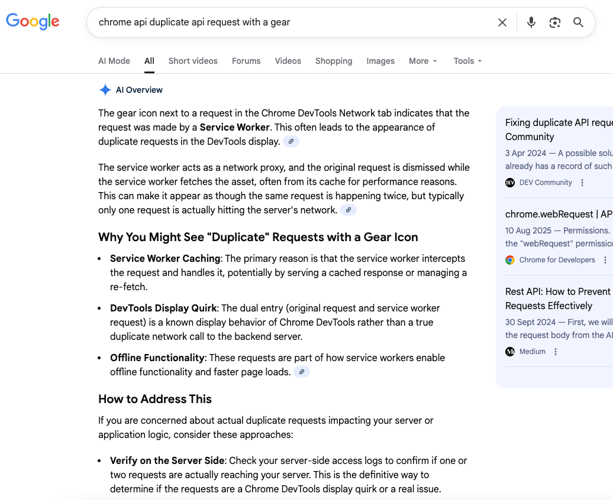

# Chrome api duplicate api request with a gear

The gear icon next to a request in the Chrome DevTools Network tab indicates that the request was made by a **Service Worker**. This often leads to the appearance of duplicate requests in the DevTools display. 

The service worker acts as a network proxy, and the original request is dismissed while the service worker fetches the asset, often from its cache for performance reasons. This can make it appear as though the same request is happening twice, but typically only one request is actually hitting the server's network. 

