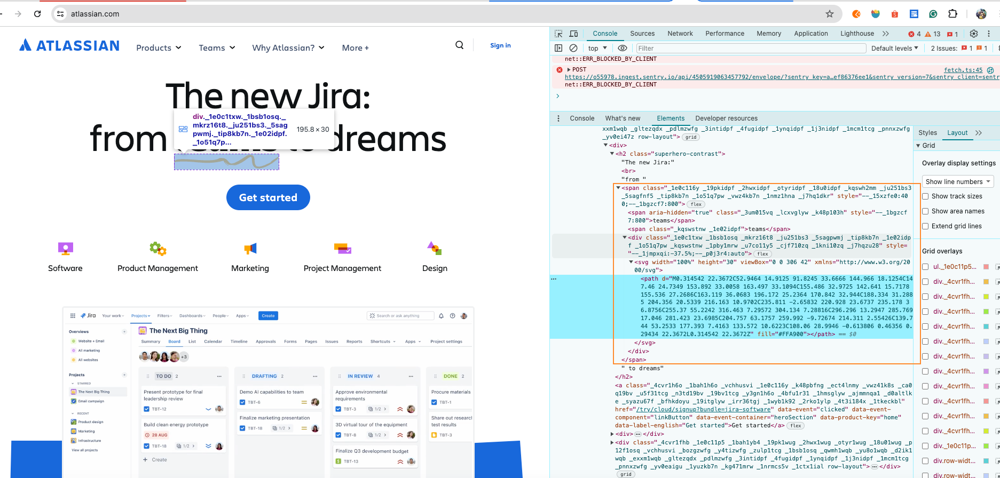

为什么homepage的第一段话都叫hero？class="superhero-contrast"

> 在网页设计中，“Hero”这个术语指的是网页上的一个显眼区域，通常位于首页或者主要页面的顶部。这个区域的目的是立即吸引访问者的注意力，并传达网站的主要信息或价值主张。Hero 区域可能包括一个引人注目的图像、有影响力的标题文字、或是引导用户行动的按钮等元素。
>
> 之所以称之为“Hero”，是因为这部分内容在页面设计中扮演了“英雄”的角色，即最重要和最能吸引注意的元素。它的目的在于有效地传达信息并吸引用户进一步浏览网站。
>
> 至于你提到的 `class="superhero-contrast"`，这看起来是一个特定的CSS类名，用于定义网页上某个元素的样式。在这个上下文中，“superhero”可能只是开发者为了增加趣味性或明确风格而选择的一个类名，而“contrast”则暗示这个类可能包含了一些提高视觉对比度的样式设置，使得该区域更为突出。这样的命名和设计都是为了增强用户对网页关键部分的注意力。
>
> by ChatGPT 4

