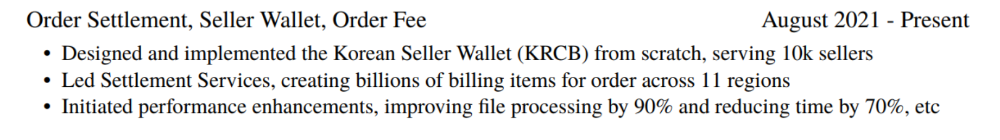

# Introduction

[Fenglyu CV](https://doc.fenglyulin.com/pdf/fenglyu_cv_20250627.pdf)

# Timeline

My name is **Fenglyu Lin**. I’m from China. 

## 2021: start

>   I earned my bachelor’s degree from **Wuhan University**.

## 2021-2023: grow

>   After graduating in 2021, I moved to Singapore and joined **Shopee** as a **Backend Engineer**, where I’ve been responsible for services related to order clearing and settlement.

## 2024: learn and build

### Jan, NUS Master

>   Over the past two years, I began to feel unmotivated by routine business requirements, so I started actively seeking new opportunities to explore different areas and push beyond my comfort zone
>
>   -   In Jan 2024, I began pursuing a Master’s degree in Computer Science at **NUS**, focusing on **AI-related courses**.

### July, sgpass.info

>    I also started building small products as a first step toward entrepreneurship:
>
>   -   In July 2024, I self-developed and launched a web application, **https://sgpass.info**, which collects and scrapes data of Singapore PR applications, attracted over 300 registered users. (Non-profit)

>   I also did a sharing of Distributed Systems in our Team https://docs.google.com/presentation/d/1WhaGyZQZUH905QXI5QKHfKzojU1wFxcuWiNiF2pq994

## 2025~Present: Build AI Agents

>   -   In Jan 2025, I initiated an **AI Agent** at Shopee to improve developer efficiency, empowering 1000+ devs in Company.
>   -   Prompt Engineering, MCP, RAG

## Skills

>   I actively share what I learn. Wrote over **200 blog posts** at https://doc.fenglyulin.com/docs/practise-coding-record

## Summary

I am **passionate** about building impactful products that benefit users and solve real problems.

However, the future direction(AI Spec) I’m currently exploring doesn’t fully align with my day-to-day work. 

That’s why I’m now looking for opportunities to work with people who share similar interests.