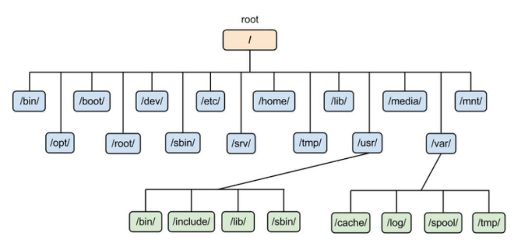

# 文件系统

## 文件权限

文件权限字符串由 10 个字符组成，由 1 bit文件类型和三个权限组组成：

| 字符位置 | 含义               | 示例                         |
| -------- | ------------------ | ---------------------------- |
| 1        | 文件类型           | `d` (目录) 或 `-` (普通文件) |
| 2-4      | 用户（所有者）权限 | `rwx`                        |
| 5-7      | 组权限             | `---`                        |
| 8-10     | 其他用户权限       | `---`                        |

文件类型

- **`d`**：表示目录（directory）。
- **`-`**：表示普通文件（regular file）。
- **`l`**：表示符号链接（symbolic link）。
- **`b`**：表示块设备（block device），如硬盘。
- **`c`**：表示字符设备（character device），如终端或键盘。
- **`s`**：表示套接字（socket）。

权限组

- 一组权限中的 3 位分别为 r、w、x 权限，表示可读、可写、可执行。

- 可以将一组权限用数字来表示， `rwx` 可以表示为 `7`。一组权限的 3 个位当做二进制数字的位，从左到右每个权限的权值为 r : 4、w : 2、x : 1。

实例

`drwx------`，

- **`d`**：表示这是一个**目录**。如果是普通文件，则这个字符会是 `-`。
- **`rwx`**：表示目录所有者（用户）有**读**（`r`）、**写**（`w`）和**执行**（`x`）权限。对于目录，"执行"（`x`）权限表示用户可以进入这个目录。
- **`---`**：表示**组用户**没有任何权限。
- **`---`**：表示**其他用户**没有任何权限。

### chmod 配置权限

change mode

```html
chmod [-R] xyz dirname/filename
```

实例：将 .bashrc 文件的权限修改为 `-rwxr-xr--`，也即 754

- 第一组 `rwx` 为 `4+2+1=7`
- 第二组 `r-x` 为 `4+1=5`
- 第三组 `r--` 为 `4`

```html
chmod 754 .bashrc
```

### 使用符号来配置权限

```html
chmod [ugoa][+-=][rwx] dirname/filename
- u：拥有者
- g：所属群组
- o：其他人
- a：所有人
- +：添加权限
- -：移除权限
- =：设定权限
```

示例：为 .bashrc 文件的所有用户添加写权限。

```html
chmod a+w .bashrc
```

示例：添加执行权限

```
chmod +x install_pytorch_cuda12_1.sh
```

### 默认权限

- 文件默认权限：文件默认没有可执行权限，因此为 666，也就是 -rw-rw-rw- 。
- 目录默认权限：目录必须要能够进入，也就是必须拥有可执行权限，因此为 777 ，也就是 drwxrwxrwx。

可以通过 umask 设置或者查看默认权限，通常以掩码的形式来表示，例如 002 表示其它用户的权限去除了一个 2 的权限，也就是写权限，因此建立新文件时默认的权限为 -rw-rw-r--。

### 目录的权限

文件名不是存储在一个文件的内容中，而是存储在一个文件所在的目录中。因此，拥有文件的 w 权限并不能对文件名进行修改。

目录存储文件列表，一个目录的权限也就是对其文件列表的权限。因此，目录的 r 权限表示可以读取文件列表；w 权限表示可以修改文件列表，具体来说，就是添加删除文件，对文件名进行修改；x 权限可以让该目录成为工作目录，x 权限是 r 和 w 权限的基础，如果不能使一个目录成为工作目录，也就没办法读取文件列表以及对文件列表进行修改了。

##  目录配置

为了使不同 Linux 发行版本的目录结构保持一致性，Filesystem Hierarchy Standard (FHS) 规定了 Linux 的目录结构。最基础的三个目录如下：

- `/`
  - root，根目录
- `/usr`
  - unix software resource，所有系统默认软件都会安装到这个目录；
- `/var`
  -  variable，存放系统或程序运行过程中的数据文件。



## 拓展系统路径 PATH

定义环境变量（如 `export PATH=/my/custom/path:$PATH`）的作用主要是为你的 Singularity 容器设置或修改运行时的系统环境，使其能够正确找到你所需的程序或工具。具体来说：

- **PATH 环境变量**：`PATH` 是一个系统环境变量，定义了操作系统在运行程序时需要搜索的目录列表。当你输入一个命令（例如 `vim` 或 `python`），系统会按照 `PATH` 中定义的目录顺序查找该命令。

- **自定义路径**：通过 `export PATH=/my/custom/path:$PATH`，你将 `/my/custom/path` 这个目录添加到 `PATH` 的最前面。这意味着当你在容器内运行某个命令时，系统会优先在 `/my/custom/path` 中查找对应的可执行文件，而不是在默认的系统目录中。

## 错误输出标准输出

在 Linux 中，程序的输出被分为三种类型：

1. **标准输入** (`stdin`)：文件描述符为 `0`。
2. **标准输出** (`stdout`)：文件描述符为 `1`。
3. **标准错误输出** (`stderr`)：文件描述符为 `2`。

当你运行一个命令时：

- `stdout` 是命令的正常输出。
- `stderr` 是命令的错误输出（例如警告或错误信息）。

可以通过添加 `2>&1` 将标准错误（`stderr`）重定向到标准输出（`stdout`）来解决问题，这样 `grep` 就能处理所有输出，包括潜在的警告信息：

```
module avail 2>&1 | grep python3 #这将同时捕获所有输出，并允许 `grep` 搜索其中包含 `python3` 的行。
```

```
module avail 2>/dev/null #将 **标准错误输出** 重定向到 `/dev/null`，即隐藏标准输出，只显示错误输出。
```

**只看错误输出**

````
module avail 2>&1 >/dev/null | grep python
````

- `2>&1` 将错误输出重定向到标准输出。

- `>/dev/null` 隐藏标准输出，只保留错误输出。`/dev/null` 是一个特殊的“黑洞”设备，任何写入它的内容都会被丢弃。因此，这个命令意味着“丢弃所有的错误输出，只保留标准输出”。

**只看标准输出**

```
module avail 2>/dev/null | grep python
```

# Reference

1. [Linux](https://www.cyc2018.xyz/%E8%AE%A1%E7%AE%97%E6%9C%BA%E5%9F%BA%E7%A1%80/Linux/Linux.html#grep)
2. 