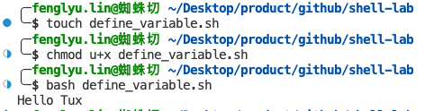

# Shell脚本概述 Shell Script

## What is Bash Shell?

The default shell for many Linux distros is the GNU Bourne-Again Shell (bash). Bash is succeeded by Bourne shell (`sh`).

When first launching the shell, it will use a startup script located in the `.bashrc` or `.bash_profile` file.

 `shell prompt` 

-   When a shell is used interactively, it displays a `$` when it is waiting for a command from the user.

-   If shell is running as root, the prompt is changed to `#`.

## What is a Bash script?

A Bash script is a series of commands written in a file. The program executes them line by line. 

You can run the script any number of times.

## How to define a bash script?

-   file extension of `.sh`
-   script starts with a `shebang`, Shebang is a combination of `bash #` and `bang !` followed the bash shell path
    -   sample: `#! /bin/bash`
-   execution permission `x`

## Create the first Bash script

-   create the script `touch hello_world.sh`

-   find your bash  `which bash`

-   write the command  

    ````
    #! /bin/bash
    echo "Hello World"
    ````

-   provide the execution right to your user `chmod u+x hello_world.sh`


-   run the script in the following two ways
    1.   `./hello_world.sh`
    2.   ``bash hello_world.sh``

# The basic syntax

## Define variable

We can define the variable by using `variable_name=value`. To get the value of a variable, add `$` before the variable.

```
#! /bin/bash
greeting=Hello
name=Tux
echo $greeting $name
```

Run it



### Arithmetic Expressions

| Operator | Usage          |
| :------- | :------------- |
| +        | addition       |
| -        | subtraction    |
|          | multiplication |
| /        | division       |
| *        | exponentiation |
| %        | modulus        |

We can execute the expressions by running the following cmd.

Note the `space`, they are part of the syntax

```
expr 1 + 1
```

Here are some samples


We can calculate the expressions and store the result in a variable like below

```
var=$((expression))
```

example

```
#!/bin/bash

var=$((3+9))
echo $var
```


### Decimal calculations

As shown in the sample like below, bc stands for `bash calculator`, scale defines the number of decimal places required in the output

```
echo "scale=2;22/7" | bc
```


## Read user input

```
read variable_name
```

example

```
#!/bin/bash

echo "Enter a numner"
read a

echo "Enter a numner"
read b

var=$((a+b))
echo $var
```

execution result


## If else

condition checking

```
if [[ condition ]]
then
    statement
elif [[ condition ]]; then
    statement 
else
    do this by default
fi
```

### Numeric Comparison Logical operators

| Operation             | Syntax        | Explanation                        |
| :-------------------- | :------------ | :--------------------------------- |
| Equality              | num1 -eq num2 | is num1 equal to num2              |
| Greater than equal to | num1 -ge num2 | is num1 greater than equal to num2 |
| Greater than          | num1 -gt num2 | is num1 greater than num2          |
| Less than equal to    | num1 -le num2 | is num1 less than equal to num2    |
| Less than             | num1 -lt num2 | is num1 less than num2             |
| Not Equal to          | num1 -ne num2 | is num1 not equal to num2          |

sample

```
read x
read y

if [ $x -gt $y ]
then
echo X is greater than Y
elif [ $x -lt $y ]
then
echo X is less than Y
elif [ $x -eq $y ]
then
echo X is equal to Y
fi
```


To make powerful comparison, we can use AND `-a` and OR `-o` as well.

The below statement translates to: if `a` is greater than 40 and `b` is less than 6.

```
if [ $a -gt 40 -a $b -lt 6 ]
```

### Empty String

https://stackoverflow.com/questions/13509508/check-if-string-is-neither-empty-nor-space-in-shell-script

| Desc                       | Syntax                                    |
| -------------------------- | ----------------------------------------- |
| not empty                  | `[[ -n "${str// /}" ]]`                   |
| str empty                  | `if [ "$str" = "" ];then    echo NULL fi` |
| str empty v2               | `if [ ! "$str" ];then    echo NULL fi`    |
| str not null               | `! -z "$str"`                             |                            |
| str not space              | `"$str" != " "`                           |
| str not null and not space | `! -z "$str" -a "$str" != " "`            |

Example

```
str1="Hello World"
str2=" "
str3=""

if [ ! -z "$str1" -a "$str1" != " " ]; then
        echo "Str1 is not null or space"
fi

if [ ! -z "$str2" -a "$str2" != " " ]; then
        echo "Str2 is not null or space"
fi

if [ ! -z "$str3" -a "$str3" != " " ]; then
        echo "Str3 is not null or space"
fi
```

only `str1` is not null or space


## For loop

looping the numbers

```
#!/bin/bash

for i in {1..5}
do
    echo $i
done
```

looping the strings

```
#!/bin/bash

for X in cyan magenta yellow  
do
    echo $X
done
```


## While loop

```
#!/bin/bash
i=1
while [[ $i -le 10 ]] ; do
   echo "$i"
  (( i += 1 ))
done
```


#### Reading file

```
#!/bin/bash

LINE=1

while read -r CURRENT_LINE
    do
        echo "$LINE: $CURRENT_LINE"
    ((LINE++))
done < "user_input.sh"
```


## Get the output of commands

If you need to include the output of a complex command in your script, you can write the statement inside back ticks.

Syntax

-   var= `commands` 

Sample

```
#!/bin/bash

var=`df -h | grep home`                                                                                                130 ↵
echo $var
```


## Get the arguement from command line

`$@` represents the position of the parameters, starting from one.

```
#!/bin/bash

for x in $@
do
    echo "Entered arg is $x"
done

echo $0 # the sh itself
echo $1 # the first argument
```


## Cronjob

Check the crontab expr here: https://crontab.guru/

Here, `*` represents minute(s) hour(s) day(s) month(s) weekday(s), respectively.

```
# Cron job example
* * * * * sh /path/to/script.sh
```

check the existing crons

```
crontab -l
```

## Find cmd

```
find . -type f -name "*.sh"
```

-   `.` represents the current directory. You can change the path accordingly.
-   `-type f` indicates that the file type we are looking for is a text based file.
-   `*.sh` tells to match all files ending with `.sh`.

3

## Todo

environment variables

date

print

## Reference

1.   [Shell Scripting for Beginners – How to Write Bash Scripts in Linux](https://www.freecodecamp.org/news/shell-scripting-crash-course-how-to-write-bash-scripts-in-linux/)