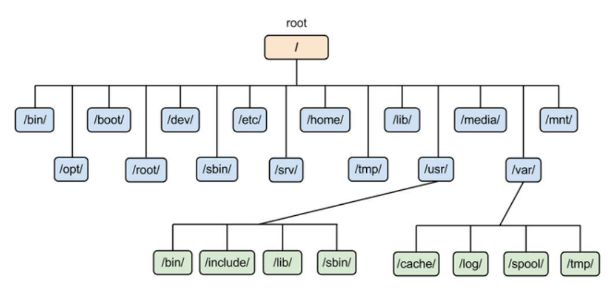

## 文件系统

### 文件权限

9 位的文件权限字段中，每 3 个为一组，如下所示共 3 个权限组。

- 文件拥有者
- 所属群组
- 其它人

一组权限中的 3 位分别为 r、w、x 权限，表示可读、可写、可执行。

可以将一组权限用数字来表示，此时一组权限的 3 个位当做二进制数字的位，从左到右每个位的权值为 4、2、1，即每个权限对应的数字权值为 r : 4、w : 2、x : 1。

```html
chmod [-R] xyz dirname/filename
```

示例：将 .bashrc 文件的权限修改为 -rwxr-xr--。

```html
chmod 754 .bashrc
```

也可以使用符号来设定权限。

```html
chmod [ugoa]  [+-=] [rwx] dirname/filename
- u：拥有者
- g：所属群组
- o：其他人
- a：所有人
- +：添加权限
- -：移除权限
- =：设定权限
```

示例：为 .bashrc 文件的所有用户添加写权限。

```html
chmod a+w .bashrc
```

### 默认权限

- 文件默认权限：文件默认没有可执行权限，因此为 666，也就是 -rw-rw-rw- 。
- 目录默认权限：目录必须要能够进入，也就是必须拥有可执行权限，因此为 777 ，也就是 drwxrwxrwx。

可以通过 umask 设置或者查看默认权限，通常以掩码的形式来表示，例如 002 表示其它用户的权限去除了一个 2 的权限，也就是写权限，因此建立新文件时默认的权限为 -rw-rw-r--。

### 目录的权限

文件名不是存储在一个文件的内容中，而是存储在一个文件所在的目录中。因此，拥有文件的 w 权限并不能对文件名进行修改。

目录存储文件列表，一个目录的权限也就是对其文件列表的权限。因此，目录的 r 权限表示可以读取文件列表；w 权限表示可以修改文件列表，具体来说，就是添加删除文件，对文件名进行修改；x 权限可以让该目录成为工作目录，x 权限是 r 和 w 权限的基础，如果不能使一个目录成为工作目录，也就没办法读取文件列表以及对文件列表进行修改了。

###  目录配置

为了使不同 Linux 发行版本的目录结构保持一致性，Filesystem Hierarchy Standard (FHS) 规定了 Linux 的目录结构。最基础的三个目录如下：

- `/`
  - root，根目录
- `/usr`
  - unix software resource，所有系统默认软件都会安装到这个目录；
- `/var`
  -  variable，存放系统或程序运行过程中的数据文件。



## Reference

1. [Linux](https://www.cyc2018.xyz/%E8%AE%A1%E7%AE%97%E6%9C%BA%E5%9F%BA%E7%A1%80/Linux/Linux.html#grep)
2. 