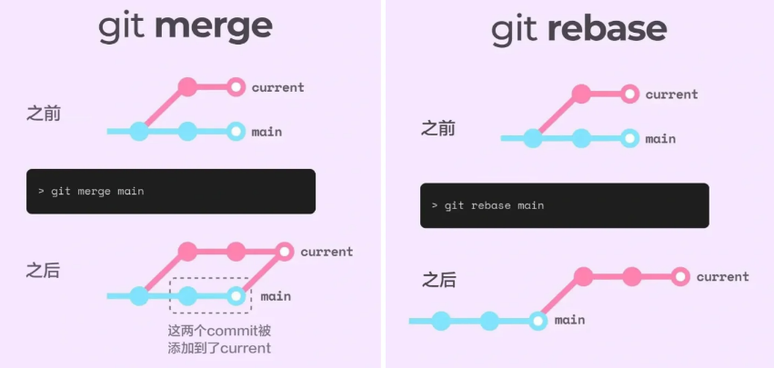
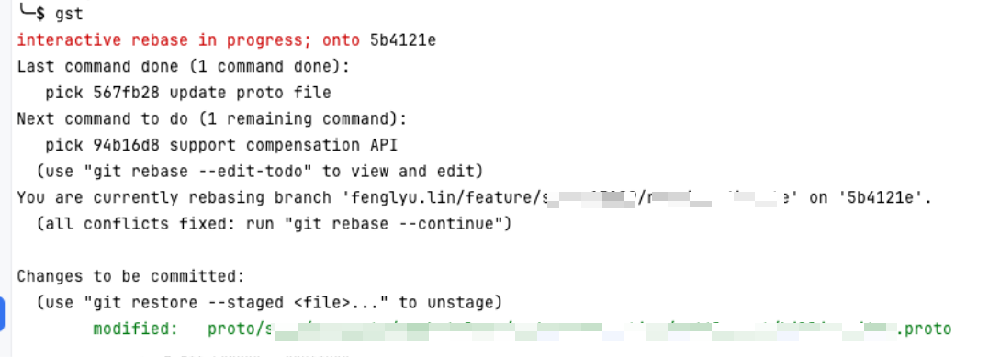
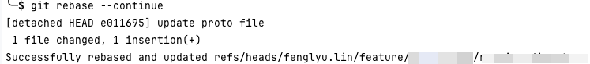
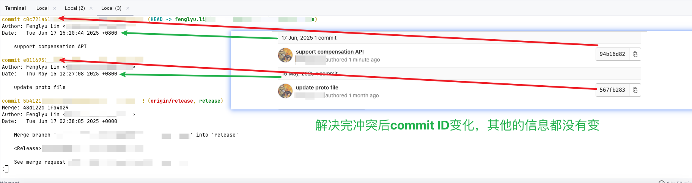
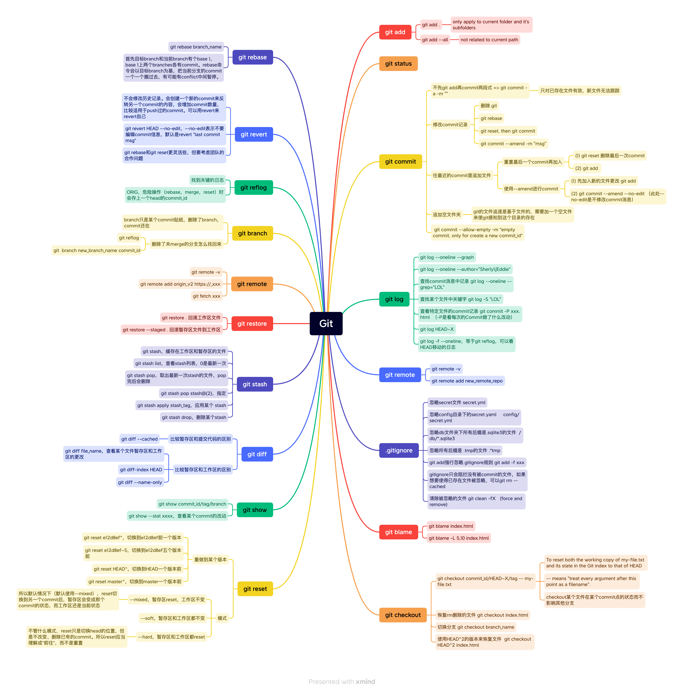

# Git Command Cheatsheet

## Remove Untracked Files

```git
git clean -f
```

## Delete Branch

```
git push -d <remote_name> <branchname>   # Delete remote
git branch -d <branchname>               # Delete local
```

After delete the remote branches, you may want to update local branch list

In the following commands, `--prune` will delete the branches that have been deleted in the remote

```
git remote update origin --prune
```

## Ensure branch is up-to-date

```
git fetch origin master
```

## Get diff against master branch

```
git diff mater...
```

get diff file name only

```
git diff master... --name-only
```

git diff with 10 surrounding lines and ignore test and mock file names

```
it diff master... --unified=10 -- $(git diff master... --name-only | grep -vE 'test|mock')
```

## Delete

```
git clean -h
usage: git clean [-d] [-f] [-i] [-n] [-q] [-e <pattern>] [-x | -X] [--] [<pathspec>...]

    -q, --quiet           do not print names of files removed
    -n, --dry-run         dry run
    -f, --force           force
    -i, --interactive     interactive cleaning
    -d                    remove whole directories
    -e, --exclude <pattern>
                          add <pattern> to ignore rules
    -x                    remove ignored files, too
    -X                    remove only ignored files
```

## Worktree

并行开发

在 `main` 上开发 A 功能，突然要修复 B 的 bug，不想 stash 或 commit：

```
git worktree add ../hotfix-bugfix hotfix/b-123
```

同时构建多个版本，有多个部署环境：

```
git worktree add ../staging staging
git worktree add ../production production
```

查看存在的worktree

```
git worktree list
```

删除 worktree

先删除工作目录，再解绑：

```
rm -rf ../feature-login
git worktree remove ../feature-login
```

或直接：

```
git worktree remove ../feature-login --force
```

### Rebase

****

git rebase是以目标分支为基准，将当前分支的新commit一个个移到上面，保持主分支历史的干净。同时也可以使用squash，将一个pr的所有commit都整合成为一个commit。

```
git rebase master
```

如果当前分支的新commit和目标分支的commit冲突，则产生冲突的文件会显示在工作区

这时使用git status会如下显示



就像日常merge时解决冲突一样，解决完之后需要提交文件到暂存区

```
git add .
```

然后继续rebase

```
git rebase
```

如下所示



最后效果如下，我的分支有两个commit id，在rebase后这两个commit id移到了从目标master的最新commit后。

这是解决过冲突的示例，所以commit id变化了



## Diagram



## Reference

1. [GIT Cheat Sheet](https://education.github.com/git-cheat-sheet-education.pdf)
2. 《GIT 必知必会》