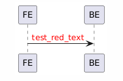

# UML Sequence Diagram

https://plantuml.com/

## 红色字体

在使用 PlantUML 绘制时序图时，你可以通过使用 `note` 或 `label` 来添加红色字体。具体的方式如下：

1.  **使用 `note` 标签**：

    ```
    plaintext
    Copy code
    note over A
    This is a note
    end note
    ```

2.  **使用 `label` 并修改颜色**： 你可以通过 HTML 标签来设置文字颜色，类似如下：

    ```
    plaintext
    Copy code
    A -> B: <font color=red>SG</font>
    ```

在你的图中，标注的“SG”可能是通过类似 `<font color=red>SG</font>` 的方式来实现红色字体的效果。如果你在 PlantUML 的时序图中使用这种方式，就能创建与图中相同的效果。

实例

```
@startuml
participant FE
participant BE

FE -> BE : <font color=red>test_red_text</font>

@enduml
```



## TODO

-   [ ] ifelse
-   [ ] notion
-   [ ] Divider 分隔线
-   [ ] group
-   [ ] participant
-   [ ] Arrow limitation